# Session 1- Census and satellite information


## Use of Satellite Imagery and SAE

One of the pioneering articles in small area estimation was the paper by Singh, R, et al. (2002), which addressed crop yield estimation for the tehsils (sub-administrative units) of Rohtak district in Haryana, India.

Raster images represent the world through a set of contiguous equally spaced cells known as pixels. These images contain information like a geographic information system and a coordinate reference system. Images store an identifier, a value in each pixel (or a vector with different values), and each cell is associated with a color scale.

Images can be obtained in raw and processed forms. The former contains only color layers, while the latter also contains values that have been processed in each cell (vegetation indices, light intensity, type of vegetation).

Raw information can be used to train desired features (roads, crop types, forest/non-forest). Fortunately, in Google Earth Engine, we find many processed indicators associated with a pixel. These indicators can be aggregated at a geographical area level.


## Satellite Image Data Sources

Some of the main sources of satellite images include:

  * [USGS Earth Explorer](http://earthexplorer.usgs.gov/)
  
  * [Land Processes Distributed Active Archive Center (LP DAAC)](https://lpdaacsvc.cr.usgs.gov/appeears/)
  
  * [NASA Earthdata Search](https://search.earthdata.nasa.gov/search)
  
  * [Copernicus Open Access Hub](https://scihub.copernicus.eu/)
  
  * [AWS Public Dataset - Landsat](https://aws.amazon.com/public-data-sets/landsat/)

However, most of these sources are centralized within **Google Earth Engine**, which allows searching for satellite image data sources. GEE can be managed through APIs in different programming languages: JavaScript (by default), Python, and R (rgee package).


## Google Earth Engine

Create an account at [this link](https://earthengine.google.com/). Once logged in, you can search for datasets of interest:

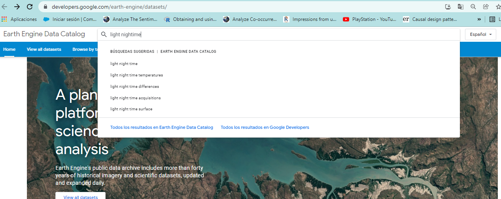

* Upon searching for the dataset, you can open a code editor provided by Google in JavaScript.

* Copy and paste the syntax provided by the dataset search to visualize the raster image and obtain statements allowing for the retrieval of the dataset of interest later in R.

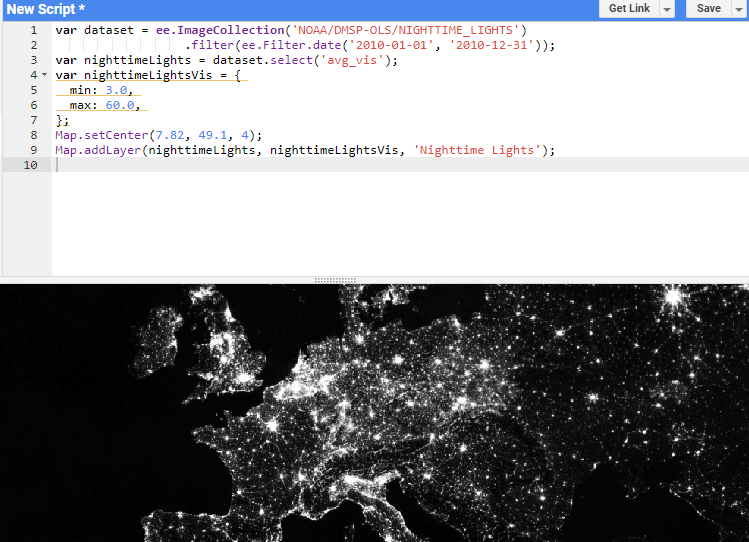

## Installing rgee

* Download and install Anaconda or Conda from [here](https://www.anaconda.com/products/individual).

* Open **Anaconda Prompt** and set up a working environment (Python environment JAM2023) using the following commands:

```
conda env list
conda create -n JAM2023 python=3.9
activate JAM2023
pip install google-api-python-client
pip install earthengine-api
pip install numpy
```

* List available Python environments in Anaconda Prompt:

```
conda env list
```

* Once you've identified the path of the JAM2023 environment, set it in R (**remember to change \\ to /**).
* Install `reticulate` and `rgee`, load packages for spatial processing, and set up the working environment as follows:


```r
library(reticulate) # Connection with Python
library(rgee) # Connection with Google Earth Engine
library(sf) # Package for handling geographic data
library(dplyr) # Package for data processing
library(magrittr)

rgee_environment_dir = "C:/Users/gnieto/Anaconda3/envs/JAM2023/python.exe"

# Set up Python (Sometimes not detected and R needs to be restarted)
reticulate::use_python(rgee_environment_dir, required=T)

rgee::ee_install_set_pyenv(py_path = rgee_environment_dir, py_env = "JAM2023")

Sys.setenv(RETICULATE_PYTHON = rgee_environment_dir)
Sys.setenv(EARTHENGINE_PYTHON = rgee_environment_dir)
```

* Once the environment is configured, you can initialize a Google Earth Engine session as follows:


```r
rgee::ee_Initialize(drive = T)
```

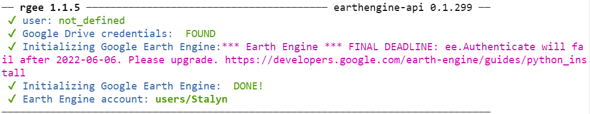


**Notes:**

- Each session must be initialized with the command `rgee::ee_Initialize(drive = T)`.

- JavaScript commands invoking methods with "." are replaced by the dollar sign ($), for example:


```r
ee.ImageCollection().filterDate()  # JavaScript
ee$ImageCollection()$filterDate()  # R
```


### Downloading Satellite Information

* **Step 1**: Have the shapefiles ready.


```r
shape <- read_sf("Shapefile/JAM2_cons.shp") 
plot(shape["geometry"])
```

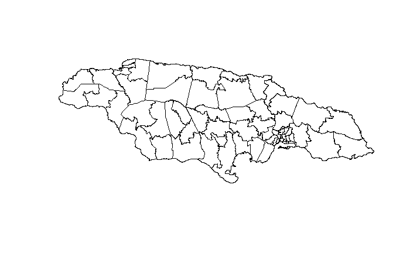

* **Step 2**: Select the image file you want to process, for example, **night lights**.


```r
lights <- ee$ImageCollection("NOAA/DMSP-OLS/NIGHTTIME_LIGHTS") %>%
  ee$ImageCollection$filterDate("2013-01-01", "2014-01-01") %>%
  ee$ImageCollection$map(function(x) x$select("stable_lights")) %>%
  ee$ImageCollection$toBands()
```

* **Step 3**: Download the information.


```r
## Takes about 10 minutes 
lights_shape <- map(unique(shape$dam2),
                 ~tryCatch(ee_extract(
                   x = lights,
                   y = shape["dam2"] %>% filter(dam2 == .x),
                   ee$Reducer$mean(),
                   sf = FALSE
                 ) %>% mutate(dam2 = .x),
                 error = function(e)data.frame(dam2 = .x)))

lights_shape %<>% bind_rows()

tba(lights_shape, cap = "Average of night lights")
```

<table class="table table-striped lightable-classic" style="margin-left: auto; margin-right: auto; font-family: Arial Narrow; margin-left: auto; margin-right: auto;">
<caption>(\#tab:unnamed-chunk-7)Average standardized night lights</caption>
 <thead>
  <tr>
   <th style="text-align:left;"> dam2 </th>
   <th style="text-align:right;"> stable_lights_mean </th>
  </tr>
 </thead>
<tbody>
  <tr>
   <td style="text-align:left;"> 0101 </td>
   <td style="text-align:right;"> 0.9393 </td>
  </tr>
  <tr>
   <td style="text-align:left;"> 0102 </td>
   <td style="text-align:right;"> 1.6857 </td>
  </tr>
  <tr>
   <td style="text-align:left;"> 0103 </td>
   <td style="text-align:right;"> 1.6900 </td>
  </tr>
  <tr>
   <td style="text-align:left;"> 0201 </td>
   <td style="text-align:right;"> -0.4380 </td>
  </tr>
  <tr>
   <td style="text-align:left;"> 0202 </td>
   <td style="text-align:right;"> 1.4627 </td>
  </tr>
  <tr>
   <td style="text-align:left;"> 0203 </td>
   <td style="text-align:right;"> 1.3519 </td>
  </tr>
  <tr>
   <td style="text-align:left;"> 0204 </td>
   <td style="text-align:right;"> 1.6333 </td>
  </tr>
  <tr>
   <td style="text-align:left;"> 0205 </td>
   <td style="text-align:right;"> 1.7522 </td>
  </tr>
  <tr>
   <td style="text-align:left;"> 0206 </td>
   <td style="text-align:right;"> 1.7522 </td>
  </tr>
  <tr>
   <td style="text-align:left;"> 0207 </td>
   <td style="text-align:right;"> 1.7444 </td>
  </tr>
</tbody>
</table>

Repeat the routine for:

- Soil type: **crops-coverfraction** (Percentage of crop cover) and **urban-coverfraction** (Percentage of urban cover) available at <https://developers.google.com/earth-engine/datasets/catalog/COPERNICUS_Landcover_100m_Proba-V-C3_Global#description>

- Travel time to the nearest hospital or clinic (**accessibility**) and travel time to the nearest hospital or clinic using non-motorized transport (**accessibility_walking_only**) information available at <https://developers.google.com/earth-engine/datasets/catalog/Oxford_MAP_accessibility_to_healthcare_2019>

- Human modification, considering human settlements, agriculture, transportation, mining, energy production, and electrical infrastructure. You can find satellite information at the following link: <https://developers.google.com/earth-engine/datasets/catalog/CSP_HM_GlobalHumanModification#description>


* **Paso 4**: Consolidate the information.

<table class="table table-striped lightable-classic" style="margin-left: auto; margin-right: auto; font-family: Arial Narrow; margin-left: auto; margin-right: auto;">
<caption>(\#tab:unnamed-chunk-8)Standardized satellite predictors</caption>
 <thead>
  <tr>
   <th style="text-align:left;"> dam2 </th>
   <th style="text-align:right;"> stable_lights_mean </th>
   <th style="text-align:right;"> crops.coverfraction_mean </th>
   <th style="text-align:right;"> urban.coverfraction_mean </th>
   <th style="text-align:right;"> gHM_mean </th>
   <th style="text-align:right;"> accessibility_mean </th>
   <th style="text-align:right;"> accessibility_walking_only_mean </th>
   <th style="text-align:right;"> stable_lights_sum </th>
   <th style="text-align:right;"> crops.coverfraction_sum </th>
   <th style="text-align:right;"> urban.coverfraction_sum </th>
   <th style="text-align:right;"> gHM_sum </th>
   <th style="text-align:right;"> accessibility_sum </th>
   <th style="text-align:right;"> accessibility_walking_only_sum </th>
  </tr>
 </thead>
<tbody>
  <tr>
   <td style="text-align:left;"> 0101 </td>
   <td style="text-align:right;"> 0.9393 </td>
   <td style="text-align:right;"> -0.5459 </td>
   <td style="text-align:right;"> 0.4390 </td>
   <td style="text-align:right;"> 0.5741 </td>
   <td style="text-align:right;"> -0.7760 </td>
   <td style="text-align:right;"> -0.9315 </td>
   <td style="text-align:right;"> -1.2660 </td>
   <td style="text-align:right;"> -0.5849 </td>
   <td style="text-align:right;"> -0.8078 </td>
   <td style="text-align:right;"> -1.1991 </td>
   <td style="text-align:right;"> -0.6242 </td>
   <td style="text-align:right;"> -0.8780 </td>
  </tr>
  <tr>
   <td style="text-align:left;"> 0102 </td>
   <td style="text-align:right;"> 1.6857 </td>
   <td style="text-align:right;"> -0.7090 </td>
   <td style="text-align:right;"> 2.2891 </td>
   <td style="text-align:right;"> 1.8346 </td>
   <td style="text-align:right;"> -0.8897 </td>
   <td style="text-align:right;"> -1.2588 </td>
   <td style="text-align:right;"> -1.7964 </td>
   <td style="text-align:right;"> -0.5947 </td>
   <td style="text-align:right;"> -1.2224 </td>
   <td style="text-align:right;"> -1.2993 </td>
   <td style="text-align:right;"> -0.6272 </td>
   <td style="text-align:right;"> -0.8873 </td>
  </tr>
  <tr>
   <td style="text-align:left;"> 0103 </td>
   <td style="text-align:right;"> 1.6900 </td>
   <td style="text-align:right;"> -0.3571 </td>
   <td style="text-align:right;"> 2.0344 </td>
   <td style="text-align:right;"> 1.7510 </td>
   <td style="text-align:right;"> -0.8684 </td>
   <td style="text-align:right;"> -1.2055 </td>
   <td style="text-align:right;"> -1.6990 </td>
   <td style="text-align:right;"> -0.5880 </td>
   <td style="text-align:right;"> -1.0667 </td>
   <td style="text-align:right;"> -1.2842 </td>
   <td style="text-align:right;"> -0.6269 </td>
   <td style="text-align:right;"> -0.8866 </td>
  </tr>
  <tr>
   <td style="text-align:left;"> 0201 </td>
   <td style="text-align:right;"> -0.4380 </td>
   <td style="text-align:right;"> -0.0874 </td>
   <td style="text-align:right;"> -0.6524 </td>
   <td style="text-align:right;"> -0.6504 </td>
   <td style="text-align:right;"> 0.0531 </td>
   <td style="text-align:right;"> 0.0511 </td>
   <td style="text-align:right;"> 1.0737 </td>
   <td style="text-align:right;"> -0.1234 </td>
   <td style="text-align:right;"> -0.6327 </td>
   <td style="text-align:right;"> 0.0186 </td>
   <td style="text-align:right;"> -0.2048 </td>
   <td style="text-align:right;"> -0.2380 </td>
  </tr>
  <tr>
   <td style="text-align:left;"> 0202 </td>
   <td style="text-align:right;"> 1.4627 </td>
   <td style="text-align:right;"> -0.6237 </td>
   <td style="text-align:right;"> 1.1018 </td>
   <td style="text-align:right;"> 0.8775 </td>
   <td style="text-align:right;"> -0.8226 </td>
   <td style="text-align:right;"> -1.0846 </td>
   <td style="text-align:right;"> -0.8523 </td>
   <td style="text-align:right;"> -0.5884 </td>
   <td style="text-align:right;"> 0.1016 </td>
   <td style="text-align:right;"> -1.1468 </td>
   <td style="text-align:right;"> -0.6231 </td>
   <td style="text-align:right;"> -0.8757 </td>
  </tr>
  <tr>
   <td style="text-align:left;"> 0203 </td>
   <td style="text-align:right;"> 1.3519 </td>
   <td style="text-align:right;"> -0.6402 </td>
   <td style="text-align:right;"> 0.9281 </td>
   <td style="text-align:right;"> 0.8771 </td>
   <td style="text-align:right;"> -0.6780 </td>
   <td style="text-align:right;"> -0.9356 </td>
   <td style="text-align:right;"> -0.8100 </td>
   <td style="text-align:right;"> -0.5891 </td>
   <td style="text-align:right;"> 0.0754 </td>
   <td style="text-align:right;"> -1.1302 </td>
   <td style="text-align:right;"> -0.6160 </td>
   <td style="text-align:right;"> -0.8673 </td>
  </tr>
  <tr>
   <td style="text-align:left;"> 0204 </td>
   <td style="text-align:right;"> 1.6333 </td>
   <td style="text-align:right;"> -0.5050 </td>
   <td style="text-align:right;"> 0.9165 </td>
   <td style="text-align:right;"> 1.0157 </td>
   <td style="text-align:right;"> -0.8334 </td>
   <td style="text-align:right;"> -1.1168 </td>
   <td style="text-align:right;"> -0.6630 </td>
   <td style="text-align:right;"> -0.5781 </td>
   <td style="text-align:right;"> 0.0671 </td>
   <td style="text-align:right;"> -1.1229 </td>
   <td style="text-align:right;"> -0.6232 </td>
   <td style="text-align:right;"> -0.8762 </td>
  </tr>
  <tr>
   <td style="text-align:left;"> 0205 </td>
   <td style="text-align:right;"> 1.7522 </td>
   <td style="text-align:right;"> -0.6844 </td>
   <td style="text-align:right;"> 2.3011 </td>
   <td style="text-align:right;"> 1.8174 </td>
   <td style="text-align:right;"> -0.8888 </td>
   <td style="text-align:right;"> -1.2573 </td>
   <td style="text-align:right;"> -1.2927 </td>
   <td style="text-align:right;"> -0.5937 </td>
   <td style="text-align:right;"> -0.0489 </td>
   <td style="text-align:right;"> -1.2119 </td>
   <td style="text-align:right;"> -0.6266 </td>
   <td style="text-align:right;"> -0.8856 </td>
  </tr>
  <tr>
   <td style="text-align:left;"> 0206 </td>
   <td style="text-align:right;"> 1.7522 </td>
   <td style="text-align:right;"> -0.4289 </td>
   <td style="text-align:right;"> 2.1777 </td>
   <td style="text-align:right;"> 1.8272 </td>
   <td style="text-align:right;"> -0.8968 </td>
   <td style="text-align:right;"> -1.2779 </td>
   <td style="text-align:right;"> -1.8138 </td>
   <td style="text-align:right;"> -0.5914 </td>
   <td style="text-align:right;"> -1.3125 </td>
   <td style="text-align:right;"> -1.3046 </td>
   <td style="text-align:right;"> -0.6273 </td>
   <td style="text-align:right;"> -0.8875 </td>
  </tr>
  <tr>
   <td style="text-align:left;"> 0207 </td>
   <td style="text-align:right;"> 1.7444 </td>
   <td style="text-align:right;"> -0.4662 </td>
   <td style="text-align:right;"> 1.7771 </td>
   <td style="text-align:right;"> 1.6966 </td>
   <td style="text-align:right;"> -0.8322 </td>
   <td style="text-align:right;"> -1.1072 </td>
   <td style="text-align:right;"> -1.5815 </td>
   <td style="text-align:right;"> -0.5898 </td>
   <td style="text-align:right;"> -1.0882 </td>
   <td style="text-align:right;"> -1.2650 </td>
   <td style="text-align:right;"> -0.6264 </td>
   <td style="text-align:right;"> -0.8850 </td>
  </tr>
</tbody>
</table>

### Night Lights

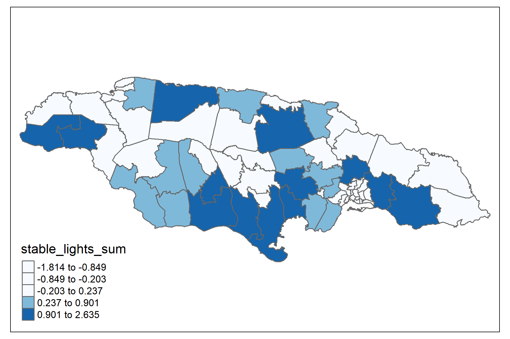
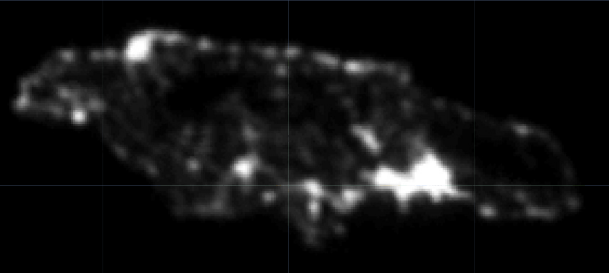


### Crop Cover

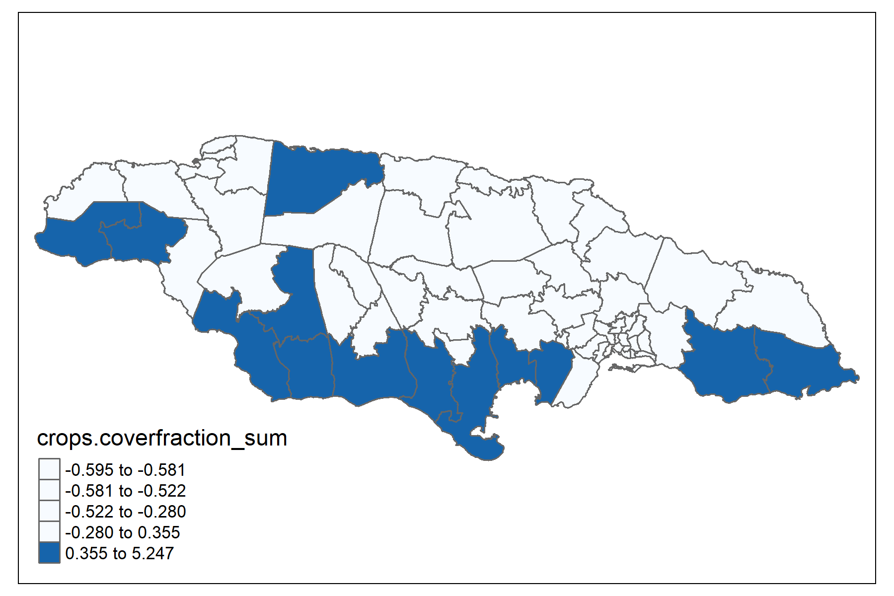
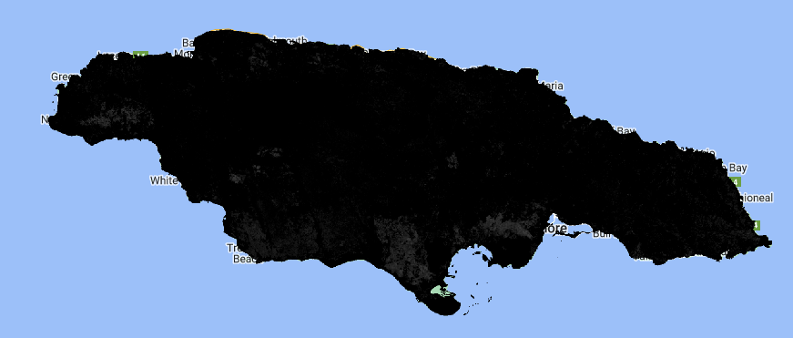


### Urban Cover

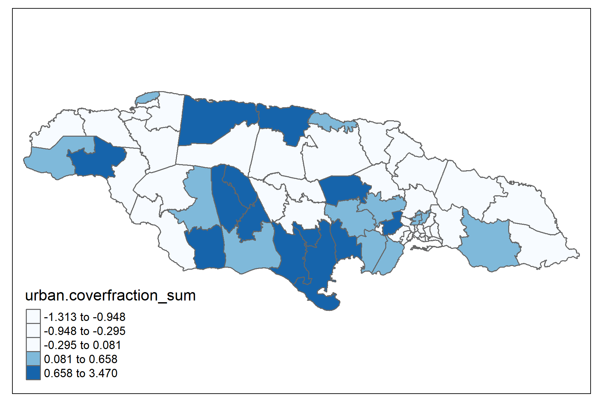
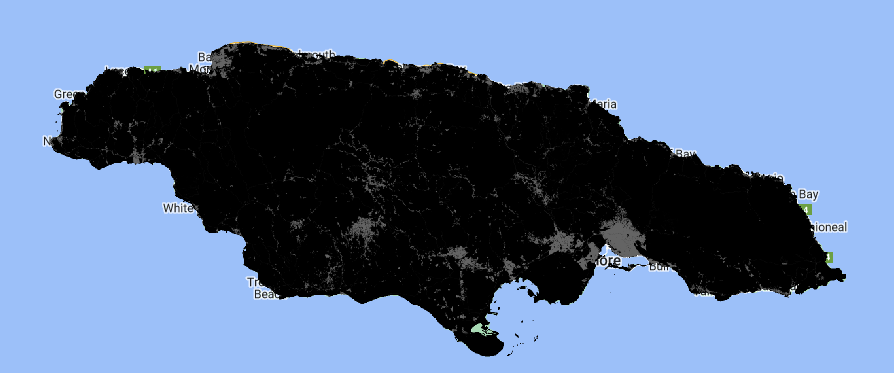


### Human Modification

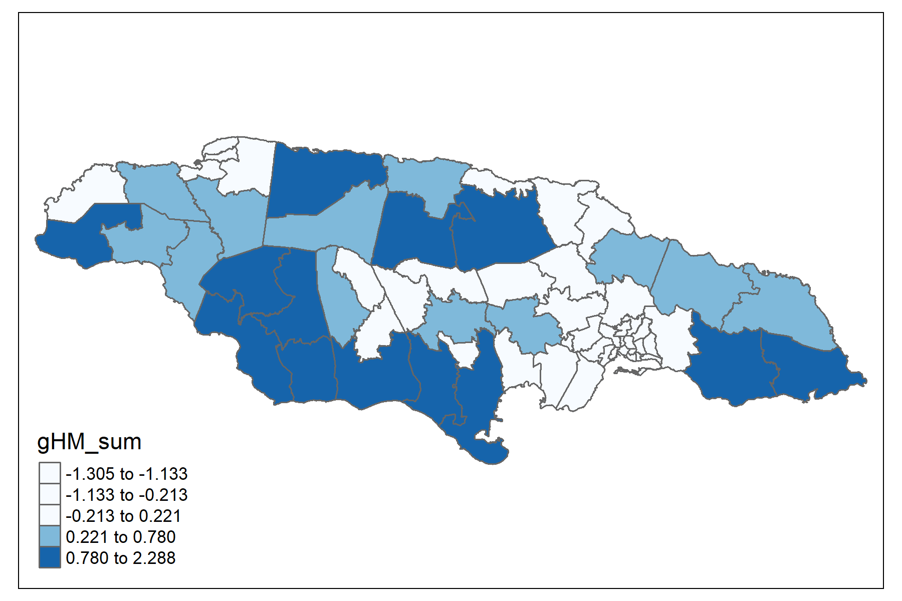


### Average Travel Time to Hospital 

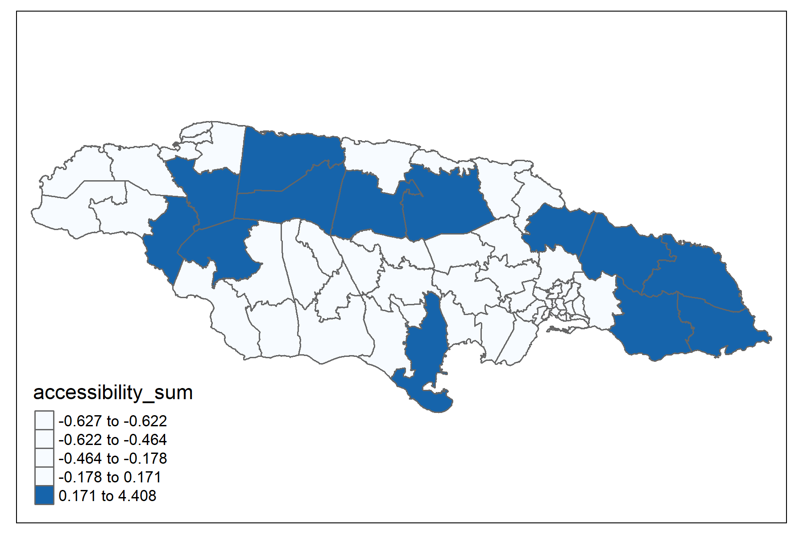

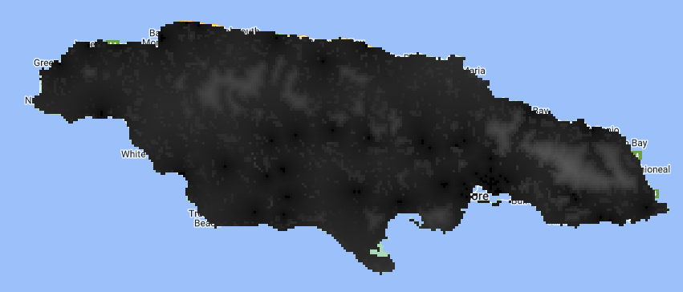


### Average Travel Time to Hospital by Non-Motorized Vehicle

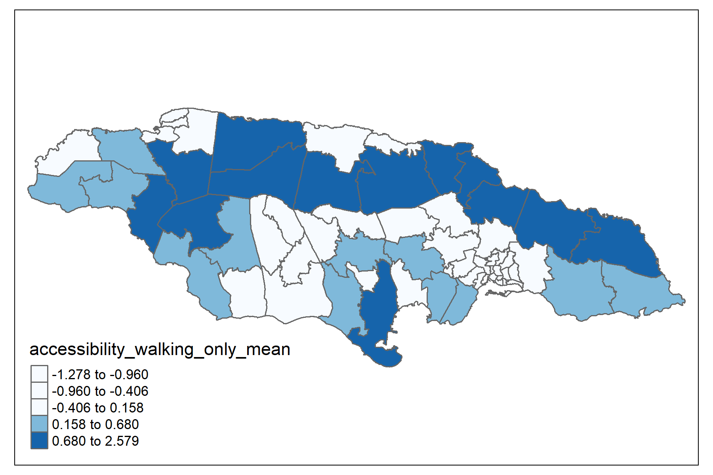

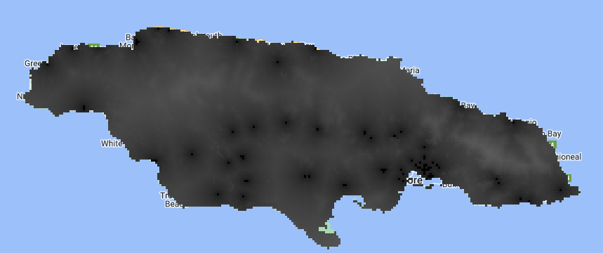


## Population and Housing Censuses

It's necessary to define the variables for the country you want to work with. As a first step, access to the country's census data is required. You can access it from the following link: <https://redatam.org/en/microdata>, where you'll find a *.zip* file with the microdata for the country. To read this dataset, you'll need to use the *redatam.open* function from the `redatam` library. This function directly depends on the census dictionary from REDATAM software, which is a file with a .dicx extension and should be located in the same folder as the data being read. This is how an object is created within R that merges the dictionary with the microdata from the census database. After performing a process in R using REDATAM syntax, we have the following table:

<table class="table table-striped lightable-classic" style="margin-left: auto; margin-right: auto; font-family: Arial Narrow; margin-left: auto; margin-right: auto;">
 <thead>
  <tr>
   <th style="text-align:left;"> dam2 </th>
   <th style="text-align:right;"> area1 </th>
   <th style="text-align:right;"> sex2 </th>
   <th style="text-align:right;"> age </th>
   <th style="text-align:right;"> tiene_sanitario </th>
   <th style="text-align:right;"> tiene_electricidad </th>
   <th style="text-align:right;"> tiene_acueducto </th>
   <th style="text-align:right;"> tiene_gas </th>
   <th style="text-align:right;"> eliminar_basura </th>
   <th style="text-align:right;"> tiene_internet </th>
   <th style="text-align:right;"> material_paredes </th>
   <th style="text-align:right;"> material_techo </th>
   <th style="text-align:right;"> TRANMODE_PRIVATE_CAR </th>
   <th style="text-align:right;"> ODDJOB </th>
   <th style="text-align:right;"> WORKED </th>
  </tr>
 </thead>
<tbody>
  <tr>
   <td style="text-align:left;"> 0101 </td>
   <td style="text-align:right;"> 1.0000 </td>
   <td style="text-align:right;"> 0.5087 </td>
   <td style="text-align:right;"> 2.5043 </td>
   <td style="text-align:right;"> 0.0019 </td>
   <td style="text-align:right;"> 0.7596 </td>
   <td style="text-align:right;"> 0.9545 </td>
   <td style="text-align:right;"> 0.7728 </td>
   <td style="text-align:right;"> 0.7804 </td>
   <td style="text-align:right;"> 0.9453 </td>
   <td style="text-align:right;"> 0.0095 </td>
   <td style="text-align:right;"> 0.7589 </td>
   <td style="text-align:right;"> 0.1472 </td>
   <td style="text-align:right;"> 0.0090 </td>
   <td style="text-align:right;"> 0.3488 </td>
  </tr>
  <tr>
   <td style="text-align:left;"> 0102 </td>
   <td style="text-align:right;"> 1.0000 </td>
   <td style="text-align:right;"> 0.4754 </td>
   <td style="text-align:right;"> 2.4689 </td>
   <td style="text-align:right;"> 0.0011 </td>
   <td style="text-align:right;"> 0.9064 </td>
   <td style="text-align:right;"> 0.9867 </td>
   <td style="text-align:right;"> 0.9181 </td>
   <td style="text-align:right;"> 0.9084 </td>
   <td style="text-align:right;"> 0.9882 </td>
   <td style="text-align:right;"> 0.0007 </td>
   <td style="text-align:right;"> 0.9060 </td>
   <td style="text-align:right;"> 0.0680 </td>
   <td style="text-align:right;"> 0.0126 </td>
   <td style="text-align:right;"> 0.2859 </td>
  </tr>
  <tr>
   <td style="text-align:left;"> 0103 </td>
   <td style="text-align:right;"> 1.0000 </td>
   <td style="text-align:right;"> 0.5037 </td>
   <td style="text-align:right;"> 2.2858 </td>
   <td style="text-align:right;"> 0.0152 </td>
   <td style="text-align:right;"> 0.6930 </td>
   <td style="text-align:right;"> 0.9741 </td>
   <td style="text-align:right;"> 0.7440 </td>
   <td style="text-align:right;"> 0.7362 </td>
   <td style="text-align:right;"> 0.9712 </td>
   <td style="text-align:right;"> 0.0028 </td>
   <td style="text-align:right;"> 0.6942 </td>
   <td style="text-align:right;"> 0.0491 </td>
   <td style="text-align:right;"> 0.0135 </td>
   <td style="text-align:right;"> 0.2819 </td>
  </tr>
  <tr>
   <td style="text-align:left;"> 0201 </td>
   <td style="text-align:right;"> 0.5147 </td>
   <td style="text-align:right;"> 0.5060 </td>
   <td style="text-align:right;"> 2.5517 </td>
   <td style="text-align:right;"> 0.0138 </td>
   <td style="text-align:right;"> 0.2342 </td>
   <td style="text-align:right;"> 0.8546 </td>
   <td style="text-align:right;"> 0.2955 </td>
   <td style="text-align:right;"> 0.6589 </td>
   <td style="text-align:right;"> 0.8386 </td>
   <td style="text-align:right;"> 0.0159 </td>
   <td style="text-align:right;"> 0.2215 </td>
   <td style="text-align:right;"> 0.1709 </td>
   <td style="text-align:right;"> 0.0077 </td>
   <td style="text-align:right;"> 0.3647 </td>
  </tr>
  <tr>
   <td style="text-align:left;"> 0202 </td>
   <td style="text-align:right;"> 0.9986 </td>
   <td style="text-align:right;"> 0.5376 </td>
   <td style="text-align:right;"> 2.7635 </td>
   <td style="text-align:right;"> 0.0028 </td>
   <td style="text-align:right;"> 0.3852 </td>
   <td style="text-align:right;"> 0.8236 </td>
   <td style="text-align:right;"> 0.4958 </td>
   <td style="text-align:right;"> 0.4138 </td>
   <td style="text-align:right;"> 0.6884 </td>
   <td style="text-align:right;"> 0.0014 </td>
   <td style="text-align:right;"> 0.5081 </td>
   <td style="text-align:right;"> 0.4489 </td>
   <td style="text-align:right;"> 0.0046 </td>
   <td style="text-align:right;"> 0.4512 </td>
  </tr>
  <tr>
   <td style="text-align:left;"> 0203 </td>
   <td style="text-align:right;"> 0.9754 </td>
   <td style="text-align:right;"> 0.5432 </td>
   <td style="text-align:right;"> 2.8765 </td>
   <td style="text-align:right;"> 0.0015 </td>
   <td style="text-align:right;"> 0.3326 </td>
   <td style="text-align:right;"> 0.7915 </td>
   <td style="text-align:right;"> 0.4864 </td>
   <td style="text-align:right;"> 0.3495 </td>
   <td style="text-align:right;"> 0.5945 </td>
   <td style="text-align:right;"> 0.0014 </td>
   <td style="text-align:right;"> 0.5135 </td>
   <td style="text-align:right;"> 0.5314 </td>
   <td style="text-align:right;"> 0.0042 </td>
   <td style="text-align:right;"> 0.4880 </td>
  </tr>
  <tr>
   <td style="text-align:left;"> 0204 </td>
   <td style="text-align:right;"> 1.0000 </td>
   <td style="text-align:right;"> 0.5300 </td>
   <td style="text-align:right;"> 2.6401 </td>
   <td style="text-align:right;"> 0.0042 </td>
   <td style="text-align:right;"> 0.5720 </td>
   <td style="text-align:right;"> 0.8835 </td>
   <td style="text-align:right;"> 0.6198 </td>
   <td style="text-align:right;"> 0.6166 </td>
   <td style="text-align:right;"> 0.7998 </td>
   <td style="text-align:right;"> 0.0016 </td>
   <td style="text-align:right;"> 0.5975 </td>
   <td style="text-align:right;"> 0.3197 </td>
   <td style="text-align:right;"> 0.0071 </td>
   <td style="text-align:right;"> 0.4125 </td>
  </tr>
  <tr>
   <td style="text-align:left;"> 0205 </td>
   <td style="text-align:right;"> 1.0000 </td>
   <td style="text-align:right;"> 0.5182 </td>
   <td style="text-align:right;"> 2.6644 </td>
   <td style="text-align:right;"> 0.0013 </td>
   <td style="text-align:right;"> 0.8060 </td>
   <td style="text-align:right;"> 0.9590 </td>
   <td style="text-align:right;"> 0.8347 </td>
   <td style="text-align:right;"> 0.8130 </td>
   <td style="text-align:right;"> 0.9091 </td>
   <td style="text-align:right;"> 0.0030 </td>
   <td style="text-align:right;"> 0.8234 </td>
   <td style="text-align:right;"> 0.3291 </td>
   <td style="text-align:right;"> 0.0068 </td>
   <td style="text-align:right;"> 0.4559 </td>
  </tr>
  <tr>
   <td style="text-align:left;"> 0206 </td>
   <td style="text-align:right;"> 1.0000 </td>
   <td style="text-align:right;"> 0.5157 </td>
   <td style="text-align:right;"> 2.3750 </td>
   <td style="text-align:right;"> 0.0290 </td>
   <td style="text-align:right;"> 0.0285 </td>
   <td style="text-align:right;"> 0.8879 </td>
   <td style="text-align:right;"> 0.1433 </td>
   <td style="text-align:right;"> 0.1516 </td>
   <td style="text-align:right;"> 0.9034 </td>
   <td style="text-align:right;"> 0.0258 </td>
   <td style="text-align:right;"> 0.0320 </td>
   <td style="text-align:right;"> 0.0639 </td>
   <td style="text-align:right;"> 0.0139 </td>
   <td style="text-align:right;"> 0.2914 </td>
  </tr>
  <tr>
   <td style="text-align:left;"> 0207 </td>
   <td style="text-align:right;"> 1.0000 </td>
   <td style="text-align:right;"> 0.5097 </td>
   <td style="text-align:right;"> 2.4257 </td>
   <td style="text-align:right;"> 0.0465 </td>
   <td style="text-align:right;"> 0.1581 </td>
   <td style="text-align:right;"> 0.8925 </td>
   <td style="text-align:right;"> 0.2551 </td>
   <td style="text-align:right;"> 0.2337 </td>
   <td style="text-align:right;"> 0.9198 </td>
   <td style="text-align:right;"> 0.0162 </td>
   <td style="text-align:right;"> 0.1512 </td>
   <td style="text-align:right;"> 0.0717 </td>
   <td style="text-align:right;"> 0.0169 </td>
   <td style="text-align:right;"> 0.3121 </td>
  </tr>
</tbody>
</table>

### Mapas de las variables con información censal. 


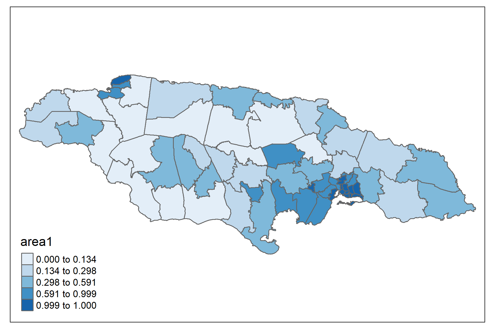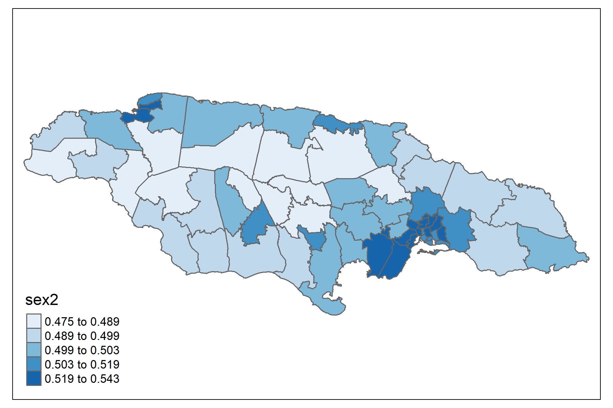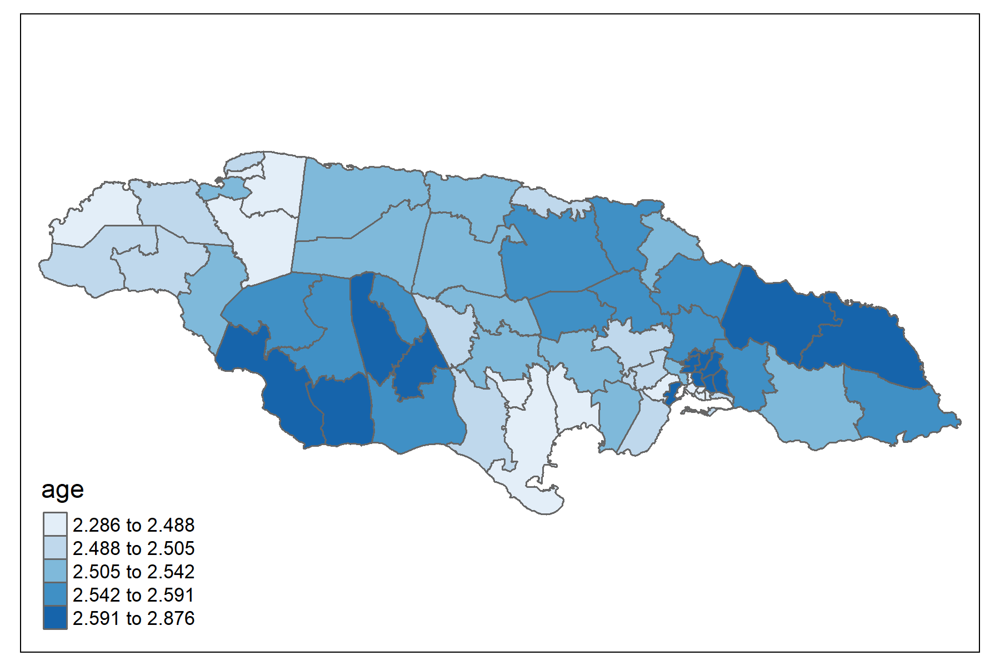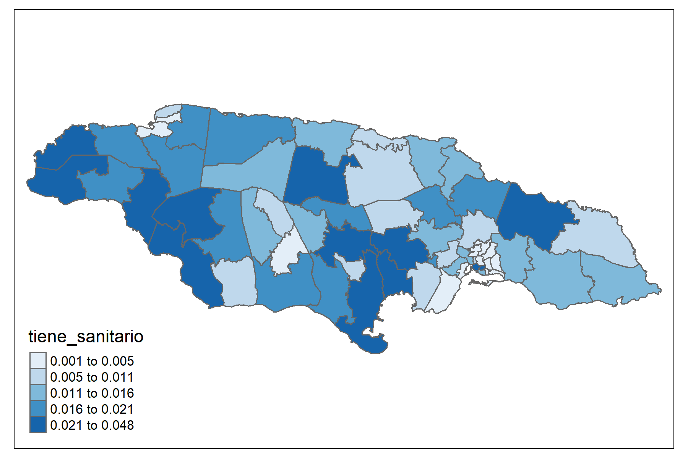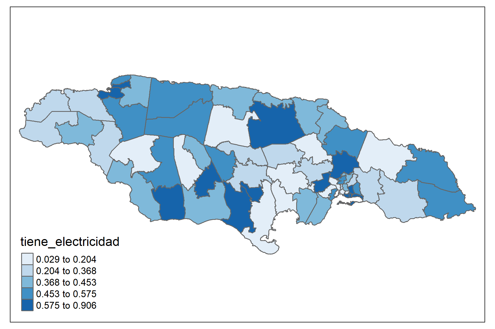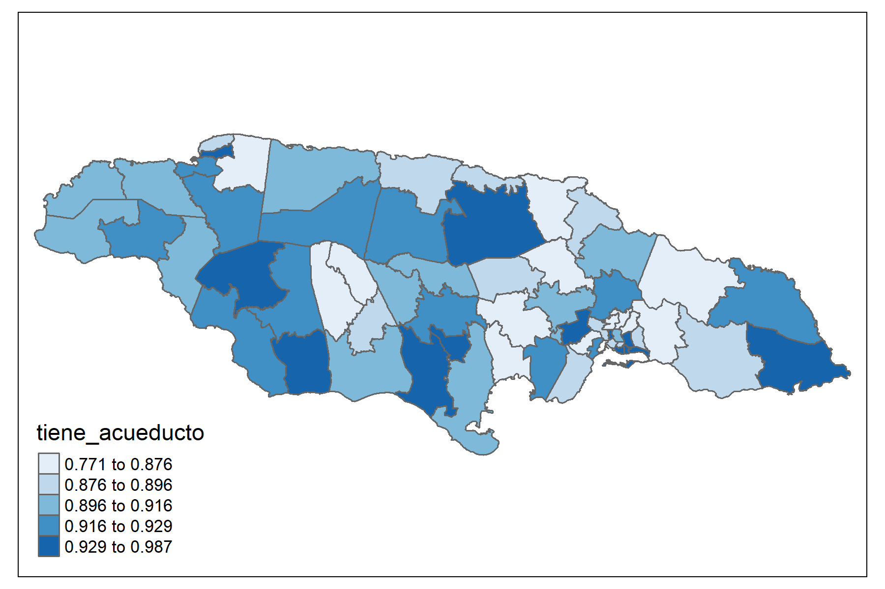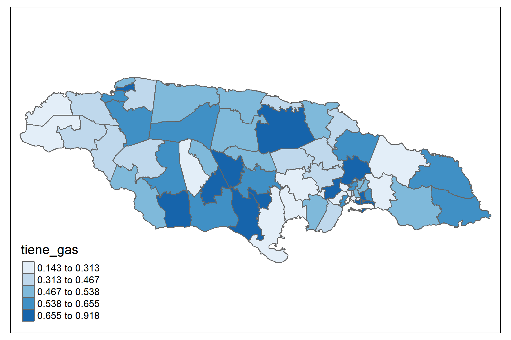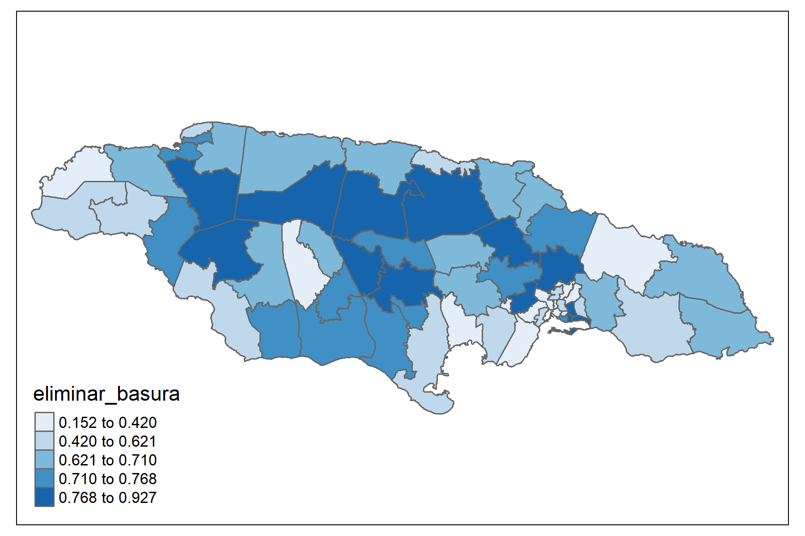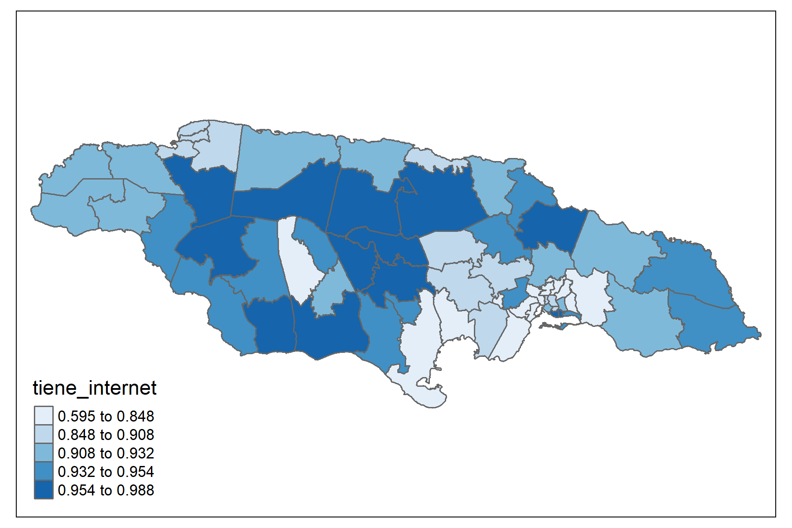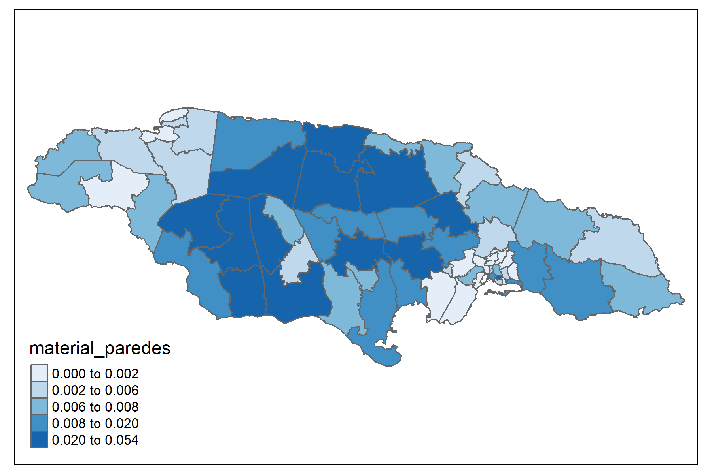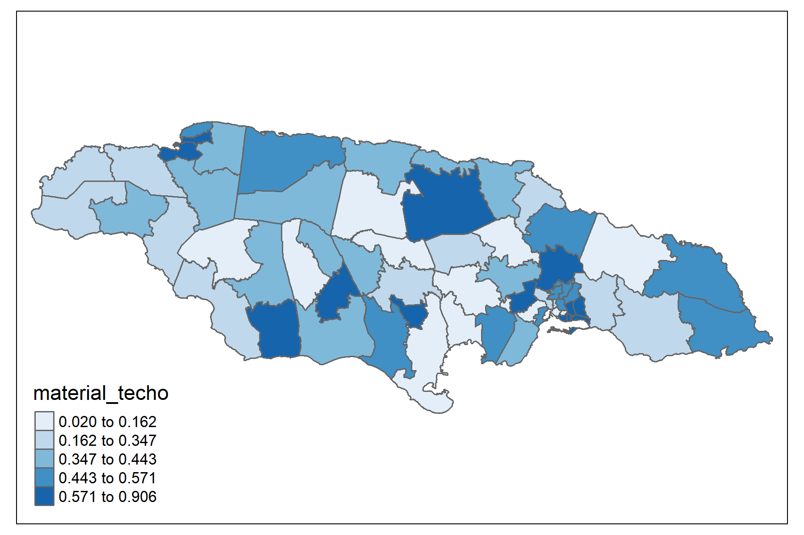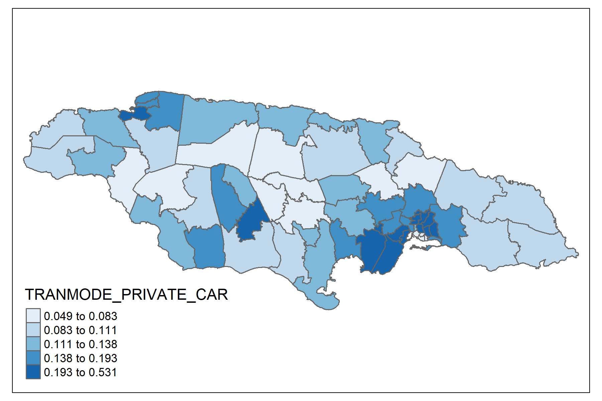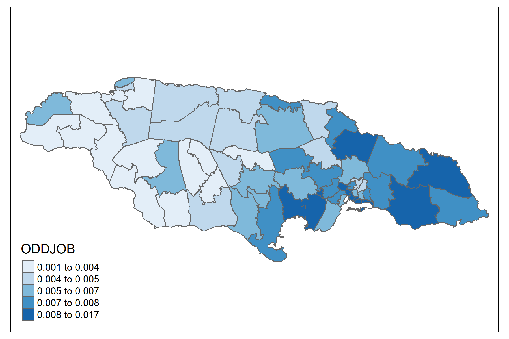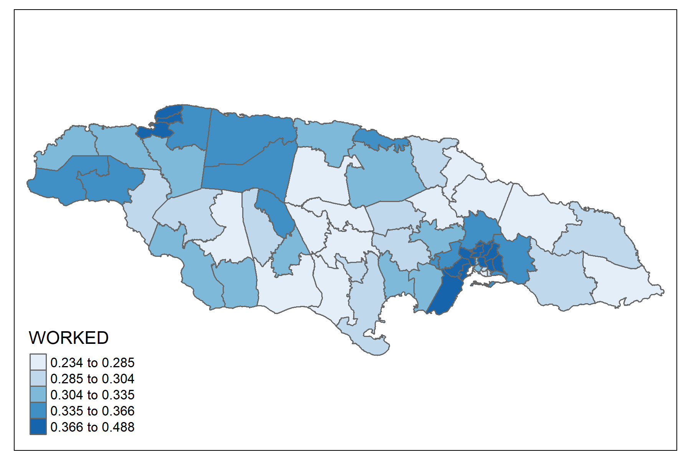

