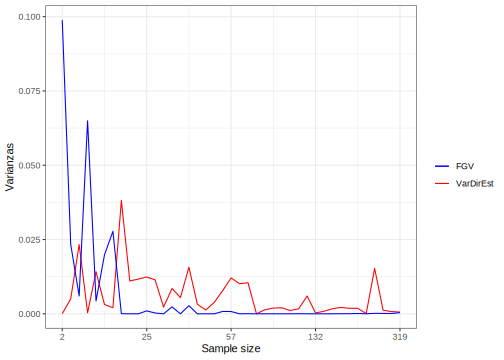

# Session 2- Generalized Variance Function


One of the most important inputs in the area model is the variance of the direct estimator at the domain level, which cannot be calculated directly. Accordingly, this value must be estimated from the data collected in each domain. However, in domains with very small sample sizes, these estimations will not perform well. Hence, it is very useful to use a **smoothing** model for variances to eliminate noise and volatility from these estimations and extract the true signal of the process.

Hidiroglou (2019) states that $E_{\mathscr{MP}}\left(\hat{\theta}^{dir}_d\right)=\boldsymbol{x}^{T}_{d}\boldsymbol{\beta}$ and $V_{\mathscr{MP}}\left(\hat{\theta}^{dir}_d\right)=\sigma_{u}^2+\tilde{\sigma}^2_{d}$, where the subscript $\mathscr{MP}$ refers to the double inference that must be taken into account in these adjustments and defines the joint probability measure between the model and the sampling design.

-   $\mathscr{M}$ refers to the probability measure induced by modeling and the inclusion of auxiliary covariates ($\boldsymbol{x}_{d}$).

-   $\mathscr{MP}$ refers to the probability measure induced by the complex sampling design that yields direct estimations.

The solution proposed here is known as the Generalized Variance Function, which involves fitting a log-linear model to the estimated direct variance. Starting from the fact that an unbiased estimator of $\sigma^2$ denoted by $\hat{\sigma}^2$ is available, it follows that:
$$
E_{\mathscr{MP}}\left(\hat{\sigma}_{d}^{2}\right)=E_{\mathscr{M}}\left(E_{\mathscr{P}}\left(\hat{\sigma}_{d}^{2}\right)\right)=E_{\mathscr{M}}\left(\sigma_{d}^{2}\right)=\tilde{\sigma}_{d}^{2}
$$

The above equality can be interpreted as an unbiased and simple estimator of $\tilde{\sigma}_{d}^{2}$, denoted as $\hat{\sigma}_{d}^{2}$. However, this sampling estimator is unstable when the sample size is small, which is precisely the dominant paradigm in small area estimation. Rivest and Belmonte (2000) consider smoothing models for the estimation of direct variances defined as follows:

$$
\log\left(\hat{\sigma}_{d}^{2}\right)=\boldsymbol{z}_{d}^{T}\boldsymbol{\alpha}+\boldsymbol{\varepsilon}_{d}
$$

Where $\boldsymbol{z}_{d}$ is a vector of explanatory covariates that are functions of $\boldsymbol{x}_{d}$, $\boldsymbol{\alpha}$ is a vector of parameters to be estimated, $\boldsymbol{\varepsilon}_{d}$ are random errors with zero mean and constant variance, assumed to be identically distributed conditionally on $\boldsymbol{z}_{d}$. From the above model, the smoothed estimation of the sampling variance is given by:

$$
\tilde{\sigma}_{d}^{2}=E_{\mathscr{MP}}\left(\sigma_{d}^{2}\right)=\exp\left(\boldsymbol{z}_{d}^{T}\boldsymbol{\alpha}\right)\times\Delta
$$

Where $E_{\mathscr{MP}}\left(\varepsilon_{d}\right)=\Delta$. There's no need to specify a parametric distribution for the errors of this model. Using the method of moments, the following unbiased estimator for $\Delta$ is obtained:

$$
\hat{\Delta}=\frac{\sum_{d=1}^{D}\hat{\sigma}_{d}^{2}}{\sum_{d=1}^{D}\exp\left(\boldsymbol{z}_{d}^{T}\boldsymbol{\alpha}\right)}
$$


Similarly, using standard procedures in linear regression, the estimation of the regression parameter coefficients is given by the following expression:

$$
\hat{\boldsymbol{\alpha}}=\left(\sum_{d=1}^{D}\boldsymbol{z}_{d}\boldsymbol{z}_{d}^{T}\right)^{-1}\sum_{d=1}^{D}\boldsymbol{z}_{d}\log\left(\hat{\sigma}_{d}^{2}\right)
$$

Finally, the smoothed estimator of the sampling variance is defined as:

$$
\hat{\tilde{\sigma}}_{d}^{2}=\exp\left(\boldsymbol{z}_{d}^{T}\hat{\boldsymbol{\alpha}}\right)\hat{\Delta}
$$

**Survey Data:**

The following code processes data using various R packages such as `survey`, `tidyverse`, `srvyr`, `TeachingSampling`, and `haven`.

1. **Library Loading:** The code loads the necessary libraries (`survey`, `tidyverse`, `srvyr`, `TeachingSampling`, `haven`) required for data manipulation and analysis.

2. **Survey Data Set Reading:** The code reads the dataset named 'data_JAM.rds' using the `readRDS` function.

3. **Data Manipulation:**
   - It creates new variables (`dam2`, `fep`, `upm`, `estrato`, `ingreso`, `pobreza`) using the `mutate` function from the `dplyr` package.
   - Filters the dataset based on a specific condition using the `filter` function.


```r
library(survey)
library(tidyverse)
library(srvyr)
library(TeachingSampling)
library(haven)
 
#read in data set

# Q518A: Gross average income From Employment
  
encuesta <- read_rds("Recursos/02_FGV/01_data_JAM.rds") 

encuesta <-
  encuesta %>%
  mutate(
    dam2,
    fep = RFACT/4,
    upm = paste0(PAR_COD , CONST_NUMBER, ED_NUMBER),
    estrato = ifelse(is.na(STRATA) ,strata,STRATA),
    ingreso = case_when(!is.na(Q518A) & !is.na(Q518B) ~ Q518A + Q518B, 
                        !is.na(Q518A) & !is.na(Q518B) ~ NA_real_,
                        !is.na(Q518A) & is.na(Q518B) ~ Q518A,
                        is.na(Q518A) & !is.na(Q518B) ~ Q518B),
    pobreza = ifelse(ingreso < 50,1,0)
  ) %>% filter(ingreso > 11)
```

*dam2*: Corresponds to the code assigned to the country's second administrative division.

**The income definition is structured in this manner to illustrate the process utilized in the small area estimation methodology for poverty estimation.**


<table class="table table-striped lightable-classic" style="width: auto !important; margin-left: auto; margin-right: auto; font-family: Arial Narrow; width: auto !important; margin-left: auto; margin-right: auto;">
 <thead>
  <tr>
   <th style="text-align:left;"> ID </th>
   <th style="text-align:right;"> QUARTER </th>
   <th style="text-align:right;"> EMPSTATUS </th>
   <th style="text-align:left;"> STRATA </th>
   <th style="text-align:left;"> CLUSTER </th>
   <th style="text-align:left;"> CONST_NUMBER </th>
   <th style="text-align:left;"> ED_NUMBER </th>
   <th style="text-align:left;"> URCODE </th>
   <th style="text-align:right;"> SEX </th>
   <th style="text-align:right;"> AGE </th>
   <th style="text-align:right;"> Q518A </th>
   <th style="text-align:right;"> Q518AP </th>
   <th style="text-align:right;"> Q518B </th>
   <th style="text-align:right;"> Q518BP </th>
   <th style="text-align:right;"> RFACT </th>
   <th style="text-align:left;"> PAR_COD </th>
   <th style="text-align:left;"> PARISH </th>
   <th style="text-align:left;"> strata </th>
   <th style="text-align:left;"> cluster </th>
   <th style="text-align:left;"> dam2 </th>
   <th style="text-align:right;"> fep </th>
   <th style="text-align:left;"> upm </th>
   <th style="text-align:left;"> estrato </th>
   <th style="text-align:right;"> ingreso </th>
   <th style="text-align:right;"> pobreza </th>
  </tr>
 </thead>
<tbody>
  <tr>
   <td style="text-align:left;"> 02010105902170101 </td>
   <td style="text-align:right;"> 3 </td>
   <td style="text-align:right;"> 5 </td>
   <td style="text-align:left;"> 014 </td>
   <td style="text-align:left;"> 014011 </td>
   <td style="text-align:left;"> 01 </td>
   <td style="text-align:left;"> 059 </td>
   <td style="text-align:left;"> 1 </td>
   <td style="text-align:right;"> 2 </td>
   <td style="text-align:right;"> 44 </td>
   <td style="text-align:right;"> 9 </td>
   <td style="text-align:right;"> NA </td>
   <td style="text-align:right;"> 9e+00 </td>
   <td style="text-align:right;"> NA </td>
   <td style="text-align:right;"> 127.4657 </td>
   <td style="text-align:left;"> 01 </td>
   <td style="text-align:left;"> Kingston </td>
   <td style="text-align:left;"> NA </td>
   <td style="text-align:left;"> NA </td>
   <td style="text-align:left;"> 0101 </td>
   <td style="text-align:right;"> 31.8664 </td>
   <td style="text-align:left;"> 0101059 </td>
   <td style="text-align:left;"> 014 </td>
   <td style="text-align:right;"> 18 </td>
   <td style="text-align:right;"> 1 </td>
  </tr>
  <tr>
   <td style="text-align:left;"> 02020207900130103 </td>
   <td style="text-align:right;"> 3 </td>
   <td style="text-align:right;"> 5 </td>
   <td style="text-align:left;"> 235 </td>
   <td style="text-align:left;"> 235472 </td>
   <td style="text-align:left;"> 02 </td>
   <td style="text-align:left;"> 079 </td>
   <td style="text-align:left;"> 2 </td>
   <td style="text-align:right;"> 1 </td>
   <td style="text-align:right;"> 36 </td>
   <td style="text-align:right;"> 0 </td>
   <td style="text-align:right;"> NA </td>
   <td style="text-align:right;"> 1e+05 </td>
   <td style="text-align:right;"> 4 </td>
   <td style="text-align:right;"> 164.6809 </td>
   <td style="text-align:left;"> 12 </td>
   <td style="text-align:left;"> Manchester </td>
   <td style="text-align:left;"> NA </td>
   <td style="text-align:left;"> NA </td>
   <td style="text-align:left;"> 1202 </td>
   <td style="text-align:right;"> 41.1702 </td>
   <td style="text-align:left;"> 1202079 </td>
   <td style="text-align:left;"> 235 </td>
   <td style="text-align:right;"> 100000 </td>
   <td style="text-align:right;"> 0 </td>
  </tr>
  <tr>
   <td style="text-align:left;"> 02020404901820105 </td>
   <td style="text-align:right;"> 3 </td>
   <td style="text-align:right;"> 5 </td>
   <td style="text-align:left;"> 239 </td>
   <td style="text-align:left;"> 239488 </td>
   <td style="text-align:left;"> 04 </td>
   <td style="text-align:left;"> 049 </td>
   <td style="text-align:left;"> 2 </td>
   <td style="text-align:right;"> 1 </td>
   <td style="text-align:right;"> 25 </td>
   <td style="text-align:right;"> NA </td>
   <td style="text-align:right;"> NA </td>
   <td style="text-align:right;"> 1e+04 </td>
   <td style="text-align:right;"> 3 </td>
   <td style="text-align:right;"> 152.1773 </td>
   <td style="text-align:left;"> 12 </td>
   <td style="text-align:left;"> Manchester </td>
   <td style="text-align:left;"> NA </td>
   <td style="text-align:left;"> NA </td>
   <td style="text-align:left;"> 1204 </td>
   <td style="text-align:right;"> 38.0443 </td>
   <td style="text-align:left;"> 1204049 </td>
   <td style="text-align:left;"> 239 </td>
   <td style="text-align:right;"> 10000 </td>
   <td style="text-align:right;"> 0 </td>
  </tr>
  <tr>
   <td style="text-align:left;"> 04010400700370102 </td>
   <td style="text-align:right;"> 3 </td>
   <td style="text-align:right;"> 5 </td>
   <td style="text-align:left;"> 036 </td>
   <td style="text-align:left;"> 036073 </td>
   <td style="text-align:left;"> 04 </td>
   <td style="text-align:left;"> 007 </td>
   <td style="text-align:left;"> 1 </td>
   <td style="text-align:right;"> 2 </td>
   <td style="text-align:right;"> 34 </td>
   <td style="text-align:right;"> 9 </td>
   <td style="text-align:right;"> NA </td>
   <td style="text-align:right;"> 9e+00 </td>
   <td style="text-align:right;"> NA </td>
   <td style="text-align:right;"> 188.7227 </td>
   <td style="text-align:left;"> 02 </td>
   <td style="text-align:left;"> St Andrew </td>
   <td style="text-align:left;"> NA </td>
   <td style="text-align:left;"> NA </td>
   <td style="text-align:left;"> 0204 </td>
   <td style="text-align:right;"> 47.1807 </td>
   <td style="text-align:left;"> 0204007 </td>
   <td style="text-align:left;"> 036 </td>
   <td style="text-align:right;"> 18 </td>
   <td style="text-align:right;"> 1 </td>
  </tr>
  <tr>
   <td style="text-align:left;"> 04030406400160106 </td>
   <td style="text-align:right;"> 3 </td>
   <td style="text-align:right;"> 5 </td>
   <td style="text-align:left;"> 221 </td>
   <td style="text-align:left;"> 221453 </td>
   <td style="text-align:left;"> 04 </td>
   <td style="text-align:left;"> 064 </td>
   <td style="text-align:left;"> 3 </td>
   <td style="text-align:right;"> 1 </td>
   <td style="text-align:right;"> 20 </td>
   <td style="text-align:right;"> 15000 </td>
   <td style="text-align:right;"> 1 </td>
   <td style="text-align:right;"> 0e+00 </td>
   <td style="text-align:right;"> NA </td>
   <td style="text-align:right;"> 308.0567 </td>
   <td style="text-align:left;"> 11 </td>
   <td style="text-align:left;"> St Elizabeth </td>
   <td style="text-align:left;"> NA </td>
   <td style="text-align:left;"> NA </td>
   <td style="text-align:left;"> 1104 </td>
   <td style="text-align:right;"> 77.0142 </td>
   <td style="text-align:left;"> 1104064 </td>
   <td style="text-align:left;"> 221 </td>
   <td style="text-align:right;"> 15000 </td>
   <td style="text-align:right;"> 0 </td>
  </tr>
  <tr>
   <td style="text-align:left;"> 05020506600550101 </td>
   <td style="text-align:right;"> 3 </td>
   <td style="text-align:right;"> 5 </td>
   <td style="text-align:left;"> 164 </td>
   <td style="text-align:left;"> 164352 </td>
   <td style="text-align:left;"> 05 </td>
   <td style="text-align:left;"> 066 </td>
   <td style="text-align:left;"> 2 </td>
   <td style="text-align:right;"> 2 </td>
   <td style="text-align:right;"> 60 </td>
   <td style="text-align:right;"> 9 </td>
   <td style="text-align:right;"> NA </td>
   <td style="text-align:right;"> 9e+00 </td>
   <td style="text-align:right;"> NA </td>
   <td style="text-align:right;"> 94.0227 </td>
   <td style="text-align:left;"> 08 </td>
   <td style="text-align:left;"> St James </td>
   <td style="text-align:left;"> NA </td>
   <td style="text-align:left;"> NA </td>
   <td style="text-align:left;"> 0805 </td>
   <td style="text-align:right;"> 23.5057 </td>
   <td style="text-align:left;"> 0805066 </td>
   <td style="text-align:left;"> 164 </td>
   <td style="text-align:right;"> 18 </td>
   <td style="text-align:right;"> 1 </td>
  </tr>
  <tr>
   <td style="text-align:left;"> 06030106300920101 </td>
   <td style="text-align:right;"> 3 </td>
   <td style="text-align:right;"> 5 </td>
   <td style="text-align:left;"> 122 </td>
   <td style="text-align:left;"> 122227 </td>
   <td style="text-align:left;"> 01 </td>
   <td style="text-align:left;"> 063 </td>
   <td style="text-align:left;"> 3 </td>
   <td style="text-align:right;"> 1 </td>
   <td style="text-align:right;"> 44 </td>
   <td style="text-align:right;"> 9 </td>
   <td style="text-align:right;"> NA </td>
   <td style="text-align:right;"> 9e+00 </td>
   <td style="text-align:right;"> NA </td>
   <td style="text-align:right;"> 252.1380 </td>
   <td style="text-align:left;"> 05 </td>
   <td style="text-align:left;"> St Mary </td>
   <td style="text-align:left;"> NA </td>
   <td style="text-align:left;"> NA </td>
   <td style="text-align:left;"> 0501 </td>
   <td style="text-align:right;"> 63.0345 </td>
   <td style="text-align:left;"> 0501063 </td>
   <td style="text-align:left;"> 122 </td>
   <td style="text-align:right;"> 18 </td>
   <td style="text-align:right;"> 1 </td>
  </tr>
  <tr>
   <td style="text-align:left;"> 06030200300140102 </td>
   <td style="text-align:right;"> 3 </td>
   <td style="text-align:right;"> 5 </td>
   <td style="text-align:left;"> 228 </td>
   <td style="text-align:left;"> 228464 </td>
   <td style="text-align:left;"> 02 </td>
   <td style="text-align:left;"> 003 </td>
   <td style="text-align:left;"> 3 </td>
   <td style="text-align:right;"> 2 </td>
   <td style="text-align:right;"> 70 </td>
   <td style="text-align:right;"> 9 </td>
   <td style="text-align:right;"> NA </td>
   <td style="text-align:right;"> 9e+00 </td>
   <td style="text-align:right;"> NA </td>
   <td style="text-align:right;"> 49.1197 </td>
   <td style="text-align:left;"> 12 </td>
   <td style="text-align:left;"> Manchester </td>
   <td style="text-align:left;"> NA </td>
   <td style="text-align:left;"> NA </td>
   <td style="text-align:left;"> 1202 </td>
   <td style="text-align:right;"> 12.2799 </td>
   <td style="text-align:left;"> 1202003 </td>
   <td style="text-align:left;"> 228 </td>
   <td style="text-align:right;"> 18 </td>
   <td style="text-align:right;"> 1 </td>
  </tr>
  <tr>
   <td style="text-align:left;"> 06030204100960101 </td>
   <td style="text-align:right;"> 3 </td>
   <td style="text-align:right;"> 5 </td>
   <td style="text-align:left;"> 084 </td>
   <td style="text-align:left;"> 084180 </td>
   <td style="text-align:left;"> 02 </td>
   <td style="text-align:left;"> 041 </td>
   <td style="text-align:left;"> 3 </td>
   <td style="text-align:right;"> 2 </td>
   <td style="text-align:right;"> 54 </td>
   <td style="text-align:right;"> 9 </td>
   <td style="text-align:right;"> NA </td>
   <td style="text-align:right;"> 9e+00 </td>
   <td style="text-align:right;"> NA </td>
   <td style="text-align:right;"> 97.2597 </td>
   <td style="text-align:left;"> 03 </td>
   <td style="text-align:left;"> St Thomas </td>
   <td style="text-align:left;"> NA </td>
   <td style="text-align:left;"> NA </td>
   <td style="text-align:left;"> 0302 </td>
   <td style="text-align:right;"> 24.3149 </td>
   <td style="text-align:left;"> 0302041 </td>
   <td style="text-align:left;"> 084 </td>
   <td style="text-align:right;"> 18 </td>
   <td style="text-align:right;"> 1 </td>
  </tr>
  <tr>
   <td style="text-align:left;"> 06030208501550102 </td>
   <td style="text-align:right;"> 3 </td>
   <td style="text-align:right;"> 5 </td>
   <td style="text-align:left;"> 234 </td>
   <td style="text-align:left;"> 234474 </td>
   <td style="text-align:left;"> 02 </td>
   <td style="text-align:left;"> 085 </td>
   <td style="text-align:left;"> 3 </td>
   <td style="text-align:right;"> 2 </td>
   <td style="text-align:right;"> 77 </td>
   <td style="text-align:right;"> 0 </td>
   <td style="text-align:right;"> NA </td>
   <td style="text-align:right;"> 3e+04 </td>
   <td style="text-align:right;"> 2 </td>
   <td style="text-align:right;"> 70.9262 </td>
   <td style="text-align:left;"> 12 </td>
   <td style="text-align:left;"> Manchester </td>
   <td style="text-align:left;"> NA </td>
   <td style="text-align:left;"> NA </td>
   <td style="text-align:left;"> 1202 </td>
   <td style="text-align:right;"> 17.7315 </td>
   <td style="text-align:left;"> 1202085 </td>
   <td style="text-align:left;"> 234 </td>
   <td style="text-align:right;"> 30000 </td>
   <td style="text-align:right;"> 0 </td>
  </tr>
</tbody>
</table>

In the following code block, the libraries `survey` and `srvyr` are used to create a sampling design from a survey database. The sampling design encompasses information about primary sampling units (PSUs), sampling weights (wkx), and strata (estrato) utilized in the sampling. Additionally, the "survey.lonely.psu" option is employed to adjust sample sizes within groups of primary sampling units that lack other primary sampling units within the same group.


```r
library(survey)
library(srvyr)
options(survey.lonely.psu = "adjust")
id_dominio <- "dam2"

diseno <-
  as_survey_design(
    ids = upm,
    weights = fep,
    strata = estrato,
    nest = TRUE,
    .data = encuesta
  )

#summary(diseno)
```
´

1. **Indicator Calculation:**
   - Groups the sampling design by domain ID and calculates indicators related to poverty (`n_pobreza` and `pobreza`). `n_pobreza` counts the number of instances where `pobreza` equals 1 (indicating poverty), while `pobreza` computes the survey mean of the `pobreza` variable with specific variance estimations.


```r
# Calculating indicators related to poverty and counts of UPMS per domain

# Indicator Calculation:
# Grouping the sampling design by domain ID and summarizing variables related to poverty.
indicador_dam <-
  diseno %>% group_by_at(id_dominio) %>% 
  summarise(
    n_pobreza = unweighted(sum(pobreza == 1)),
    pobreza = survey_mean(pobreza,
                          vartype = c("se",  "var"),
                          deff = T
    )
  )
```

2. **Counts of UPMS per Domain:**
   - Extracts domain ID and UPMs from the survey dataset, obtaining unique UPMs per domain and counting them.
   - Joins the count of unique UPMs per domain with the previously calculated indicators related to poverty.


```r
# Counts of UPMS per domain:
# Selecting domain ID and UPMs, obtaining unique UPMs per domain, and counting them.
# Joining the count of unique UPMs per domain with previously calculated indicators related to poverty.
indicador_dam <- encuesta %>% select(id_dominio, upm) %>%
  distinct() %>% 
  group_by_at(id_dominio) %>% 
  tally(name = "n_upm") %>% 
  inner_join(indicador_dam, by = id_dominio)
# saveRDS(directodam2, "Recursos/02_FGV/indicador_dam.Rds")
```

<table class="table table-striped lightable-classic" style="width: auto !important; margin-left: auto; margin-right: auto; font-family: Arial Narrow; width: auto !important; margin-left: auto; margin-right: auto;">
 <thead>
  <tr>
   <th style="text-align:left;"> dam2 </th>
   <th style="text-align:right;"> n_upm </th>
   <th style="text-align:right;"> n_pobreza </th>
   <th style="text-align:right;"> pobreza </th>
   <th style="text-align:right;"> pobreza_se </th>
   <th style="text-align:right;"> pobreza_var </th>
   <th style="text-align:right;"> pobreza_deff </th>
  </tr>
 </thead>
<tbody>
  <tr>
   <td style="text-align:left;"> 0101 </td>
   <td style="text-align:right;"> 17 </td>
   <td style="text-align:right;"> 237 </td>
   <td style="text-align:right;"> 0.9980 </td>
   <td style="text-align:right;"> 0.0021 </td>
   <td style="text-align:right;"> 0.0000 </td>
   <td style="text-align:right;"> 5.228000e-01 </td>
  </tr>
  <tr>
   <td style="text-align:left;"> 0102 </td>
   <td style="text-align:right;"> 12 </td>
   <td style="text-align:right;"> 197 </td>
   <td style="text-align:right;"> 0.9836 </td>
   <td style="text-align:right;"> 0.0089 </td>
   <td style="text-align:right;"> 0.0001 </td>
   <td style="text-align:right;"> 1.053700e+00 </td>
  </tr>
  <tr>
   <td style="text-align:left;"> 0103 </td>
   <td style="text-align:right;"> 9 </td>
   <td style="text-align:right;"> 65 </td>
   <td style="text-align:right;"> 1.0000 </td>
   <td style="text-align:right;"> 0.0000 </td>
   <td style="text-align:right;"> 0.0000 </td>
   <td style="text-align:right;"> 3.065785e+32 </td>
  </tr>
  <tr>
   <td style="text-align:left;"> 0201 </td>
   <td style="text-align:right;"> 11 </td>
   <td style="text-align:right;"> 244 </td>
   <td style="text-align:right;"> 1.0000 </td>
   <td style="text-align:right;"> 0.0000 </td>
   <td style="text-align:right;"> 0.0000 </td>
   <td style="text-align:right;"> NaN </td>
  </tr>
  <tr>
   <td style="text-align:left;"> 0202 </td>
   <td style="text-align:right;"> 11 </td>
   <td style="text-align:right;"> 141 </td>
   <td style="text-align:right;"> 0.9391 </td>
   <td style="text-align:right;"> 0.0292 </td>
   <td style="text-align:right;"> 0.0009 </td>
   <td style="text-align:right;"> 2.317700e+00 </td>
  </tr>
  <tr>
   <td style="text-align:left;"> 0203 </td>
   <td style="text-align:right;"> 12 </td>
   <td style="text-align:right;"> 101 </td>
   <td style="text-align:right;"> 0.8117 </td>
   <td style="text-align:right;"> 0.0775 </td>
   <td style="text-align:right;"> 0.0060 </td>
   <td style="text-align:right;"> 4.795200e+00 </td>
  </tr>
  <tr>
   <td style="text-align:left;"> 0204 </td>
   <td style="text-align:right;"> 11 </td>
   <td style="text-align:right;"> 224 </td>
   <td style="text-align:right;"> 1.0000 </td>
   <td style="text-align:right;"> 0.0000 </td>
   <td style="text-align:right;"> 0.0000 </td>
   <td style="text-align:right;"> NaN </td>
  </tr>
  <tr>
   <td style="text-align:left;"> 0205 </td>
   <td style="text-align:right;"> 9 </td>
   <td style="text-align:right;"> 85 </td>
   <td style="text-align:right;"> 0.9646 </td>
   <td style="text-align:right;"> 0.0331 </td>
   <td style="text-align:right;"> 0.0011 </td>
   <td style="text-align:right;"> 2.932600e+00 </td>
  </tr>
  <tr>
   <td style="text-align:left;"> 0206 </td>
   <td style="text-align:right;"> 8 </td>
   <td style="text-align:right;"> 102 </td>
   <td style="text-align:right;"> 1.0000 </td>
   <td style="text-align:right;"> 0.0000 </td>
   <td style="text-align:right;"> 0.0000 </td>
   <td style="text-align:right;"> NaN </td>
  </tr>
  <tr>
   <td style="text-align:left;"> 0207 </td>
   <td style="text-align:right;"> 11 </td>
   <td style="text-align:right;"> 149 </td>
   <td style="text-align:right;"> 1.0000 </td>
   <td style="text-align:right;"> 0.0000 </td>
   <td style="text-align:right;"> 0.0000 </td>
   <td style="text-align:right;"> NaN </td>
  </tr>
</tbody>
</table>

Domains with 5 or more UPMs and all those with a deff greater than 1 are now filtered.


```r
base_sae <- indicador_dam %>%
  filter(n_upm >= 5,
         pobreza_deff > 1) 
```


Next, the transformation $\log(\hat{\sigma}^2_d)$ is performed. Additionally, the selection of the municipality identifier columns (`dam2`), the direct estimation (`pobreza`), the number of people in the domain (`nd`), and the estimated variance for the direct estimation (`vardir`) is carried out, the latter being transformed using the `log()` function.


```r
baseFGV <-  base_sae %>% 
  select(dam2, pobreza, nd = n_pobreza, vardir = pobreza_var) %>%
  mutate(ln_sigma2 = log(vardir))
```

## Graphical Analysis

The first graph, `p1`, displays a scatter plot of the variable `ln_sigma2` against the variable `pobreza`, with a smooth line representing a trend estimation. The x-axis is labeled as _pobreza_.

The second graph, `p2`, exhibits a scatter plot of the variable `ln_sigma2` against the variable `nd`, with a smooth line indicating a trend estimation. The x-axis is labeled as _Tamaño de muestra_ (Sample Size).

The third graph, `p3`, demonstrates a scatter plot of the variable `ln_sigma2` in relation to the product of `pobreza` and `nd`, with a smooth line representing a trend estimation. The x-axis is labeled as _Número de pobres_ (Number of Poor).

The fourth graph, `p4`, shows a scatter plot of the variable `ln_sigma2` against the square root of the variable `pobreza`, with a smooth line representing a trend estimation. The x-axis is labeled as _Raiz cuadrada de pobreza_ (Square Root of Poverty).

Overall, these graphs are designed to explore the relationship between `ln_sigma2` and different independent variables such as `pobreza`, `nd`, and the square root of poverty. Choosing to use the "loess" function to smooth the lines instead of a straight line aids in visualizing general trends in the data more effectively.


```r
theme_set(theme_bw())

# pobreza vs Ln_sigma2 #
p1 <- ggplot(baseFGV, aes(x = pobreza, y = ln_sigma2)) +
  geom_point() +
  geom_smooth(method = "loess") +
  xlab("poverty")

# Sample Size vs Ln_sigma2 #
p2 <- ggplot(baseFGV, aes(x = nd, y = ln_sigma2)) + 
  geom_point() +
  geom_smooth(method = "loess") + 
  xlab("Sample size")

# Number of Poor vs Ln_sigma2 #
p3 <- ggplot(baseFGV, aes(x = pobreza * nd, y = ln_sigma2)) + 
  geom_point() +
  geom_smooth(method = "loess") + 
  xlab("Number of poor")

# Square Root of Poverty vs Ln_sigma2 #
p4 <- ggplot(baseFGV, aes(x = sqrt(pobreza), y = ln_sigma2)) + 
  geom_point() +
  geom_smooth(method = "loess") + 
  xlab("Square root of poverty")

library(patchwork)
(p1 | p2) / (p3 | p4)
```


## Variance Model

The code fits a multiple linear regression model (using the `lm()` function), where `ln_sigma2` is the response variable and the predictor variables include `pobreza`, `nd`, and various transformations of these variables. The goal of this model is to estimate the generalized variance function (FGV) for the observed domains.


```r
library(gtsummary)
FGV1 <- lm(ln_sigma2 ~ -1 +  pobreza +
             I(pobreza*nd),
     data = baseFGV)

tbl_regression(FGV1) %>% 
  add_glance_table(include = c(r.squared, adj.r.squared))
```

```{=html}
<div id="obmyhrpwpc" style="padding-left:0px;padding-right:0px;padding-top:10px;padding-bottom:10px;overflow-x:auto;overflow-y:auto;width:auto;height:auto;">
<style>#obmyhrpwpc table {
  font-family: system-ui, 'Segoe UI', Roboto, Helvetica, Arial, sans-serif, 'Apple Color Emoji', 'Segoe UI Emoji', 'Segoe UI Symbol', 'Noto Color Emoji';
  -webkit-font-smoothing: antialiased;
  -moz-osx-font-smoothing: grayscale;
}

#obmyhrpwpc thead, #obmyhrpwpc tbody, #obmyhrpwpc tfoot, #obmyhrpwpc tr, #obmyhrpwpc td, #obmyhrpwpc th {
  border-style: none;
}

#obmyhrpwpc p {
  margin: 0;
  padding: 0;
}

#obmyhrpwpc .gt_table {
  display: table;
  border-collapse: collapse;
  line-height: normal;
  margin-left: auto;
  margin-right: auto;
  color: #333333;
  font-size: 16px;
  font-weight: normal;
  font-style: normal;
  background-color: #FFFFFF;
  width: auto;
  border-top-style: solid;
  border-top-width: 2px;
  border-top-color: #A8A8A8;
  border-right-style: none;
  border-right-width: 2px;
  border-right-color: #D3D3D3;
  border-bottom-style: solid;
  border-bottom-width: 2px;
  border-bottom-color: #A8A8A8;
  border-left-style: none;
  border-left-width: 2px;
  border-left-color: #D3D3D3;
}

#obmyhrpwpc .gt_caption {
  padding-top: 4px;
  padding-bottom: 4px;
}

#obmyhrpwpc .gt_title {
  color: #333333;
  font-size: 125%;
  font-weight: initial;
  padding-top: 4px;
  padding-bottom: 4px;
  padding-left: 5px;
  padding-right: 5px;
  border-bottom-color: #FFFFFF;
  border-bottom-width: 0;
}

#obmyhrpwpc .gt_subtitle {
  color: #333333;
  font-size: 85%;
  font-weight: initial;
  padding-top: 3px;
  padding-bottom: 5px;
  padding-left: 5px;
  padding-right: 5px;
  border-top-color: #FFFFFF;
  border-top-width: 0;
}

#obmyhrpwpc .gt_heading {
  background-color: #FFFFFF;
  text-align: center;
  border-bottom-color: #FFFFFF;
  border-left-style: none;
  border-left-width: 1px;
  border-left-color: #D3D3D3;
  border-right-style: none;
  border-right-width: 1px;
  border-right-color: #D3D3D3;
}

#obmyhrpwpc .gt_bottom_border {
  border-bottom-style: solid;
  border-bottom-width: 2px;
  border-bottom-color: #D3D3D3;
}

#obmyhrpwpc .gt_col_headings {
  border-top-style: solid;
  border-top-width: 2px;
  border-top-color: #D3D3D3;
  border-bottom-style: solid;
  border-bottom-width: 2px;
  border-bottom-color: #D3D3D3;
  border-left-style: none;
  border-left-width: 1px;
  border-left-color: #D3D3D3;
  border-right-style: none;
  border-right-width: 1px;
  border-right-color: #D3D3D3;
}

#obmyhrpwpc .gt_col_heading {
  color: #333333;
  background-color: #FFFFFF;
  font-size: 100%;
  font-weight: normal;
  text-transform: inherit;
  border-left-style: none;
  border-left-width: 1px;
  border-left-color: #D3D3D3;
  border-right-style: none;
  border-right-width: 1px;
  border-right-color: #D3D3D3;
  vertical-align: bottom;
  padding-top: 5px;
  padding-bottom: 6px;
  padding-left: 5px;
  padding-right: 5px;
  overflow-x: hidden;
}

#obmyhrpwpc .gt_column_spanner_outer {
  color: #333333;
  background-color: #FFFFFF;
  font-size: 100%;
  font-weight: normal;
  text-transform: inherit;
  padding-top: 0;
  padding-bottom: 0;
  padding-left: 4px;
  padding-right: 4px;
}

#obmyhrpwpc .gt_column_spanner_outer:first-child {
  padding-left: 0;
}

#obmyhrpwpc .gt_column_spanner_outer:last-child {
  padding-right: 0;
}

#obmyhrpwpc .gt_column_spanner {
  border-bottom-style: solid;
  border-bottom-width: 2px;
  border-bottom-color: #D3D3D3;
  vertical-align: bottom;
  padding-top: 5px;
  padding-bottom: 5px;
  overflow-x: hidden;
  display: inline-block;
  width: 100%;
}

#obmyhrpwpc .gt_spanner_row {
  border-bottom-style: hidden;
}

#obmyhrpwpc .gt_group_heading {
  padding-top: 8px;
  padding-bottom: 8px;
  padding-left: 5px;
  padding-right: 5px;
  color: #333333;
  background-color: #FFFFFF;
  font-size: 100%;
  font-weight: initial;
  text-transform: inherit;
  border-top-style: solid;
  border-top-width: 2px;
  border-top-color: #D3D3D3;
  border-bottom-style: solid;
  border-bottom-width: 2px;
  border-bottom-color: #D3D3D3;
  border-left-style: none;
  border-left-width: 1px;
  border-left-color: #D3D3D3;
  border-right-style: none;
  border-right-width: 1px;
  border-right-color: #D3D3D3;
  vertical-align: middle;
  text-align: left;
}

#obmyhrpwpc .gt_empty_group_heading {
  padding: 0.5px;
  color: #333333;
  background-color: #FFFFFF;
  font-size: 100%;
  font-weight: initial;
  border-top-style: solid;
  border-top-width: 2px;
  border-top-color: #D3D3D3;
  border-bottom-style: solid;
  border-bottom-width: 2px;
  border-bottom-color: #D3D3D3;
  vertical-align: middle;
}

#obmyhrpwpc .gt_from_md > :first-child {
  margin-top: 0;
}

#obmyhrpwpc .gt_from_md > :last-child {
  margin-bottom: 0;
}

#obmyhrpwpc .gt_row {
  padding-top: 8px;
  padding-bottom: 8px;
  padding-left: 5px;
  padding-right: 5px;
  margin: 10px;
  border-top-style: solid;
  border-top-width: 1px;
  border-top-color: #D3D3D3;
  border-left-style: none;
  border-left-width: 1px;
  border-left-color: #D3D3D3;
  border-right-style: none;
  border-right-width: 1px;
  border-right-color: #D3D3D3;
  vertical-align: middle;
  overflow-x: hidden;
}

#obmyhrpwpc .gt_stub {
  color: #333333;
  background-color: #FFFFFF;
  font-size: 100%;
  font-weight: initial;
  text-transform: inherit;
  border-right-style: solid;
  border-right-width: 2px;
  border-right-color: #D3D3D3;
  padding-left: 5px;
  padding-right: 5px;
}

#obmyhrpwpc .gt_stub_row_group {
  color: #333333;
  background-color: #FFFFFF;
  font-size: 100%;
  font-weight: initial;
  text-transform: inherit;
  border-right-style: solid;
  border-right-width: 2px;
  border-right-color: #D3D3D3;
  padding-left: 5px;
  padding-right: 5px;
  vertical-align: top;
}

#obmyhrpwpc .gt_row_group_first td {
  border-top-width: 2px;
}

#obmyhrpwpc .gt_row_group_first th {
  border-top-width: 2px;
}

#obmyhrpwpc .gt_summary_row {
  color: #333333;
  background-color: #FFFFFF;
  text-transform: inherit;
  padding-top: 8px;
  padding-bottom: 8px;
  padding-left: 5px;
  padding-right: 5px;
}

#obmyhrpwpc .gt_first_summary_row {
  border-top-style: solid;
  border-top-color: #D3D3D3;
}

#obmyhrpwpc .gt_first_summary_row.thick {
  border-top-width: 2px;
}

#obmyhrpwpc .gt_last_summary_row {
  padding-top: 8px;
  padding-bottom: 8px;
  padding-left: 5px;
  padding-right: 5px;
  border-bottom-style: solid;
  border-bottom-width: 2px;
  border-bottom-color: #D3D3D3;
}

#obmyhrpwpc .gt_grand_summary_row {
  color: #333333;
  background-color: #FFFFFF;
  text-transform: inherit;
  padding-top: 8px;
  padding-bottom: 8px;
  padding-left: 5px;
  padding-right: 5px;
}

#obmyhrpwpc .gt_first_grand_summary_row {
  padding-top: 8px;
  padding-bottom: 8px;
  padding-left: 5px;
  padding-right: 5px;
  border-top-style: double;
  border-top-width: 6px;
  border-top-color: #D3D3D3;
}

#obmyhrpwpc .gt_last_grand_summary_row_top {
  padding-top: 8px;
  padding-bottom: 8px;
  padding-left: 5px;
  padding-right: 5px;
  border-bottom-style: double;
  border-bottom-width: 6px;
  border-bottom-color: #D3D3D3;
}

#obmyhrpwpc .gt_striped {
  background-color: rgba(128, 128, 128, 0.05);
}

#obmyhrpwpc .gt_table_body {
  border-top-style: solid;
  border-top-width: 2px;
  border-top-color: #D3D3D3;
  border-bottom-style: solid;
  border-bottom-width: 2px;
  border-bottom-color: #D3D3D3;
}

#obmyhrpwpc .gt_footnotes {
  color: #333333;
  background-color: #FFFFFF;
  border-bottom-style: none;
  border-bottom-width: 2px;
  border-bottom-color: #D3D3D3;
  border-left-style: none;
  border-left-width: 2px;
  border-left-color: #D3D3D3;
  border-right-style: none;
  border-right-width: 2px;
  border-right-color: #D3D3D3;
}

#obmyhrpwpc .gt_footnote {
  margin: 0px;
  font-size: 90%;
  padding-top: 4px;
  padding-bottom: 4px;
  padding-left: 5px;
  padding-right: 5px;
}

#obmyhrpwpc .gt_sourcenotes {
  color: #333333;
  background-color: #FFFFFF;
  border-bottom-style: none;
  border-bottom-width: 2px;
  border-bottom-color: #D3D3D3;
  border-left-style: none;
  border-left-width: 2px;
  border-left-color: #D3D3D3;
  border-right-style: none;
  border-right-width: 2px;
  border-right-color: #D3D3D3;
}

#obmyhrpwpc .gt_sourcenote {
  font-size: 90%;
  padding-top: 4px;
  padding-bottom: 4px;
  padding-left: 5px;
  padding-right: 5px;
}

#obmyhrpwpc .gt_left {
  text-align: left;
}

#obmyhrpwpc .gt_center {
  text-align: center;
}

#obmyhrpwpc .gt_right {
  text-align: right;
  font-variant-numeric: tabular-nums;
}

#obmyhrpwpc .gt_font_normal {
  font-weight: normal;
}

#obmyhrpwpc .gt_font_bold {
  font-weight: bold;
}

#obmyhrpwpc .gt_font_italic {
  font-style: italic;
}

#obmyhrpwpc .gt_super {
  font-size: 65%;
}

#obmyhrpwpc .gt_footnote_marks {
  font-size: 75%;
  vertical-align: 0.4em;
  position: initial;
}

#obmyhrpwpc .gt_asterisk {
  font-size: 100%;
  vertical-align: 0;
}

#obmyhrpwpc .gt_indent_1 {
  text-indent: 5px;
}

#obmyhrpwpc .gt_indent_2 {
  text-indent: 10px;
}

#obmyhrpwpc .gt_indent_3 {
  text-indent: 15px;
}

#obmyhrpwpc .gt_indent_4 {
  text-indent: 20px;
}

#obmyhrpwpc .gt_indent_5 {
  text-indent: 25px;
}
</style>
<table class="gt_table" data-quarto-disable-processing="false" data-quarto-bootstrap="false">
  <thead>
    
    <tr class="gt_col_headings">
      <th class="gt_col_heading gt_columns_bottom_border gt_left" rowspan="1" colspan="1" scope="col" id="&lt;strong&gt;Characteristic&lt;/strong&gt;"><strong>Characteristic</strong></th>
      <th class="gt_col_heading gt_columns_bottom_border gt_center" rowspan="1" colspan="1" scope="col" id="&lt;strong&gt;Beta&lt;/strong&gt;"><strong>Beta</strong></th>
      <th class="gt_col_heading gt_columns_bottom_border gt_center" rowspan="1" colspan="1" scope="col" id="&lt;strong&gt;95% CI&lt;/strong&gt;&lt;span class=&quot;gt_footnote_marks&quot; style=&quot;white-space:nowrap;font-style:italic;font-weight:normal;&quot;&gt;&lt;sup&gt;1&lt;/sup&gt;&lt;/span&gt;"><strong>95% CI</strong><span class="gt_footnote_marks" style="white-space:nowrap;font-style:italic;font-weight:normal;"><sup>1</sup></span></th>
      <th class="gt_col_heading gt_columns_bottom_border gt_center" rowspan="1" colspan="1" scope="col" id="&lt;strong&gt;p-value&lt;/strong&gt;"><strong>p-value</strong></th>
    </tr>
  </thead>
  <tbody class="gt_table_body">
    <tr><td headers="label" class="gt_row gt_left">pobreza</td>
<td headers="estimate" class="gt_row gt_center">-12</td>
<td headers="ci" class="gt_row gt_center">-20, -4.5</td>
<td headers="p.value" class="gt_row gt_center">0.003</td></tr>
    <tr><td headers="label" class="gt_row gt_left">I(pobreza * nd)</td>
<td headers="estimate" class="gt_row gt_center">0.02</td>
<td headers="ci" class="gt_row gt_center">-0.04, 0.07</td>
<td headers="p.value" class="gt_row gt_center">0.5</td></tr>
    <tr><td headers="label" class="gt_row gt_left" style="border-top-width: 2px; border-top-style: solid; border-top-color: #D3D3D3;">R²</td>
<td headers="estimate" class="gt_row gt_center" style="border-top-width: 2px; border-top-style: solid; border-top-color: #D3D3D3;">0.345</td>
<td headers="ci" class="gt_row gt_center" style="border-top-width: 2px; border-top-style: solid; border-top-color: #D3D3D3;"><br /></td>
<td headers="p.value" class="gt_row gt_center" style="border-top-width: 2px; border-top-style: solid; border-top-color: #D3D3D3;"><br /></td></tr>
    <tr><td headers="label" class="gt_row gt_left">Adjusted R²</td>
<td headers="estimate" class="gt_row gt_center">0.311</td>
<td headers="ci" class="gt_row gt_center"><br /></td>
<td headers="p.value" class="gt_row gt_center"><br /></td></tr>
  </tbody>
  
  <tfoot class="gt_footnotes">
    <tr>
      <td class="gt_footnote" colspan="4"><span class="gt_footnote_marks" style="white-space:nowrap;font-style:italic;font-weight:normal;"><sup>1</sup></span> CI = Confidence Interval</td>
    </tr>
  </tfoot>
</table>
</div>
```

After obtaining the model estimation, the value of the constant $\Delta$ must be obtained, for which the following code is used.


```r
delta.hat = sum(baseFGV$vardir) / 
  sum(exp(fitted.values(FGV1)))
```


From which it is derived that $\Delta = 0.110434$. Finally, it is possible to obtain the smoothed variance by executing the following command.


```r
hat.sigma <- 
  data.frame(dam2 = baseFGV$dam2,
             hat_var = delta.hat * exp(fitted.values(FGV1)))

baseFGV <- left_join(baseFGV, hat.sigma)
tba(head(baseFGV, 10))
```

<table class="table table-striped lightable-classic" style="width: auto !important; margin-left: auto; margin-right: auto; font-family: Arial Narrow; width: auto !important; margin-left: auto; margin-right: auto;">
 <thead>
  <tr>
   <th style="text-align:left;"> dam2 </th>
   <th style="text-align:right;"> pobreza </th>
   <th style="text-align:right;"> nd </th>
   <th style="text-align:right;"> vardir </th>
   <th style="text-align:right;"> ln_sigma2 </th>
   <th style="text-align:right;"> hat_var </th>
  </tr>
 </thead>
<tbody>
  <tr>
   <td style="text-align:left;"> 0102 </td>
   <td style="text-align:right;"> 0.9836 </td>
   <td style="text-align:right;"> 197 </td>
   <td style="text-align:right;"> 0.0001 </td>
   <td style="text-align:right;"> -9.4372 </td>
   <td style="text-align:right;"> 0e+00 </td>
  </tr>
  <tr>
   <td style="text-align:left;"> 0103 </td>
   <td style="text-align:right;"> 1.0000 </td>
   <td style="text-align:right;"> 65 </td>
   <td style="text-align:right;"> 0.0000 </td>
   <td style="text-align:right;"> -76.3620 </td>
   <td style="text-align:right;"> 0e+00 </td>
  </tr>
  <tr>
   <td style="text-align:left;"> 0202 </td>
   <td style="text-align:right;"> 0.9391 </td>
   <td style="text-align:right;"> 141 </td>
   <td style="text-align:right;"> 0.0009 </td>
   <td style="text-align:right;"> -7.0701 </td>
   <td style="text-align:right;"> 0e+00 </td>
  </tr>
  <tr>
   <td style="text-align:left;"> 0203 </td>
   <td style="text-align:right;"> 0.8117 </td>
   <td style="text-align:right;"> 101 </td>
   <td style="text-align:right;"> 0.0060 </td>
   <td style="text-align:right;"> -5.1159 </td>
   <td style="text-align:right;"> 0e+00 </td>
  </tr>
  <tr>
   <td style="text-align:left;"> 0205 </td>
   <td style="text-align:right;"> 0.9646 </td>
   <td style="text-align:right;"> 85 </td>
   <td style="text-align:right;"> 0.0011 </td>
   <td style="text-align:right;"> -6.8149 </td>
   <td style="text-align:right;"> 0e+00 </td>
  </tr>
  <tr>
   <td style="text-align:left;"> 0212 </td>
   <td style="text-align:right;"> 0.8304 </td>
   <td style="text-align:right;"> 59 </td>
   <td style="text-align:right;"> 0.0101 </td>
   <td style="text-align:right;"> -4.5936 </td>
   <td style="text-align:right;"> 0e+00 </td>
  </tr>
  <tr>
   <td style="text-align:left;"> 0301 </td>
   <td style="text-align:right;"> 0.9419 </td>
   <td style="text-align:right;"> 45 </td>
   <td style="text-align:right;"> 0.0013 </td>
   <td style="text-align:right;"> -6.6569 </td>
   <td style="text-align:right;"> 0e+00 </td>
  </tr>
  <tr>
   <td style="text-align:left;"> 0302 </td>
   <td style="text-align:right;"> 0.9109 </td>
   <td style="text-align:right;"> 159 </td>
   <td style="text-align:right;"> 0.0017 </td>
   <td style="text-align:right;"> -6.3681 </td>
   <td style="text-align:right;"> 0e+00 </td>
  </tr>
  <tr>
   <td style="text-align:left;"> 0401 </td>
   <td style="text-align:right;"> 0.8063 </td>
   <td style="text-align:right;"> 319 </td>
   <td style="text-align:right;"> 0.0006 </td>
   <td style="text-align:right;"> -7.4369 </td>
   <td style="text-align:right;"> 4e-04 </td>
  </tr>
  <tr>
   <td style="text-align:left;"> 0402 </td>
   <td style="text-align:right;"> 0.8311 </td>
   <td style="text-align:right;"> 259 </td>
   <td style="text-align:right;"> 0.0012 </td>
   <td style="text-align:right;"> -6.7172 </td>
   <td style="text-align:right;"> 1e-04 </td>
  </tr>
</tbody>
</table>

Model validation for the FGV


```r
par(mfrow = c(2, 2))
plot(FGV1)
```


Smoothed variance prediction


```r
base_sae <- left_join(indicador_dam,
                      baseFGV %>% select(id_dominio, hat_var),
                      by = id_dominio) %>%
  mutate(
    pobreza_var = ifelse(is.na(hat_var), NA_real_, pobreza_var),
    pobreza_deff = ifelse(is.na(hat_var), NA_real_, pobreza_deff)
  )
```

Now, we make a line graph to see the volatility and the estimates of the variances.


```{.r .fold-hide}
nDom <- sum(!is.na(base_sae$hat_var))
temp_FH <- base_sae %>% filter(!is.na(hat_var))
ggplot(temp_FH %>%
         arrange(n_pobreza), aes(x = 1:nDom)) +
  geom_line(aes(y = pobreza_var, color = "VarDirEst")) +
  geom_line(aes(y = hat_var, color = "FGV")) +
  labs(y = "Varianzas", x = "Sample size", color = " ") +
  scale_x_continuous(breaks = seq(1, nDom, by = 10),
                     labels = temp_FH$n_pobreza[order(temp_FH$n_pobreza)][seq(1, nDom, by = 10)]) +
  scale_color_manual(values = c("FGV" = "Blue", "VarDirEst" = "Red"))
```




This code performs several transformations on the dataset `base_sae`:

1. **Creation of new variables:**
   - `pobreza_deff`: Replaces NaN values with 1 if they exist; otherwise, it keeps the original value.
   - `deff_FGV`: Computes a new Design Effect (DEFF) using the formula `hat_var / (pobreza_var / pobreza_deff)` when `pobreza_var` is not equal to 0.
   - `n_eff_FGV`: Calculates the effective number of surveyed individuals as `n_pobreza / deff_FGV`.

2. **Modification of the variable `pobreza`:**
   - If `hat_var` is NA, it replaces `pobreza` values with NA; otherwise, it retains the original value.


```r
base_FH <- base_sae %>%
  mutate(
    pobreza_deff = ifelse(is.nan(pobreza_deff), 1, pobreza_deff),
    deff_FGV = ifelse(pobreza_var == 0 ,
      1,
      hat_var / (pobreza_var / pobreza_deff) #Fórmula del nuevo DEFF
    ),
    # Criterio MDS para regularizar el DeffFGV
    n_eff_FGV = n_pobreza / deff_FGV, #Número efectivo de personas encuestadas

     pobreza = ifelse(is.na(hat_var), NA_real_, pobreza) 
  )


#saveRDS(object = base_FH, "Recursos/02_FGV/base_FH_2020.rds")
```


