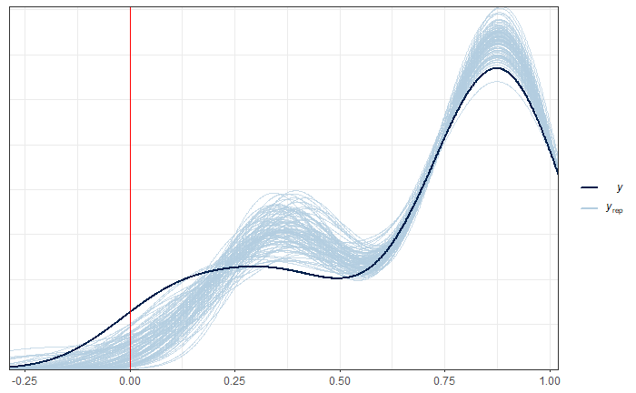

# Session 1- Fay Herriot Model - Poverty Estimation


The Fay Herriot model, proposed by Fay and Herriot (1979), is a statistical area model and is the most commonly used. It's essential to note that within small area estimation methodology, area models are the most applied because having individual-level information is often not feasible. Instead, we typically have data at the area level along with associated auxiliary information. This mixed linear model was the first to include random effects at the area level, implying that most of the information fed into the model corresponds to usually aggregated units like departments, regions, provinces, municipalities, among others. The estimates obtained from the model are over these aggregations or subpopulations.

Now, the Fay Herriot model relates area indicators $\theta_d$, where $d$ ranges from 1 to $D$, assuming they vary with respect to a vector of $p$ covariates $\boldsymbol{x}_d$. The model is defined by the equation $\theta_d = \boldsymbol{x}^{T}_{d}\boldsymbol{\beta} + u_d$, where $u_d$ is the error term or random effect, distinct for each area and distributed as $u_{d} \stackrel{ind}{\sim}\left(0,\sigma_{u}^{2}\right)$.

However, the true values of the indicators $\theta_d$ are not observable. Hence, the direct estimator $\hat{\theta}^{DIR}_d$ is used to estimate them, leading to sampling error. This estimator is still considered unbiased under the sample design, i.e., 
$$
\hat{\theta}_d^{DIR} = \theta + e_d  
$$

The model is then fitted using the sampling error term $e_d$, where $e_{d} \stackrel{ind}{\sim} \left(0,\sigma^2_{e_d}\right)$, and the variances $\sigma^2_{e_d}$ are estimated using survey microdata. The FH model is rewritten as

$$
\hat{\theta}^{DIR}_{d} = \boldsymbol{x}^{T}_{d}\boldsymbol{\beta} + u_d + e_d
$$.

The best linear unbiased predictor (BLUP) under the FH model is given by 

$$
\tilde{\theta}_{d}^{FH} = \boldsymbol{x}^{T}_{d}\tilde{\boldsymbol{\beta}}+\tilde{u}_{d}
$$,

where $\tilde{u}_d = \gamma_d\left(\hat{\theta}^{DIR}_{d} - \boldsymbol{x}^{T}_{d}\tilde{\boldsymbol{\beta}} \right)$ and $\gamma_d=\frac{\sigma^2_u}{\sigma^2_u + \sigma^2_{e_d}}$.


### Area Model for Poverty Estimation {-}

Let $P_d$ be the probability of finding a person in a state of poverty in the $d$-th domain of the population. Then, the direct estimator of $P_d$ can be written as:

$$
\hat{P}^{DIR}_{d} = P_d + e_d
$$

Now, $P_d$ can be modeled as follows:

$$
P_d = \boldsymbol{x}^{T}_{d}\boldsymbol{\beta} + u_d
$$

Rewriting $\hat{P}^{DIR}_{d}$ in terms of the two previous equations, we have:

$$
\hat{P}^{DIR}_{d} = \boldsymbol{x}^{T}_{d}\boldsymbol{\beta} + u_d + e_d
$$

It is then possible to assume that $\hat{P}^{DIR}_d \sim N(\boldsymbol{x}^{T}_{d}\boldsymbol \beta, \sigma_u^2 +\sigma_{e_d}^2)$, $\hat{P}^{DIR}_d \mid u_d \sim N(\boldsymbol{x}^{T}_{d}\boldsymbol \beta + u_d,\sigma_{e_d}^2)$, and $u_d \sim N(0, \sigma^2_u)$.

Next, prior distributions are assumed for $\boldsymbol{\beta}$ and $\sigma^2_u$:

$$
\begin{align*}
\beta_p & \sim N(0, 10000)\\
\sigma^2_u &\sim IG(0.0001, 0.0001)
\end{align*}
$$

Therefore, the Bayesian estimator for $P_d$ is given as $\tilde{P}_d = E\left(P_d\mid\hat{P}_d^{DIR}\right)$.


### Optimal Predictor of \(P_d\) {-}

The optimal predictor of \(P_d\) is given by:

\[E(P_d | \hat{P}^{DIR}_d) = \gamma_d\hat{P}^{DIR}_d + (1-\gamma_d)\boldsymbol{x}^{T}_{d}\boldsymbol \beta\]

where \(\gamma_d = \frac{\sigma_u^2}{\sigma_u^2 +\sigma_{e_d}^2}\).

We know that \(\hat{P}^{DIR}_d \sim N(\boldsymbol{x}^{T}_{d}\boldsymbol \beta, \sigma_u^2 +\sigma_{e_d}^2)\), \(\hat{P}^{DIR}_d \mid u_d \sim N(\boldsymbol{x}^{T}_{d}\boldsymbol \beta + u_d,\sigma_{e_d}^2)\), and \(u_d \sim N(0, \sigma^2_u)\).

Therefore, the optimal predictor is determined by a weighted combination of the direct estimator \(\hat{P}^{DIR}_d\) and the linear predictor \(\boldsymbol{x}^{T}_{d}\boldsymbol \beta\) where the weights are determined by the ratio of the variance components, providing an optimal balance between the direct estimate and the model-based prediction.


$$
\begin{align*}
f(u_d| \hat{P}^{DIR}_d) \propto f(\hat{P}^{DIR}_d | u_d)f(u_d) & = \frac{1}{\sigma^2_{e_d}\sqrt{2\pi}}\exp\left\{-\frac{1}{2\sigma^2_{e_d}(\hat{P}^{DIR}_d-\boldsymbol{x}^{T}_{d}\boldsymbol \beta - u_d)^2}\right\} \frac{1}{\sigma^2_u\sqrt{2\pi}}\exp\left\{- \frac{1}{2\sigma^2_u}u_d^2\right\}\\
& \propto \exp\left\{-\frac{u_d^2 - 2u_d(\hat{P}^{DIR}_d-\boldsymbol{x}^{T}_{d}\boldsymbol \beta)}{2\sigma^2_{e_d}} - \frac{u_d^2}{2\sigma^2_u}\right\} \\
& = \exp\left\{-\frac{1}{2}\left[(\frac{1}{\sigma^2_{e_d}} + \frac{1}{\sigma^2_u})u_d^2 - 2\frac{\hat{P}^{DIR}_d-\boldsymbol{x}^{T}_{d}\boldsymbol \beta}{\sigma_{e_d}^2}u_d\right] \right\} \\
& = \exp \left\{ -\frac{1}{2\frac{\sigma_u^2\sigma_{e_d}^2}{\sigma_u^2 +\sigma_{e_d}^2}}\left[u_d^2 - 2\frac{\sigma_u^2}{\sigma_u^2 +\sigma_{e_d}^2}(\hat{P}^{DIR}_d-\boldsymbol{x}^{T}_{d}\boldsymbol \beta)u_d \right] \right\} \\
& \propto \exp \left\{ -\frac{1}{2\frac{\sigma_u^2\sigma_{e_d}^2}{\sigma_u^2 +\sigma_{e_d}^2}}\left[u_d -  \frac{\sigma_u^2}{\sigma_u^2 +\sigma_{e_d}^2}(\hat{P}^{DIR}_d-\boldsymbol{x}^{T}_{d}\boldsymbol \beta)\right]^2 \right\} \\
& \propto N(E(u_d|\hat{P}^{DIR}_d), \text{Var}(u_d|P^{DIR}))
\end{align*}
$$

with $E(u_d|\hat{P}^{DIR}_d) = \frac{\sigma_u^2}{\sigma_u^2 +\sigma_{e_d}^2}(\hat{P}^{DIR}_d-\boldsymbol{x}^{T}_{d}\boldsymbol \beta)$ y $\text{Var}(u_d|P^{DIR}) = \frac{\sigma_u^2\sigma_{e_d}^2}{\sigma_u^2 +\sigma_{e_d}^2}$. Therefore you have,

$$
\begin{align*}
E(P_d | \hat{P}^{DIR}_d) = \boldsymbol{x}^{T}_{d}\boldsymbol \beta + E(u_d|\hat{P}^{DIR}_d) & =  \boldsymbol{x}^{T}_{d}\boldsymbol \beta + \frac{\sigma_u^2}{\sigma_u^2 +\sigma_{e_d}^2}(\hat{P}^{DIR}_d-\boldsymbol{x}^{T}_{d}\boldsymbol \beta) \\
& = \frac{\sigma_{e_d}^2}{\sigma_u^2 +\sigma_{e_d}^2}\hat{P}^{DIR}_d + \frac{\sigma_u^2}{\sigma_u^2 +\sigma_{e_d}^2}\boldsymbol{x}^{T}_{d}\boldsymbol \beta \\
& = \gamma_d\hat{P}^{DIR}_d + (1-\gamma_d)\boldsymbol{x}^{T}_{d}\boldsymbol \beta
\end{align*}
$$


## Estimation Procedure

This code utilizes the libraries `tidyverse` and `magrittr` for data processing and analysis.

The function `readRDS()` is used to load a data file in RDS format, containing direct estimates and smoothed variance for the proportion of individuals in poverty for the year 2018. Subsequently, the `%>%` operator from the `magrittr` library is employed to chain the selection of specific columns, namely `dam2`, `nd`, `pobreza`, `vardir`, and `hat_var`.


```r
library(tidyverse)
library(magrittr)
base_FH <- readRDS("Recursos/03_FH_normal/01_base_FH.Rds") %>% 
  select(dam2,pobreza,hat_var)
```


Reading the covariates, which have been previously obtained. Due to the difference in scales between variables, an adjustment is necessary.


```r
statelevel_predictors_df <- readRDS('Recursos/03_FH_normal/02_statelevel_predictors_dam.rds') %>% 
  mutate(id_order = 1:n())
```

Next, a full join (`full_join`) is performed between the dataset `base_FH` and the predictors `statelevel_predictors_df` using the variable `dam2` as the joining key.

The function `tba()` is used to display the first 10 rows and 8 columns of the resulting dataset from the previous join.

A full join (`full_join`) combines data from both datasets, preserving all rows from both and filling in missing values (NA) if matches aren't found based on the joining variable (dam2 in this case).

The `tba()` function displays an HTML-formatted table in the R console showing the first 10 rows and 8 columns of the resulting dataset from the join.


```r
base_FH <- full_join(base_FH, statelevel_predictors_df, by = "dam2" )
tba(base_FH[1:10,1:8])
```

<table class="table table-striped lightable-classic" style="width: auto !important; margin-left: auto; margin-right: auto; font-family: Arial Narrow; width: auto !important; margin-left: auto; margin-right: auto;">
 <thead>
  <tr>
   <th style="text-align:left;"> dam2 </th>
   <th style="text-align:right;"> pobreza </th>
   <th style="text-align:right;"> hat_var </th>
   <th style="text-align:right;"> area1 </th>
   <th style="text-align:right;"> sex2 </th>
   <th style="text-align:right;"> age </th>
   <th style="text-align:right;"> tiene_sanitario </th>
   <th style="text-align:right;"> tiene_electricidad </th>
  </tr>
 </thead>
<tbody>
  <tr>
   <td style="text-align:left;"> 0101 </td>
   <td style="text-align:right;"> NA </td>
   <td style="text-align:right;"> NA </td>
   <td style="text-align:right;"> 1.0000 </td>
   <td style="text-align:right;"> 0.5087 </td>
   <td style="text-align:right;"> 2.5043 </td>
   <td style="text-align:right;"> 0.0019 </td>
   <td style="text-align:right;"> 0.7596 </td>
  </tr>
  <tr>
   <td style="text-align:left;"> 0102 </td>
   <td style="text-align:right;"> 0.9836 </td>
   <td style="text-align:right;"> 0 </td>
   <td style="text-align:right;"> 1.0000 </td>
   <td style="text-align:right;"> 0.4754 </td>
   <td style="text-align:right;"> 2.4689 </td>
   <td style="text-align:right;"> 0.0011 </td>
   <td style="text-align:right;"> 0.9064 </td>
  </tr>
  <tr>
   <td style="text-align:left;"> 0103 </td>
   <td style="text-align:right;"> 1.0000 </td>
   <td style="text-align:right;"> 0 </td>
   <td style="text-align:right;"> 1.0000 </td>
   <td style="text-align:right;"> 0.5037 </td>
   <td style="text-align:right;"> 2.2858 </td>
   <td style="text-align:right;"> 0.0152 </td>
   <td style="text-align:right;"> 0.6930 </td>
  </tr>
  <tr>
   <td style="text-align:left;"> 0201 </td>
   <td style="text-align:right;"> NA </td>
   <td style="text-align:right;"> NA </td>
   <td style="text-align:right;"> 0.5147 </td>
   <td style="text-align:right;"> 0.5060 </td>
   <td style="text-align:right;"> 2.5517 </td>
   <td style="text-align:right;"> 0.0138 </td>
   <td style="text-align:right;"> 0.2342 </td>
  </tr>
  <tr>
   <td style="text-align:left;"> 0202 </td>
   <td style="text-align:right;"> 0.9391 </td>
   <td style="text-align:right;"> 0 </td>
   <td style="text-align:right;"> 0.9986 </td>
   <td style="text-align:right;"> 0.5376 </td>
   <td style="text-align:right;"> 2.7635 </td>
   <td style="text-align:right;"> 0.0028 </td>
   <td style="text-align:right;"> 0.3852 </td>
  </tr>
  <tr>
   <td style="text-align:left;"> 0203 </td>
   <td style="text-align:right;"> 0.8117 </td>
   <td style="text-align:right;"> 0 </td>
   <td style="text-align:right;"> 0.9754 </td>
   <td style="text-align:right;"> 0.5432 </td>
   <td style="text-align:right;"> 2.8765 </td>
   <td style="text-align:right;"> 0.0015 </td>
   <td style="text-align:right;"> 0.3326 </td>
  </tr>
  <tr>
   <td style="text-align:left;"> 0204 </td>
   <td style="text-align:right;"> NA </td>
   <td style="text-align:right;"> NA </td>
   <td style="text-align:right;"> 1.0000 </td>
   <td style="text-align:right;"> 0.5300 </td>
   <td style="text-align:right;"> 2.6401 </td>
   <td style="text-align:right;"> 0.0042 </td>
   <td style="text-align:right;"> 0.5720 </td>
  </tr>
  <tr>
   <td style="text-align:left;"> 0205 </td>
   <td style="text-align:right;"> 0.9646 </td>
   <td style="text-align:right;"> 0 </td>
   <td style="text-align:right;"> 1.0000 </td>
   <td style="text-align:right;"> 0.5182 </td>
   <td style="text-align:right;"> 2.6644 </td>
   <td style="text-align:right;"> 0.0013 </td>
   <td style="text-align:right;"> 0.8060 </td>
  </tr>
  <tr>
   <td style="text-align:left;"> 0206 </td>
   <td style="text-align:right;"> NA </td>
   <td style="text-align:right;"> NA </td>
   <td style="text-align:right;"> 1.0000 </td>
   <td style="text-align:right;"> 0.5157 </td>
   <td style="text-align:right;"> 2.3750 </td>
   <td style="text-align:right;"> 0.0290 </td>
   <td style="text-align:right;"> 0.0285 </td>
  </tr>
  <tr>
   <td style="text-align:left;"> 0207 </td>
   <td style="text-align:right;"> NA </td>
   <td style="text-align:right;"> NA </td>
   <td style="text-align:right;"> 1.0000 </td>
   <td style="text-align:right;"> 0.5097 </td>
   <td style="text-align:right;"> 2.4257 </td>
   <td style="text-align:right;"> 0.0465 </td>
   <td style="text-align:right;"> 0.1581 </td>
  </tr>
</tbody>
</table>

```r
# View(base_FH)
```

## Preparing the supplies for `STAN`


1. Splitting the database into observed and unobserved domains.

   Observed domains.


```r
data_dir <- base_FH %>% filter(!is.na(pobreza))
```

   Unobserved domains.


```r
data_syn <-
  base_FH %>% anti_join(data_dir %>% select(dam2))
tba(data_syn[1:10, 1:8])
```

<table class="table table-striped lightable-classic" style="width: auto !important; margin-left: auto; margin-right: auto; font-family: Arial Narrow; width: auto !important; margin-left: auto; margin-right: auto;">
 <thead>
  <tr>
   <th style="text-align:left;"> dam2 </th>
   <th style="text-align:right;"> pobreza </th>
   <th style="text-align:right;"> hat_var </th>
   <th style="text-align:right;"> area1 </th>
   <th style="text-align:right;"> sex2 </th>
   <th style="text-align:right;"> age </th>
   <th style="text-align:right;"> tiene_sanitario </th>
   <th style="text-align:right;"> tiene_electricidad </th>
  </tr>
 </thead>
<tbody>
  <tr>
   <td style="text-align:left;"> 0101 </td>
   <td style="text-align:right;"> NA </td>
   <td style="text-align:right;"> NA </td>
   <td style="text-align:right;"> 1.0000 </td>
   <td style="text-align:right;"> 0.5087 </td>
   <td style="text-align:right;"> 2.5043 </td>
   <td style="text-align:right;"> 0.0019 </td>
   <td style="text-align:right;"> 0.7596 </td>
  </tr>
  <tr>
   <td style="text-align:left;"> 0201 </td>
   <td style="text-align:right;"> NA </td>
   <td style="text-align:right;"> NA </td>
   <td style="text-align:right;"> 0.5147 </td>
   <td style="text-align:right;"> 0.5060 </td>
   <td style="text-align:right;"> 2.5517 </td>
   <td style="text-align:right;"> 0.0138 </td>
   <td style="text-align:right;"> 0.2342 </td>
  </tr>
  <tr>
   <td style="text-align:left;"> 0204 </td>
   <td style="text-align:right;"> NA </td>
   <td style="text-align:right;"> NA </td>
   <td style="text-align:right;"> 1.0000 </td>
   <td style="text-align:right;"> 0.5300 </td>
   <td style="text-align:right;"> 2.6401 </td>
   <td style="text-align:right;"> 0.0042 </td>
   <td style="text-align:right;"> 0.5720 </td>
  </tr>
  <tr>
   <td style="text-align:left;"> 0206 </td>
   <td style="text-align:right;"> NA </td>
   <td style="text-align:right;"> NA </td>
   <td style="text-align:right;"> 1.0000 </td>
   <td style="text-align:right;"> 0.5157 </td>
   <td style="text-align:right;"> 2.3750 </td>
   <td style="text-align:right;"> 0.0290 </td>
   <td style="text-align:right;"> 0.0285 </td>
  </tr>
  <tr>
   <td style="text-align:left;"> 0207 </td>
   <td style="text-align:right;"> NA </td>
   <td style="text-align:right;"> NA </td>
   <td style="text-align:right;"> 1.0000 </td>
   <td style="text-align:right;"> 0.5097 </td>
   <td style="text-align:right;"> 2.4257 </td>
   <td style="text-align:right;"> 0.0465 </td>
   <td style="text-align:right;"> 0.1581 </td>
  </tr>
  <tr>
   <td style="text-align:left;"> 0208 </td>
   <td style="text-align:right;"> NA </td>
   <td style="text-align:right;"> NA </td>
   <td style="text-align:right;"> 1.0000 </td>
   <td style="text-align:right;"> 0.5256 </td>
   <td style="text-align:right;"> 2.6193 </td>
   <td style="text-align:right;"> 0.0018 </td>
   <td style="text-align:right;"> 0.4508 </td>
  </tr>
  <tr>
   <td style="text-align:left;"> 0209 </td>
   <td style="text-align:right;"> NA </td>
   <td style="text-align:right;"> NA </td>
   <td style="text-align:right;"> 1.0000 </td>
   <td style="text-align:right;"> 0.5149 </td>
   <td style="text-align:right;"> 2.4776 </td>
   <td style="text-align:right;"> 0.0066 </td>
   <td style="text-align:right;"> 0.3041 </td>
  </tr>
  <tr>
   <td style="text-align:left;"> 0210 </td>
   <td style="text-align:right;"> NA </td>
   <td style="text-align:right;"> NA </td>
   <td style="text-align:right;"> 0.9779 </td>
   <td style="text-align:right;"> 0.5194 </td>
   <td style="text-align:right;"> 2.5153 </td>
   <td style="text-align:right;"> 0.0144 </td>
   <td style="text-align:right;"> 0.2003 </td>
  </tr>
  <tr>
   <td style="text-align:left;"> 0211 </td>
   <td style="text-align:right;"> NA </td>
   <td style="text-align:right;"> NA </td>
   <td style="text-align:right;"> 1.0000 </td>
   <td style="text-align:right;"> 0.5427 </td>
   <td style="text-align:right;"> 2.8148 </td>
   <td style="text-align:right;"> 0.0006 </td>
   <td style="text-align:right;"> 0.5348 </td>
  </tr>
  <tr>
   <td style="text-align:left;"> 0502 </td>
   <td style="text-align:right;"> NA </td>
   <td style="text-align:right;"> NA </td>
   <td style="text-align:right;"> 0.3699 </td>
   <td style="text-align:right;"> 0.4974 </td>
   <td style="text-align:right;"> 2.5265 </td>
   <td style="text-align:right;"> 0.0127 </td>
   <td style="text-align:right;"> 0.3983 </td>
  </tr>
</tbody>
</table>

2. Defining the fixed-effects matrix.

   Defines a linear model using the `formula()` function, incorporating various predictor variables such as age, ethnicity, unemployment rate, among others.

   Utilizes the `model.matrix()` function to generate design matrices (`Xdat` and `Xs`) from the observed (`data_observed`) and unobserved (`data_unobserved`) data to use in building regression models. The `model.matrix()` function transforms categorical variables into binary (dummy) variables, allowing them to be used in modeling.
   

```r
formula_mod  <- formula(~  ODDJOB + WORKED +
                         stable_lights_mean + 
                         accessibility_mean + 
                         urban.coverfraction_sum)
## Dominios observados
Xdat <- model.matrix(formula_mod, data = data_dir)

## Dominios no observados
Xs <- model.matrix(formula_mod, data = data_syn)
dim(Xs)
```

```
## [1] 22  6
```

```r
dim(data_syn)
```

```
## [1] 22 30
```


  3.    Creando lista de parámetros para `STAN`


```r
sample_data <- list(
  N1 = nrow(Xdat),   # Observed.
  N2 = nrow(Xs),   # Not observed.
  p  = ncol(Xdat),       # Number of predictors.
  X  = as.matrix(Xdat),  # Observed covariates.
  Xs = as.matrix(Xs),    # Not observed covariates.
  y  = as.numeric(data_dir$pobreza), # Direct estimation
  sigma_e = sqrt(data_dir$hat_var)   # Estimation error
)
```

Rutina implementada en `STAN`


```r
data {
  int<lower=0> N1;   // number of data items
  int<lower=0> N2;   // number of data items for prediction
  int<lower=0> p;   // number of predictors
  matrix[N1, p] X;   // predictor matrix
  matrix[N2, p] Xs;   // predictor matrix
  vector[N1] y;      // predictor matrix 
  vector[N1] sigma_e; // known variances
}

parameters {
  vector[p] beta;       // coefficients for predictors
  real<lower=0> sigma2_u;
  vector[N1] u;
}

transformed parameters{
  vector[N1] theta;
  vector[N1] thetaSyn;
  vector[N1] thetaFH;
  vector[N1] gammaj;
  real<lower=0> sigma_u;
  thetaSyn = X * beta;
  theta = thetaSyn + u;
  sigma_u = sqrt(sigma2_u);
  gammaj =  to_vector(sigma_u ./ (sigma_u + sigma_e));
  thetaFH = (gammaj) .* y + (1-gammaj).*thetaSyn; 
}

model {
  // likelihood
  y ~ normal(theta, sigma_e); 
  // priors
  beta ~ normal(0, 100);
  u ~ normal(0, sigma_u);
  sigma2_u ~ inv_gamma(0.0001, 0.0001);
}

generated quantities{
  vector[N2] y_pred;
  for(j in 1:N2) {
    y_pred[j] = normal_rng(Xs[j] * beta, sigma_u);
  }
}
```

4. Compiling the model in `STAN`.
Here's the process to compile the `STAN` code from R:

This code utilizes the `rstan` library to fit a Bayesian model using the file `17FH_normal.stan`, which contains the model written in the Stan probabilistic modeling language.

Initially, the `stan()` function is employed to fit the model to the `sample_data`. The arguments passed to `stan()` include the file containing the model (`fit_FH_normal`), the data (`sample_data`), and control arguments for managing the model fitting process, such as the number of iterations for the warmup period (`warmup`), the sampling period (`iter`), and the number of CPU cores to use for the fitting process (`cores`).

Additionally, the `parallel::detectCores()` function is used to automatically detect the number of available CPU cores. The `mc.cores` option is then set to utilize the maximum number of available cores for the model fitting.

The outcome of the model fitting is stored in `model_FH_normal`, which contains a sample from the posterior distribution of the model. This sample can be employed for inferences about the model parameters and predictions. Overall, this code is useful for fitting Bayesian models using Stan and conducting subsequent inferences.


```r
library(rstan)
fit_FH_normal <- "Recursos/03_FH_normal/modelosStan/17FH_normal.stan"
options(mc.cores = parallel::detectCores())
rstan::rstan_options(auto_write = TRUE) # speed up running time 
model_FH_normal <- stan(
  file = fit_FH_normal,  
  data = sample_data,   
  verbose = FALSE,
  warmup = 2500,         
  iter = 3000,            
  cores = 4              
)
saveRDS(object = model_FH_normal,
        file = "Recursos/03_FH_normal/03_model_FH_normal.rds")
```

Leer el modelo 

```r
model_FH_normal<- readRDS("Recursos/03_FH_normal/03_model_FH_normal.rds")
```
### Results of the model for observed domains.

In this code, the `bayesplot`, `posterior`, and `patchwork` libraries are loaded to create graphics and visualizations of the model results.

Subsequently, the `as.array()` and `as_draws_matrix()` functions are used to extract samples from the posterior distribution of the parameter `theta` from the model. Then, 100 rows of these samples are randomly selected using the `sample()` function, resulting in the `y_pred2` matrix.

Finally, the `ppc_dens_overlay()` function from `bayesplot` is utilized to plot a comparison between the empirical distribution of the observed variable `pobreza` in the data (`data_dir$pobreza`) and the simulated posterior predictive distributions for the same variable (`y_pred2`). The `ppc_dens_overlay()` function generates a density plot for both distributions, facilitating the visualization of their comparison.


```r
library(bayesplot)
library(posterior)
library(patchwork)
y_pred_B <- as.array(model_FH_normal, pars = "theta") %>% 
  as_draws_matrix()
rowsrandom <- sample(nrow(y_pred_B), 100)
y_pred2 <- y_pred_B[rowsrandom, ]
p1 <-  ppc_dens_overlay(y = as.numeric(data_dir$pobreza), y_pred2)

# ggsave(plot = p1,
#        filename = "Recursos/Día2/Sesion1/0Recursos/FH1.png",
#        scale = 2)
p1 + geom_vline(xintercept = 0, color = "red")
```



<span style="color:red">**The results indicate that using the Fay-Herriot normal method is not possible, as we are obtaining outcomes outside the boundaries.**</span>


