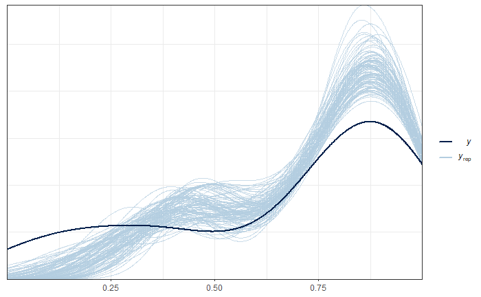
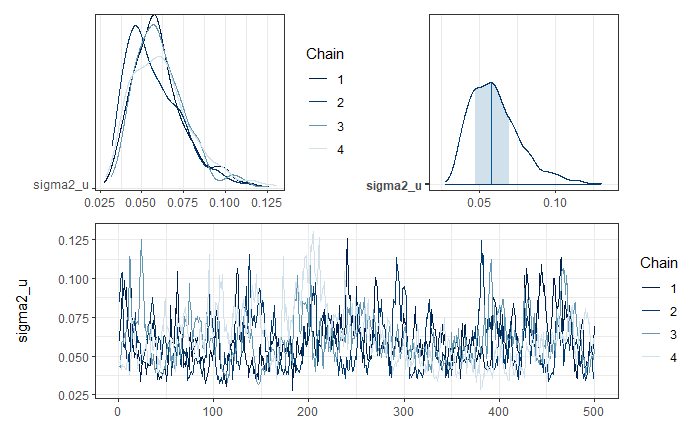
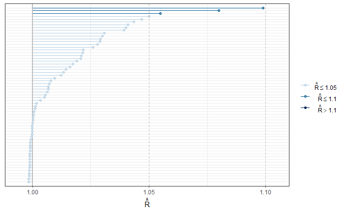

## Area models - ArcSin transformation.


In its most basic conception, the **Fay-Herriot** model is a linear combination of covariates. However, the result of this combination can take values that fall outside the acceptable range for a proportion; that is, generally, the Fay-Herriot estimator $\theta \in \mathbb{R}$, whereas the direct estimator $\theta \in (0,1)$. The arcsine transformation is given by:

$$
\hat{z}_d = \arcsin\left( \sqrt{ \hat{\theta}_d} \right)
$$ 

where 

$$
Var\left( \hat{z}_d \right) = \frac{\widehat{DEFF}_d}{4\times n_d} = \frac{1}{4\times n_{d, \text{effective}} }
$$

The Fay-Herriot model is defined as follows:

$$
\begin{align*}
Z_d \mid \mu_d,\sigma^2_d &  \sim  N(\mu_d, \sigma^2_d)\\
\mu_d & = \boldsymbol{x}^{T}_{d}\boldsymbol{\beta} + u_d \\
\theta_d & =  \left(\sin(\mu_d)\right)^2
\end{align*}
$$ 

where $u_d \sim N(0 , \sigma^2)$.

Let the prior distributions for $\boldsymbol{\beta}$ and $\sigma_{u}^{2}$ be given by:

$$
\begin{align*}
\boldsymbol{\beta}	\sim	N\left(0,1000 \right)\\
\sigma_{u}^{2}	\sim	\text{IG}\left(0.0001,0.0001\right)
\end{align*}
$$

### Estimation procedure

Reading the database that resulted in the previous step and selecting the columns of interest


```r
library(tidyverse)
library(magrittr)

base_FH <- readRDS('Recursos/04_FH_Arcosin/01_base_FH.Rds') %>% 
transmute(dam2,                            ## id dominios
          pobreza,
          T_pobreza = asin(sqrt(pobreza)),  ## creando zd
          n_effec = n_eff_FGV,              ## n efectivo
          varhat = 1/(4*n_effec)            ## varianza para zd
)
```

Joining the two databases.


```r
statelevel_predictors_df <-
  readRDS('Recursos/03_FH_normal/02_statelevel_predictors_dam.rds') %>%
  mutate(id_order = 1:n())
base_FH <-
  full_join(base_FH, statelevel_predictors_df, by = "dam2")
tba(base_FH[, 1:8] %>% head(10))
```

<table class="table table-striped lightable-classic" style="width: auto !important; margin-left: auto; margin-right: auto; font-family: Arial Narrow; width: auto !important; margin-left: auto; margin-right: auto;">
 <thead>
  <tr>
   <th style="text-align:left;"> dam2 </th>
   <th style="text-align:right;"> pobreza </th>
   <th style="text-align:right;"> T_pobreza </th>
   <th style="text-align:right;"> n_effec </th>
   <th style="text-align:right;"> varhat </th>
   <th style="text-align:right;"> area1 </th>
   <th style="text-align:right;"> sex2 </th>
   <th style="text-align:right;"> age2 </th>
  </tr>
 </thead>
<tbody>
  <tr>
   <td style="text-align:left;"> 0101 </td>
   <td style="text-align:right;"> NA </td>
   <td style="text-align:right;"> NA </td>
   <td style="text-align:right;"> NA </td>
   <td style="text-align:right;"> NA </td>
   <td style="text-align:right;"> 1.0000 </td>
   <td style="text-align:right;"> 0.5087 </td>
   <td style="text-align:right;"> 0.2694 </td>
  </tr>
  <tr>
   <td style="text-align:left;"> 0102 </td>
   <td style="text-align:right;"> 0.9836 </td>
   <td style="text-align:right;"> 1.4422 </td>
   <td style="text-align:right;"> 1029.570 </td>
   <td style="text-align:right;"> 2.000000e-04 </td>
   <td style="text-align:right;"> 1.0000 </td>
   <td style="text-align:right;"> 0.4754 </td>
   <td style="text-align:right;"> 0.2857 </td>
  </tr>
  <tr>
   <td style="text-align:left;"> 0103 </td>
   <td style="text-align:right;"> 1.0000 </td>
   <td style="text-align:right;"> 1.5708 </td>
   <td style="text-align:right;"> 0.000 </td>
   <td style="text-align:right;"> 2.226882e+57 </td>
   <td style="text-align:right;"> 1.0000 </td>
   <td style="text-align:right;"> 0.5037 </td>
   <td style="text-align:right;"> 0.3095 </td>
  </tr>
  <tr>
   <td style="text-align:left;"> 0201 </td>
   <td style="text-align:right;"> NA </td>
   <td style="text-align:right;"> NA </td>
   <td style="text-align:right;"> NA </td>
   <td style="text-align:right;"> NA </td>
   <td style="text-align:right;"> 0.5147 </td>
   <td style="text-align:right;"> 0.5060 </td>
   <td style="text-align:right;"> 0.2962 </td>
  </tr>
  <tr>
   <td style="text-align:left;"> 0202 </td>
   <td style="text-align:right;"> 0.9391 </td>
   <td style="text-align:right;"> 1.3215 </td>
   <td style="text-align:right;"> 5881.354 </td>
   <td style="text-align:right;"> 0.000000e+00 </td>
   <td style="text-align:right;"> 0.9986 </td>
   <td style="text-align:right;"> 0.5376 </td>
   <td style="text-align:right;"> 0.2625 </td>
  </tr>
  <tr>
   <td style="text-align:left;"> 0203 </td>
   <td style="text-align:right;"> 0.8117 </td>
   <td style="text-align:right;"> 1.1219 </td>
   <td style="text-align:right;"> 6965.029 </td>
   <td style="text-align:right;"> 0.000000e+00 </td>
   <td style="text-align:right;"> 0.9754 </td>
   <td style="text-align:right;"> 0.5432 </td>
   <td style="text-align:right;"> 0.2454 </td>
  </tr>
  <tr>
   <td style="text-align:left;"> 0204 </td>
   <td style="text-align:right;"> NA </td>
   <td style="text-align:right;"> NA </td>
   <td style="text-align:right;"> NA </td>
   <td style="text-align:right;"> NA </td>
   <td style="text-align:right;"> 1.0000 </td>
   <td style="text-align:right;"> 0.5300 </td>
   <td style="text-align:right;"> 0.3151 </td>
  </tr>
  <tr>
   <td style="text-align:left;"> 0205 </td>
   <td style="text-align:right;"> 0.9646 </td>
   <td style="text-align:right;"> 1.3814 </td>
   <td style="text-align:right;"> 11790.358 </td>
   <td style="text-align:right;"> 0.000000e+00 </td>
   <td style="text-align:right;"> 1.0000 </td>
   <td style="text-align:right;"> 0.5182 </td>
   <td style="text-align:right;"> 0.3057 </td>
  </tr>
  <tr>
   <td style="text-align:left;"> 0206 </td>
   <td style="text-align:right;"> NA </td>
   <td style="text-align:right;"> NA </td>
   <td style="text-align:right;"> NA </td>
   <td style="text-align:right;"> NA </td>
   <td style="text-align:right;"> 1.0000 </td>
   <td style="text-align:right;"> 0.5157 </td>
   <td style="text-align:right;"> 0.3192 </td>
  </tr>
  <tr>
   <td style="text-align:left;"> 0207 </td>
   <td style="text-align:right;"> NA </td>
   <td style="text-align:right;"> NA </td>
   <td style="text-align:right;"> NA </td>
   <td style="text-align:right;"> NA </td>
   <td style="text-align:right;"> 1.0000 </td>
   <td style="text-align:right;"> 0.5097 </td>
   <td style="text-align:right;"> 0.3099 </td>
  </tr>
</tbody>
</table>

Selecting the covariates for the model.


```r
names_cov <-
    c(
       "ODDJOB","WORKED",
      "stable_lights_mean",
      "accessibility_mean",
      "urban.coverfraction_sum"
    )
```

### Preparing Inputs for `STAN`

1. Splitting the database into observed and unobserved domains

Observed domains.

```r
data_dir <- base_FH %>% filter(!is.na(T_pobreza))
```

Unobserved domains.

```r
data_syn <-
  base_FH %>% anti_join(data_dir %>% select(dam2))
```

2. Defining the fixed-effects matrix.


```r
## Observed domains
Xdat <- cbind(inter = 1,data_dir[,names_cov])

## Unobserved domains
Xs <-  cbind(inter = 1,data_syn[,names_cov])
```

3. Creating a parameter list for `STAN`.


```r
sample_data <- list(
  N1 = nrow(Xdat),       # Observed.
  N2 = nrow(Xs),         # Unobserved.
  p  = ncol(Xdat),       # Number of regressors.
  X  = as.matrix(Xdat),  # Observed Covariates.
  Xs = as.matrix(Xs),    # Unobserved Covariates
  y  = as.numeric(data_dir$T_pobreza),
  sigma_e = sqrt(data_dir$varhat)
)
```

4. Compiling the model in `STAN`.
  

```r
library(rstan)
fit_FH_arcoseno <- "Recursos/04_FH_Arcosin/modelosStan/15FH_arcsin_normal.stan"
options(mc.cores = parallel::detectCores())
rstan::rstan_options(auto_write = TRUE) # speed up running time 
model_FH_arcoseno <- stan(
  file = fit_FH_arcoseno,  
  data = sample_data,   
  verbose = FALSE,
  warmup = 2500,         
  iter = 3000,            
  cores = 4              
)
saveRDS(model_FH_arcoseno,
        "Recursos/04_FH_Arcosin/02_model_FH_arcoseno.rds")
```


```r
model_FH_arcoseno <- readRDS("Recursos/04_FH_Arcosin/02_model_FH_arcoseno.rds")
```


#### Model results for the observed domains. 


```r
library(bayesplot)
library(patchwork)
library(posterior)

y_pred_B <- as.array(model_FH_arcoseno, pars = "theta") %>% 
  as_draws_matrix()
rowsrandom <- sample(nrow(y_pred_B), 100)

y_pred2 <- y_pred_B[rowsrandom, ]
ppc_dens_overlay(y = as.numeric(data_dir$pobreza), y_pred2)
```


Graphical analysis of the convergence of $\sigma^2_u$ chains.


```r
posterior_sigma2_u <- as.array(model_FH_arcoseno, pars = "sigma2_u")
(mcmc_dens_chains(posterior_sigma2_u) +
    mcmc_areas(posterior_sigma2_u) ) / 
  mcmc_trace(posterior_sigma2_u)
```




To validate the convergence of all chains, the *R-hat* is used.


```r
parametros <- summary(model_FH_arcoseno, pars =  c("theta", "theta_pred") )$summary %>%
  data.frame()
p1 <- mcmc_rhat(parametros$Rhat)
p1
```




Estimation of the FH of poverty in the observed domains.


```r
theta_FH <-   summary(model_FH_arcoseno,pars =  "theta")$summary %>%
  data.frame()
data_dir %<>% mutate(pred_arcoseno = theta_FH$mean, 
                     pred_arcoseno_EE = theta_FH$sd,
                     Cv_pred = pred_arcoseno_EE/pred_arcoseno)
```

Estimation of the FH of poverty in the NOT observed domains.


```r
theta_FH_pred <- summary(model_FH_arcoseno,pars =  "theta_pred")$summary %>%
  data.frame()
data_syn <- data_syn %>% 
  mutate(pred_arcoseno = theta_FH_pred$mean,
         pred_arcoseno_EE = theta_FH_pred$sd,
         Cv_pred = pred_arcoseno_EE/pred_arcoseno)
```

<table class="table table-striped lightable-classic" style="width: auto !important; margin-left: auto; margin-right: auto; font-family: Arial Narrow; width: auto !important; margin-left: auto; margin-right: auto;">
 <thead>
  <tr>
   <th style="text-align:left;"> dam2 </th>
   <th style="text-align:right;"> pobreza </th>
   <th style="text-align:right;"> pred_arcoseno </th>
   <th style="text-align:right;"> pred_arcoseno_EE </th>
   <th style="text-align:right;"> Cv_pred </th>
  </tr>
 </thead>
<tbody>
  <tr>
   <td style="text-align:left;"> 0101 </td>
   <td style="text-align:right;"> NA </td>
   <td style="text-align:right;"> 0.8630 </td>
   <td style="text-align:right;"> 0.1463 </td>
   <td style="text-align:right;"> 0.1696 </td>
  </tr>
  <tr>
   <td style="text-align:left;"> 0201 </td>
   <td style="text-align:right;"> NA </td>
   <td style="text-align:right;"> 0.8797 </td>
   <td style="text-align:right;"> 0.1426 </td>
   <td style="text-align:right;"> 0.1621 </td>
  </tr>
  <tr>
   <td style="text-align:left;"> 0204 </td>
   <td style="text-align:right;"> NA </td>
   <td style="text-align:right;"> 0.8412 </td>
   <td style="text-align:right;"> 0.1592 </td>
   <td style="text-align:right;"> 0.1893 </td>
  </tr>
  <tr>
   <td style="text-align:left;"> 0206 </td>
   <td style="text-align:right;"> NA </td>
   <td style="text-align:right;"> 0.8980 </td>
   <td style="text-align:right;"> 0.1296 </td>
   <td style="text-align:right;"> 0.1443 </td>
  </tr>
  <tr>
   <td style="text-align:left;"> 0207 </td>
   <td style="text-align:right;"> NA </td>
   <td style="text-align:right;"> 0.8958 </td>
   <td style="text-align:right;"> 0.1321 </td>
   <td style="text-align:right;"> 0.1475 </td>
  </tr>
  <tr>
   <td style="text-align:left;"> 0208 </td>
   <td style="text-align:right;"> NA </td>
   <td style="text-align:right;"> 0.7818 </td>
   <td style="text-align:right;"> 0.1893 </td>
   <td style="text-align:right;"> 0.2421 </td>
  </tr>
  <tr>
   <td style="text-align:left;"> 0209 </td>
   <td style="text-align:right;"> NA </td>
   <td style="text-align:right;"> 0.8910 </td>
   <td style="text-align:right;"> 0.1313 </td>
   <td style="text-align:right;"> 0.1474 </td>
  </tr>
  <tr>
   <td style="text-align:left;"> 0210 </td>
   <td style="text-align:right;"> NA </td>
   <td style="text-align:right;"> 0.8990 </td>
   <td style="text-align:right;"> 0.1290 </td>
   <td style="text-align:right;"> 0.1435 </td>
  </tr>
  <tr>
   <td style="text-align:left;"> 0211 </td>
   <td style="text-align:right;"> NA </td>
   <td style="text-align:right;"> 0.8872 </td>
   <td style="text-align:right;"> 0.1389 </td>
   <td style="text-align:right;"> 0.1566 </td>
  </tr>
  <tr>
   <td style="text-align:left;"> 0502 </td>
   <td style="text-align:right;"> NA </td>
   <td style="text-align:right;"> 0.7649 </td>
   <td style="text-align:right;"> 0.1889 </td>
   <td style="text-align:right;"> 0.2470 </td>
  </tr>
</tbody>
</table>


consolidating the bases of estimates for observed and UNobserved domains.


```r
estimacionesPre <- bind_rows(data_dir, data_syn) %>% 
  select(dam2, theta_pred = pred_arcoseno) %>% 
  mutate(dam = substr(dam2,1,2))
```


## Benchmark Process

1. From the census extract the total number of people by DAM2


```r
total_pp <- readRDS(file = "Recursos/04_FH_Arcosin/06_censo_mrp.rds") %>% 
   mutate(dam = substr(dam2,1,2))


N_dam_pp <- total_pp %>%   group_by(dam,dam2) %>%  
            summarise(total_pp = sum(n) ) %>% 
  group_by(dam) %>% mutate(dam_pp = sum(total_pp))

tba(N_dam_pp %>% data.frame() %>% slice(1:10))
```

<table class="table table-striped lightable-classic" style="width: auto !important; margin-left: auto; margin-right: auto; font-family: Arial Narrow; width: auto !important; margin-left: auto; margin-right: auto;">
 <thead>
  <tr>
   <th style="text-align:left;"> dam </th>
   <th style="text-align:left;"> dam2 </th>
   <th style="text-align:right;"> total_pp </th>
   <th style="text-align:right;"> dam_pp </th>
  </tr>
 </thead>
<tbody>
  <tr>
   <td style="text-align:left;"> 01 </td>
   <td style="text-align:left;"> 0101 </td>
   <td style="text-align:right;"> 35750 </td>
   <td style="text-align:right;"> 88799 </td>
  </tr>
  <tr>
   <td style="text-align:left;"> 01 </td>
   <td style="text-align:left;"> 0102 </td>
   <td style="text-align:right;"> 26458 </td>
   <td style="text-align:right;"> 88799 </td>
  </tr>
  <tr>
   <td style="text-align:left;"> 01 </td>
   <td style="text-align:left;"> 0103 </td>
   <td style="text-align:right;"> 26591 </td>
   <td style="text-align:right;"> 88799 </td>
  </tr>
  <tr>
   <td style="text-align:left;"> 02 </td>
   <td style="text-align:left;"> 0201 </td>
   <td style="text-align:right;"> 58937 </td>
   <td style="text-align:right;"> 573065 </td>
  </tr>
  <tr>
   <td style="text-align:left;"> 02 </td>
   <td style="text-align:left;"> 0202 </td>
   <td style="text-align:right;"> 43700 </td>
   <td style="text-align:right;"> 573065 </td>
  </tr>
  <tr>
   <td style="text-align:left;"> 02 </td>
   <td style="text-align:left;"> 0203 </td>
   <td style="text-align:right;"> 35309 </td>
   <td style="text-align:right;"> 573065 </td>
  </tr>
  <tr>
   <td style="text-align:left;"> 02 </td>
   <td style="text-align:left;"> 0204 </td>
   <td style="text-align:right;"> 47230 </td>
   <td style="text-align:right;"> 573065 </td>
  </tr>
  <tr>
   <td style="text-align:left;"> 02 </td>
   <td style="text-align:left;"> 0205 </td>
   <td style="text-align:right;"> 35694 </td>
   <td style="text-align:right;"> 573065 </td>
  </tr>
  <tr>
   <td style="text-align:left;"> 02 </td>
   <td style="text-align:left;"> 0206 </td>
   <td style="text-align:right;"> 38832 </td>
   <td style="text-align:right;"> 573065 </td>
  </tr>
  <tr>
   <td style="text-align:left;"> 02 </td>
   <td style="text-align:left;"> 0207 </td>
   <td style="text-align:right;"> 42103 </td>
   <td style="text-align:right;"> 573065 </td>
  </tr>
</tbody>
</table>


2. Obtaining direct estimates by DAM or the level of aggregation at which the survey is representative.

In this code, an RDS file of a survey (`07_data_JAM.rds`) is read, and the `transmute()` function is used to select and transform the variables of interest.


```r
encuesta <- readRDS("Recursos/04_FH_Arcosin/07_encuesta.rds") %>% 
   mutate(dam = substr(dam2,1,2))
```

The code is conducting survey data analysis using the `survey` package in R. Initially, an object `design` is created as a survey design using the `as_survey_design()` function from the `srvyr` package. This design includes primary sampling unit identifiers (`upm`), weights (`fep`), strata (`estrato`), and survey data (`encuesta`). Subsequently, the `design` object is grouped by the variable "Aggregate," and the mean of the variable "pobreza" with a confidence interval for the entire population is calculated using the `survey_mean()` function. The result is stored in the `directoDam` object and displayed in a table.


```r
library(survey)
library(srvyr)
options(survey.lonely.psu = "adjust")

diseno <-
  as_survey_design(
    ids = upm,
    weights = fep,
    strata = estrato,
    nest = TRUE,
    .data = encuesta
  )
directoDam <- diseno %>% 
    group_by(dam) %>% 
  summarise(
    theta_dir = survey_mean(pobreza, vartype = c("ci"))
    )
tba(directoDam %>% slice(1:10))
```

<table class="table table-striped lightable-classic" style="width: auto !important; margin-left: auto; margin-right: auto; font-family: Arial Narrow; width: auto !important; margin-left: auto; margin-right: auto;">
 <thead>
  <tr>
   <th style="text-align:left;"> dam </th>
   <th style="text-align:right;"> theta_dir </th>
   <th style="text-align:right;"> theta_dir_low </th>
   <th style="text-align:right;"> theta_dir_upp </th>
  </tr>
 </thead>
<tbody>
  <tr>
   <td style="text-align:left;"> 01 </td>
   <td style="text-align:right;"> 0.9926 </td>
   <td style="text-align:right;"> 0.9848 </td>
   <td style="text-align:right;"> 1.0004 </td>
  </tr>
  <tr>
   <td style="text-align:left;"> 02 </td>
   <td style="text-align:right;"> 0.9760 </td>
   <td style="text-align:right;"> 0.9638 </td>
   <td style="text-align:right;"> 0.9881 </td>
  </tr>
  <tr>
   <td style="text-align:left;"> 03 </td>
   <td style="text-align:right;"> 0.9191 </td>
   <td style="text-align:right;"> 0.8566 </td>
   <td style="text-align:right;"> 0.9816 </td>
  </tr>
  <tr>
   <td style="text-align:left;"> 04 </td>
   <td style="text-align:right;"> 0.8160 </td>
   <td style="text-align:right;"> 0.7742 </td>
   <td style="text-align:right;"> 0.8578 </td>
  </tr>
  <tr>
   <td style="text-align:left;"> 05 </td>
   <td style="text-align:right;"> 0.7486 </td>
   <td style="text-align:right;"> 0.6943 </td>
   <td style="text-align:right;"> 0.8029 </td>
  </tr>
  <tr>
   <td style="text-align:left;"> 06 </td>
   <td style="text-align:right;"> 0.9419 </td>
   <td style="text-align:right;"> 0.8993 </td>
   <td style="text-align:right;"> 0.9844 </td>
  </tr>
  <tr>
   <td style="text-align:left;"> 07 </td>
   <td style="text-align:right;"> 0.8019 </td>
   <td style="text-align:right;"> 0.7076 </td>
   <td style="text-align:right;"> 0.8962 </td>
  </tr>
  <tr>
   <td style="text-align:left;"> 08 </td>
   <td style="text-align:right;"> 0.5933 </td>
   <td style="text-align:right;"> 0.4904 </td>
   <td style="text-align:right;"> 0.6961 </td>
  </tr>
  <tr>
   <td style="text-align:left;"> 09 </td>
   <td style="text-align:right;"> 0.8628 </td>
   <td style="text-align:right;"> 0.8167 </td>
   <td style="text-align:right;"> 0.9090 </td>
  </tr>
  <tr>
   <td style="text-align:left;"> 10 </td>
   <td style="text-align:right;"> 0.7379 </td>
   <td style="text-align:right;"> 0.6348 </td>
   <td style="text-align:right;"> 0.8410 </td>
  </tr>
</tbody>
</table>


3. Carry out the consolidation of information obtained in *1* and *2*.


```r
temp <- estimacionesPre %>%
  inner_join(N_dam_pp ) %>% 
  inner_join(directoDam )

tba(temp %>% slice(1:10))
```

<table class="table table-striped lightable-classic" style="width: auto !important; margin-left: auto; margin-right: auto; font-family: Arial Narrow; width: auto !important; margin-left: auto; margin-right: auto;">
 <thead>
  <tr>
   <th style="text-align:left;"> dam2 </th>
   <th style="text-align:right;"> theta_pred </th>
   <th style="text-align:left;"> dam </th>
   <th style="text-align:right;"> total_pp </th>
   <th style="text-align:right;"> dam_pp </th>
   <th style="text-align:right;"> theta_dir </th>
   <th style="text-align:right;"> theta_dir_low </th>
   <th style="text-align:right;"> theta_dir_upp </th>
  </tr>
 </thead>
<tbody>
  <tr>
   <td style="text-align:left;"> 0102 </td>
   <td style="text-align:right;"> 0.9832 </td>
   <td style="text-align:left;"> 01 </td>
   <td style="text-align:right;"> 26458 </td>
   <td style="text-align:right;"> 88799 </td>
   <td style="text-align:right;"> 0.9926 </td>
   <td style="text-align:right;"> 0.9848 </td>
   <td style="text-align:right;"> 1.0004 </td>
  </tr>
  <tr>
   <td style="text-align:left;"> 0103 </td>
   <td style="text-align:right;"> 0.8759 </td>
   <td style="text-align:left;"> 01 </td>
   <td style="text-align:right;"> 26591 </td>
   <td style="text-align:right;"> 88799 </td>
   <td style="text-align:right;"> 0.9926 </td>
   <td style="text-align:right;"> 0.9848 </td>
   <td style="text-align:right;"> 1.0004 </td>
  </tr>
  <tr>
   <td style="text-align:left;"> 0202 </td>
   <td style="text-align:right;"> 0.9391 </td>
   <td style="text-align:left;"> 02 </td>
   <td style="text-align:right;"> 43700 </td>
   <td style="text-align:right;"> 573065 </td>
   <td style="text-align:right;"> 0.9760 </td>
   <td style="text-align:right;"> 0.9638 </td>
   <td style="text-align:right;"> 0.9881 </td>
  </tr>
  <tr>
   <td style="text-align:left;"> 0203 </td>
   <td style="text-align:right;"> 0.8117 </td>
   <td style="text-align:left;"> 02 </td>
   <td style="text-align:right;"> 35309 </td>
   <td style="text-align:right;"> 573065 </td>
   <td style="text-align:right;"> 0.9760 </td>
   <td style="text-align:right;"> 0.9638 </td>
   <td style="text-align:right;"> 0.9881 </td>
  </tr>
  <tr>
   <td style="text-align:left;"> 0205 </td>
   <td style="text-align:right;"> 0.9645 </td>
   <td style="text-align:left;"> 02 </td>
   <td style="text-align:right;"> 35694 </td>
   <td style="text-align:right;"> 573065 </td>
   <td style="text-align:right;"> 0.9760 </td>
   <td style="text-align:right;"> 0.9638 </td>
   <td style="text-align:right;"> 0.9881 </td>
  </tr>
  <tr>
   <td style="text-align:left;"> 0212 </td>
   <td style="text-align:right;"> 0.8303 </td>
   <td style="text-align:left;"> 02 </td>
   <td style="text-align:right;"> 58509 </td>
   <td style="text-align:right;"> 573065 </td>
   <td style="text-align:right;"> 0.9760 </td>
   <td style="text-align:right;"> 0.9638 </td>
   <td style="text-align:right;"> 0.9881 </td>
  </tr>
  <tr>
   <td style="text-align:left;"> 0301 </td>
   <td style="text-align:right;"> 0.9419 </td>
   <td style="text-align:left;"> 03 </td>
   <td style="text-align:right;"> 41762 </td>
   <td style="text-align:right;"> 93896 </td>
   <td style="text-align:right;"> 0.9191 </td>
   <td style="text-align:right;"> 0.8566 </td>
   <td style="text-align:right;"> 0.9816 </td>
  </tr>
  <tr>
   <td style="text-align:left;"> 0302 </td>
   <td style="text-align:right;"> 0.9109 </td>
   <td style="text-align:left;"> 03 </td>
   <td style="text-align:right;"> 52134 </td>
   <td style="text-align:right;"> 93896 </td>
   <td style="text-align:right;"> 0.9191 </td>
   <td style="text-align:right;"> 0.8566 </td>
   <td style="text-align:right;"> 0.9816 </td>
  </tr>
  <tr>
   <td style="text-align:left;"> 0401 </td>
   <td style="text-align:right;"> 0.8079 </td>
   <td style="text-align:left;"> 04 </td>
   <td style="text-align:right;"> 49909 </td>
   <td style="text-align:right;"> 81732 </td>
   <td style="text-align:right;"> 0.8160 </td>
   <td style="text-align:right;"> 0.7742 </td>
   <td style="text-align:right;"> 0.8578 </td>
  </tr>
  <tr>
   <td style="text-align:left;"> 0402 </td>
   <td style="text-align:right;"> 0.8307 </td>
   <td style="text-align:left;"> 04 </td>
   <td style="text-align:right;"> 31823 </td>
   <td style="text-align:right;"> 81732 </td>
   <td style="text-align:right;"> 0.8160 </td>
   <td style="text-align:right;"> 0.7742 </td>
   <td style="text-align:right;"> 0.8578 </td>
  </tr>
</tbody>
</table>

4. With the organized information, calculate the weights for the Benchmark


```r
R_dam2 <- temp %>% group_by(dam) %>% 
  summarise(
  R_dam_RB = unique(theta_dir) / sum((total_pp  / dam_pp) * theta_pred)
) %>%
  left_join(directoDam, by = "dam")

tba(R_dam2 %>% arrange(desc(R_dam_RB)))
```

<table class="table table-striped lightable-classic" style="width: auto !important; margin-left: auto; margin-right: auto; font-family: Arial Narrow; width: auto !important; margin-left: auto; margin-right: auto;">
 <thead>
  <tr>
   <th style="text-align:left;"> dam </th>
   <th style="text-align:right;"> R_dam_RB </th>
   <th style="text-align:right;"> theta_dir </th>
   <th style="text-align:right;"> theta_dir_low </th>
   <th style="text-align:right;"> theta_dir_upp </th>
  </tr>
 </thead>
<tbody>
  <tr>
   <td style="text-align:left;"> 13 </td>
   <td style="text-align:right;"> 1.1793 </td>
   <td style="text-align:right;"> 0.6461 </td>
   <td style="text-align:right;"> 0.5226 </td>
   <td style="text-align:right;"> 0.7696 </td>
  </tr>
  <tr>
   <td style="text-align:left;"> 02 </td>
   <td style="text-align:right;"> 1.1158 </td>
   <td style="text-align:right;"> 0.9760 </td>
   <td style="text-align:right;"> 0.9638 </td>
   <td style="text-align:right;"> 0.9881 </td>
  </tr>
  <tr>
   <td style="text-align:left;"> 01 </td>
   <td style="text-align:right;"> 1.0996 </td>
   <td style="text-align:right;"> 0.9926 </td>
   <td style="text-align:right;"> 0.9848 </td>
   <td style="text-align:right;"> 1.0004 </td>
  </tr>
  <tr>
   <td style="text-align:left;"> 09 </td>
   <td style="text-align:right;"> 1.0669 </td>
   <td style="text-align:right;"> 0.8628 </td>
   <td style="text-align:right;"> 0.8167 </td>
   <td style="text-align:right;"> 0.9090 </td>
  </tr>
  <tr>
   <td style="text-align:left;"> 14 </td>
   <td style="text-align:right;"> 1.0550 </td>
   <td style="text-align:right;"> 0.8792 </td>
   <td style="text-align:right;"> 0.8376 </td>
   <td style="text-align:right;"> 0.9207 </td>
  </tr>
  <tr>
   <td style="text-align:left;"> 10 </td>
   <td style="text-align:right;"> 1.0465 </td>
   <td style="text-align:right;"> 0.7379 </td>
   <td style="text-align:right;"> 0.6348 </td>
   <td style="text-align:right;"> 0.8410 </td>
  </tr>
  <tr>
   <td style="text-align:left;"> 05 </td>
   <td style="text-align:right;"> 1.0098 </td>
   <td style="text-align:right;"> 0.7486 </td>
   <td style="text-align:right;"> 0.6943 </td>
   <td style="text-align:right;"> 0.8029 </td>
  </tr>
  <tr>
   <td style="text-align:left;"> 06 </td>
   <td style="text-align:right;"> 1.0031 </td>
   <td style="text-align:right;"> 0.9419 </td>
   <td style="text-align:right;"> 0.8993 </td>
   <td style="text-align:right;"> 0.9844 </td>
  </tr>
  <tr>
   <td style="text-align:left;"> 04 </td>
   <td style="text-align:right;"> 0.9991 </td>
   <td style="text-align:right;"> 0.8160 </td>
   <td style="text-align:right;"> 0.7742 </td>
   <td style="text-align:right;"> 0.8578 </td>
  </tr>
  <tr>
   <td style="text-align:left;"> 08 </td>
   <td style="text-align:right;"> 0.9973 </td>
   <td style="text-align:right;"> 0.5933 </td>
   <td style="text-align:right;"> 0.4904 </td>
   <td style="text-align:right;"> 0.6961 </td>
  </tr>
  <tr>
   <td style="text-align:left;"> 03 </td>
   <td style="text-align:right;"> 0.9940 </td>
   <td style="text-align:right;"> 0.9191 </td>
   <td style="text-align:right;"> 0.8566 </td>
   <td style="text-align:right;"> 0.9816 </td>
  </tr>
  <tr>
   <td style="text-align:left;"> 07 </td>
   <td style="text-align:right;"> 0.9474 </td>
   <td style="text-align:right;"> 0.8019 </td>
   <td style="text-align:right;"> 0.7076 </td>
   <td style="text-align:right;"> 0.8962 </td>
  </tr>
  <tr>
   <td style="text-align:left;"> 11 </td>
   <td style="text-align:right;"> 0.8631 </td>
   <td style="text-align:right;"> 0.4277 </td>
   <td style="text-align:right;"> 0.3056 </td>
   <td style="text-align:right;"> 0.5498 </td>
  </tr>
  <tr>
   <td style="text-align:left;"> 12 </td>
   <td style="text-align:right;"> 0.0480 </td>
   <td style="text-align:right;"> 0.0292 </td>
   <td style="text-align:right;"> 0.0120 </td>
   <td style="text-align:right;"> 0.0463 </td>
  </tr>
</tbody>
</table>
calculating the weights for each domain.


```r
pesos <- temp %>% 
  mutate(W_i = total_pp / dam_pp) %>% 
  select(dam2, W_i)
tba(pesos %>% slice(1:10))
```

<table class="table table-striped lightable-classic" style="width: auto !important; margin-left: auto; margin-right: auto; font-family: Arial Narrow; width: auto !important; margin-left: auto; margin-right: auto;">
 <thead>
  <tr>
   <th style="text-align:left;"> dam2 </th>
   <th style="text-align:right;"> W_i </th>
  </tr>
 </thead>
<tbody>
  <tr>
   <td style="text-align:left;"> 0102 </td>
   <td style="text-align:right;"> 0.2980 </td>
  </tr>
  <tr>
   <td style="text-align:left;"> 0103 </td>
   <td style="text-align:right;"> 0.2995 </td>
  </tr>
  <tr>
   <td style="text-align:left;"> 0202 </td>
   <td style="text-align:right;"> 0.0763 </td>
  </tr>
  <tr>
   <td style="text-align:left;"> 0203 </td>
   <td style="text-align:right;"> 0.0616 </td>
  </tr>
  <tr>
   <td style="text-align:left;"> 0205 </td>
   <td style="text-align:right;"> 0.0623 </td>
  </tr>
  <tr>
   <td style="text-align:left;"> 0212 </td>
   <td style="text-align:right;"> 0.1021 </td>
  </tr>
  <tr>
   <td style="text-align:left;"> 0301 </td>
   <td style="text-align:right;"> 0.4448 </td>
  </tr>
  <tr>
   <td style="text-align:left;"> 0302 </td>
   <td style="text-align:right;"> 0.5552 </td>
  </tr>
  <tr>
   <td style="text-align:left;"> 0401 </td>
   <td style="text-align:right;"> 0.6106 </td>
  </tr>
  <tr>
   <td style="text-align:left;"> 0402 </td>
   <td style="text-align:right;"> 0.3894 </td>
  </tr>
</tbody>
</table>


5. Perform FH Benchmark Estimation


```r
estimacionesBench <- estimacionesPre %>%
  left_join(R_dam2, by = c("dam")) %>%
  mutate(theta_pred_RBench = R_dam_RB * theta_pred) %>%
  left_join(pesos) %>% 
  select(dam, dam2, W_i, theta_pred, theta_pred_RBench)  

  tba(estimacionesBench %>% slice(1:10))
```

<table class="table table-striped lightable-classic" style="width: auto !important; margin-left: auto; margin-right: auto; font-family: Arial Narrow; width: auto !important; margin-left: auto; margin-right: auto;">
 <thead>
  <tr>
   <th style="text-align:left;"> dam </th>
   <th style="text-align:left;"> dam2 </th>
   <th style="text-align:right;"> W_i </th>
   <th style="text-align:right;"> theta_pred </th>
   <th style="text-align:right;"> theta_pred_RBench </th>
  </tr>
 </thead>
<tbody>
  <tr>
   <td style="text-align:left;"> 01 </td>
   <td style="text-align:left;"> 0102 </td>
   <td style="text-align:right;"> 0.2980 </td>
   <td style="text-align:right;"> 0.9832 </td>
   <td style="text-align:right;"> 1.0811 </td>
  </tr>
  <tr>
   <td style="text-align:left;"> 01 </td>
   <td style="text-align:left;"> 0103 </td>
   <td style="text-align:right;"> 0.2995 </td>
   <td style="text-align:right;"> 0.8759 </td>
   <td style="text-align:right;"> 0.9632 </td>
  </tr>
  <tr>
   <td style="text-align:left;"> 02 </td>
   <td style="text-align:left;"> 0202 </td>
   <td style="text-align:right;"> 0.0763 </td>
   <td style="text-align:right;"> 0.9391 </td>
   <td style="text-align:right;"> 1.0478 </td>
  </tr>
  <tr>
   <td style="text-align:left;"> 02 </td>
   <td style="text-align:left;"> 0203 </td>
   <td style="text-align:right;"> 0.0616 </td>
   <td style="text-align:right;"> 0.8117 </td>
   <td style="text-align:right;"> 0.9057 </td>
  </tr>
  <tr>
   <td style="text-align:left;"> 02 </td>
   <td style="text-align:left;"> 0205 </td>
   <td style="text-align:right;"> 0.0623 </td>
   <td style="text-align:right;"> 0.9645 </td>
   <td style="text-align:right;"> 1.0762 </td>
  </tr>
  <tr>
   <td style="text-align:left;"> 02 </td>
   <td style="text-align:left;"> 0212 </td>
   <td style="text-align:right;"> 0.1021 </td>
   <td style="text-align:right;"> 0.8303 </td>
   <td style="text-align:right;"> 0.9264 </td>
  </tr>
  <tr>
   <td style="text-align:left;"> 03 </td>
   <td style="text-align:left;"> 0301 </td>
   <td style="text-align:right;"> 0.4448 </td>
   <td style="text-align:right;"> 0.9419 </td>
   <td style="text-align:right;"> 0.9363 </td>
  </tr>
  <tr>
   <td style="text-align:left;"> 03 </td>
   <td style="text-align:left;"> 0302 </td>
   <td style="text-align:right;"> 0.5552 </td>
   <td style="text-align:right;"> 0.9109 </td>
   <td style="text-align:right;"> 0.9054 </td>
  </tr>
  <tr>
   <td style="text-align:left;"> 04 </td>
   <td style="text-align:left;"> 0401 </td>
   <td style="text-align:right;"> 0.6106 </td>
   <td style="text-align:right;"> 0.8079 </td>
   <td style="text-align:right;"> 0.8072 </td>
  </tr>
  <tr>
   <td style="text-align:left;"> 04 </td>
   <td style="text-align:left;"> 0402 </td>
   <td style="text-align:right;"> 0.3894 </td>
   <td style="text-align:right;"> 0.8307 </td>
   <td style="text-align:right;"> 0.8299 </td>
  </tr>
</tbody>
</table>

6. Validation: FH Estimation with Benchmark


```r
estimacionesBench %>% group_by(dam) %>%
  summarise(theta_reg_RB = sum(W_i * theta_pred_RBench)) %>%
  left_join(directoDam, by = "dam") %>% 
  tba()
```

<table class="table table-striped lightable-classic" style="width: auto !important; margin-left: auto; margin-right: auto; font-family: Arial Narrow; width: auto !important; margin-left: auto; margin-right: auto;">
 <thead>
  <tr>
   <th style="text-align:left;"> dam </th>
   <th style="text-align:right;"> theta_reg_RB </th>
   <th style="text-align:right;"> theta_dir </th>
   <th style="text-align:right;"> theta_dir_low </th>
   <th style="text-align:right;"> theta_dir_upp </th>
  </tr>
 </thead>
<tbody>
  <tr>
   <td style="text-align:left;"> 01 </td>
   <td style="text-align:right;"> 0.9926 </td>
   <td style="text-align:right;"> 0.9926 </td>
   <td style="text-align:right;"> 0.9848 </td>
   <td style="text-align:right;"> 1.0004 </td>
  </tr>
  <tr>
   <td style="text-align:left;"> 02 </td>
   <td style="text-align:right;"> 0.9760 </td>
   <td style="text-align:right;"> 0.9760 </td>
   <td style="text-align:right;"> 0.9638 </td>
   <td style="text-align:right;"> 0.9881 </td>
  </tr>
  <tr>
   <td style="text-align:left;"> 03 </td>
   <td style="text-align:right;"> 0.9191 </td>
   <td style="text-align:right;"> 0.9191 </td>
   <td style="text-align:right;"> 0.8566 </td>
   <td style="text-align:right;"> 0.9816 </td>
  </tr>
  <tr>
   <td style="text-align:left;"> 04 </td>
   <td style="text-align:right;"> 0.8160 </td>
   <td style="text-align:right;"> 0.8160 </td>
   <td style="text-align:right;"> 0.7742 </td>
   <td style="text-align:right;"> 0.8578 </td>
  </tr>
  <tr>
   <td style="text-align:left;"> 05 </td>
   <td style="text-align:right;"> 0.7486 </td>
   <td style="text-align:right;"> 0.7486 </td>
   <td style="text-align:right;"> 0.6943 </td>
   <td style="text-align:right;"> 0.8029 </td>
  </tr>
  <tr>
   <td style="text-align:left;"> 06 </td>
   <td style="text-align:right;"> 0.9419 </td>
   <td style="text-align:right;"> 0.9419 </td>
   <td style="text-align:right;"> 0.8993 </td>
   <td style="text-align:right;"> 0.9844 </td>
  </tr>
  <tr>
   <td style="text-align:left;"> 07 </td>
   <td style="text-align:right;"> 0.8019 </td>
   <td style="text-align:right;"> 0.8019 </td>
   <td style="text-align:right;"> 0.7076 </td>
   <td style="text-align:right;"> 0.8962 </td>
  </tr>
  <tr>
   <td style="text-align:left;"> 08 </td>
   <td style="text-align:right;"> 0.5933 </td>
   <td style="text-align:right;"> 0.5933 </td>
   <td style="text-align:right;"> 0.4904 </td>
   <td style="text-align:right;"> 0.6961 </td>
  </tr>
  <tr>
   <td style="text-align:left;"> 09 </td>
   <td style="text-align:right;"> 0.8628 </td>
   <td style="text-align:right;"> 0.8628 </td>
   <td style="text-align:right;"> 0.8167 </td>
   <td style="text-align:right;"> 0.9090 </td>
  </tr>
  <tr>
   <td style="text-align:left;"> 10 </td>
   <td style="text-align:right;"> 0.7379 </td>
   <td style="text-align:right;"> 0.7379 </td>
   <td style="text-align:right;"> 0.6348 </td>
   <td style="text-align:right;"> 0.8410 </td>
  </tr>
  <tr>
   <td style="text-align:left;"> 11 </td>
   <td style="text-align:right;"> 0.4277 </td>
   <td style="text-align:right;"> 0.4277 </td>
   <td style="text-align:right;"> 0.3056 </td>
   <td style="text-align:right;"> 0.5498 </td>
  </tr>
  <tr>
   <td style="text-align:left;"> 12 </td>
   <td style="text-align:right;"> 0.0292 </td>
   <td style="text-align:right;"> 0.0292 </td>
   <td style="text-align:right;"> 0.0120 </td>
   <td style="text-align:right;"> 0.0463 </td>
  </tr>
  <tr>
   <td style="text-align:left;"> 13 </td>
   <td style="text-align:right;"> 0.6461 </td>
   <td style="text-align:right;"> 0.6461 </td>
   <td style="text-align:right;"> 0.5226 </td>
   <td style="text-align:right;"> 0.7696 </td>
  </tr>
  <tr>
   <td style="text-align:left;"> 14 </td>
   <td style="text-align:right;"> 0.8792 </td>
   <td style="text-align:right;"> 0.8792 </td>
   <td style="text-align:right;"> 0.8376 </td>
   <td style="text-align:right;"> 0.9207 </td>
  </tr>
</tbody>
</table>

### Results Validation

This code conducts data analysis and visualization using the `ggplot2` library. Specifically, it merges two `data frames` using the `left_join()` function, groups the data by the `dam` variable, and performs some operations to transform the `thetaFH` and `theta_pred_RBench` variables. Afterwards, it utilizes the `gather()` function to organize the data in a long format and visualizes it with `ggplot()`.

The resulting visualization displays points in different shapes and colors, representing various estimation methods. Additionally, it includes two dashed lines that depict the upper and lower confidence intervals for the observed values in the `theta_dir` variable.


```r
temp <- estimacionesBench %>% left_join(
bind_rows(
data_dir %>% select(dam2, thetaFH = pred_arcoseno),
data_syn %>% select(dam2, thetaFH = pred_arcoseno))) %>% 
group_by(dam) %>% 
summarise(thetaFH = sum(W_i * theta_pred),
          theta_RBench = sum(W_i * theta_pred_RBench)
          ) %>%   
left_join(directoDam, by = "dam")  %>% 
mutate(id = 1:n())

temp %<>% gather(key = "Metodo",value = "Estimacion",
                -id, -dam, -theta_dir_upp, -theta_dir_low)

p1 <- ggplot(data = temp, aes(x = id, y = Estimacion, shape = Metodo)) +
  geom_point(aes(color = Metodo), size = 2) +
  geom_line(aes(y = theta_dir_low), linetype  = 2) +
  geom_line(aes(y = theta_dir_upp),  linetype  = 2) +
  theme_bw(20) + 
  scale_x_continuous(breaks = temp$id,
    labels =  temp$dam) +
  labs(y = "", x = "")

# ggsave(plot = p1,
#        filename = "Recursos/04_FH_Arcosin/08_validar_bench.png",width = 16,height = 12)
p1 
```


## Poverty Map

This code block loads various packages (`sf`, `tmap`) and performs several operations. Initially, it conducts a `left_join` between the benchmark-adjusted estimates (`estimacionesBench`) and the model estimates (`data_dir`, `data_syn`), utilizing the `dam2` variable as the key for the join. Subsequently, it reads a `Shapefile` containing geospatial information for the country. Then, it creates a thematic map (`tmap`) using the `tm_shape()` function and adds layers using the `tm_polygons()` function. The map represents a variable `theta_pred_RBench` utilizing a color palette named "YlOrRd" and sets the intervals' breaks for the variable with the variable `brks_lp`. Finally, the `tm_layout()` function sets some design parameters for the map, such as the aspect ratio (asp).


```r
library(sf)
library(tmap)

estimacionesBench %<>% left_join(
bind_rows(
data_dir %>% select(dam2, pobreza, pred_arcoseno_EE , Cv_pred),
data_syn %>% select(dam2,pobreza, pred_arcoseno_EE , Cv_pred)))

## Leer Shapefile del país
ShapeSAE <- read_sf("Shapefile/JAM2_cons.shp")


mapa <- tm_shape(ShapeSAE %>%
                   left_join(estimacionesBench,  by = "dam2"))

tmap_options(check.and.fix = TRUE)
Mapa_lp <-
  mapa + tm_polygons(
    c("pobreza","theta_pred_RBench"),
    title = "Poverty map",
    palette = "YlOrRd",
    colorNA = "white"
  ) + tm_layout(asp = 1.5)

tmap_save(Mapa_lp, 
          filename = "Recursos/04_FH_Arcosin/09_map.png",
           width = 2500,
  height = 2000,
  asp = 0)
Mapa_lp
```


