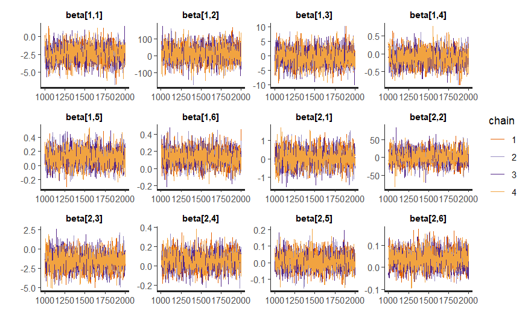
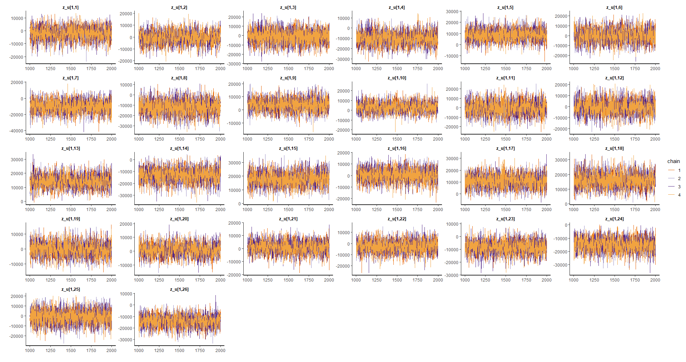
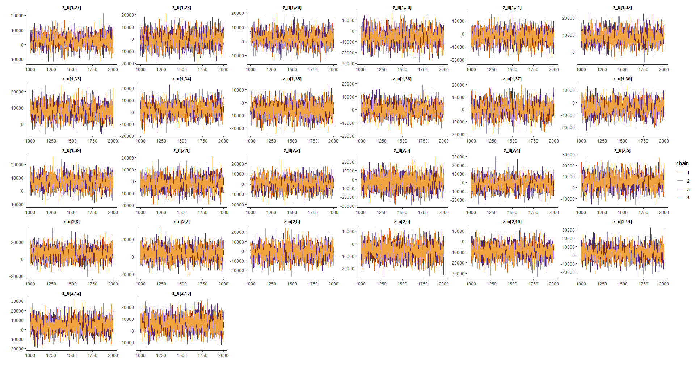
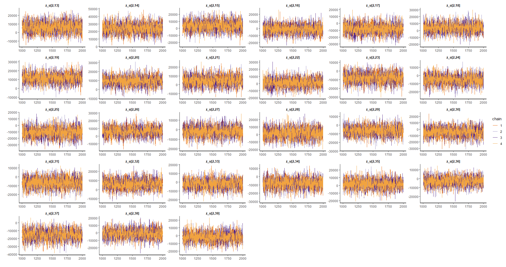
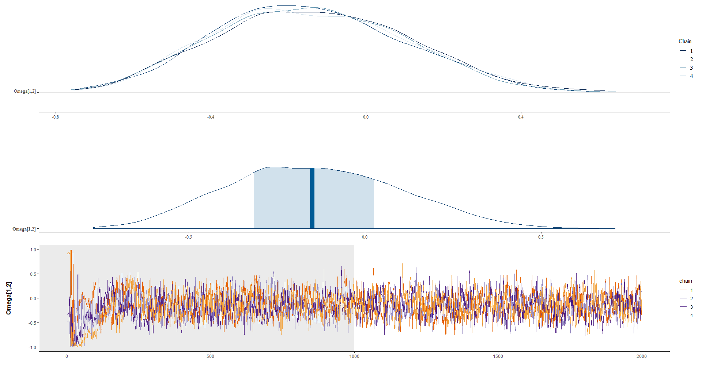
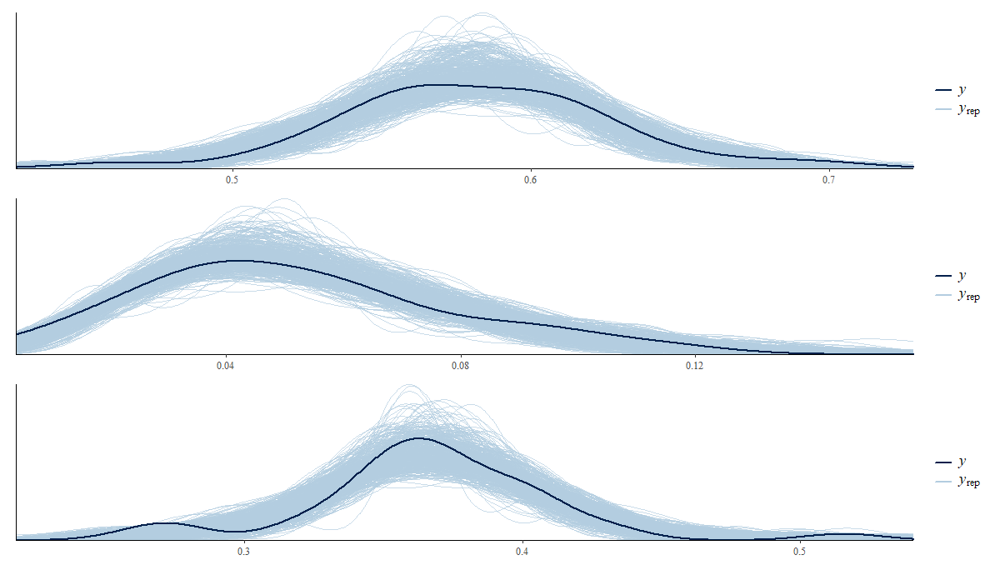

# Session 4 - Area model for labor market statistics


The National Labour Force Survey (NLFS) is a key survey in Jamaica conducted by the Statistical Institute of Jamaica (STATIN). This survey provides detailed and up-to-date information on the dynamics of the country's labor market. Some highlights of the NLFS include:

1. **Employment and Unemployment Measurement:** The survey gathers comprehensive data on the employment status of working-age individuals, identifying the employed, unemployed populations, and the unemployment rate across different demographic segments and regions of the country.

2. **Underemployment and Labor Conditions:** In addition to measuring unemployment, the survey assesses employment conditions, including underemployment, involuntary part-time work, and other forms of inadequate employment.

3. **Demographic Variables:** Important demographic data such as age, gender, education, and geographic location are collected, enabling the identification of specific labor patterns within different population groups.

4. **Frequency and Scope:** The survey is conducted periodically to capture changes in the labor market over time and covers a broad, representative sample of the population to ensure precise and reliable results.


## Definition of the Multinomial Model

-   Let $K$ be the number of categories of the variable of interest $𝑌\sim multinomial\left(\boldsymbol{\theta}\right)$, with $\boldsymbol{\theta}=\left(p_{1},p_{2},\dots ,p_{k}\right)$ and $\sum_{k=1}^{K}p_{k}=1$.

-   Let $N_i$ be the number of elements in the i-th domain and $N_{ik}$ be the number of elements in the k-th category. Note that $\sum_{k=1}^{K}N_{ik}=N_{i}$ and $p_{ik}=\frac{N_{ik}}{N_{i}}$.

-   Let $\hat{p}_{ik}$ be the direct estimation of $p_{ik}$ and $v_{ik}=Var\left(\hat{p}_{ik}\right)$, and denote the estimator of the variance by $\hat{v}_{ik}=\widehat{Var}\left(\hat{p}_{ik}\right)$

Note that the design effect changes between categories; therefore, the first step is to define the effective sample size per category. This is:

The estimation of $\tilde{n}$ is given by $\tilde{n}_{ik} = \frac{(\tilde{p}_{ik}\times(1-\tilde{p}_{ik}))}{\hat{v}_{ik}},$

$\tilde{y}_{ik}=\tilde{n}_{ik}\times\hat{p}_{ik}$

Then, $\hat{n}_{i} = \sum_{k=1}^{K}\tilde{y}_{ik}$

From where it follows that $\hat{y}_{ik} = \hat{n}_i\times \hat{p}_{ik}$

Let $\boldsymbol{\theta}=\left(p_{1},p_{2}, p_{3}\right)^{T}=\left(\frac{N_{i1}}{N_{i}},\frac{N_{i2}}{N_{i}}\frac{N_{i3}}{N_{i}}\right)^{T}$, then the multinomial model for the i-th domain would be:

$$
\left(\tilde{y}_{i1},\tilde{y}_{i2},\tilde{y}_{i3}\right)\mid\hat{n}_{i},\boldsymbol{\theta}_{i}\sim multinomial\left(\hat{n}_{i},\boldsymbol{\theta}_{i}\right)
$$ 
Now, you can write $p_{ik}$ as follows:

$\ln\left(\frac{p_{i2}}{p_{i1}}\right)=\boldsymbol{X}_{i}^{T}\beta_{2} + u_{i2}$ and
$\ln\left(\frac{p_{i3}}{p_{i1}}\right)=\boldsymbol{X}_{i}^{T}\beta_{3}+ u_{i3}$


Given the restriction $1 = p_{i1} + p_{i2} + p_{i3}$ then 
$$p_{i1} + p_{i1}(e^{\boldsymbol{X}_{i}^{T}\boldsymbol{\beta_{2}}}+  u_{i2})+p_{i1}(e^{\boldsymbol{X}_{i}^{T}\boldsymbol{\beta}_{3}} + u_{i3})$$ from where it follows that 

$$
p_{i1}=\frac{1}{1+e^{\boldsymbol{X}_{i}^{T}\boldsymbol{\beta_{2}}}+ u_{i2}+e^{\boldsymbol{X_{i}}^{T}\boldsymbol{\beta_{3}}}+ u_{i3}}
$$

The expressions for $p_{i2}$ and $p_{i3}$ would be:

$$
p_{i2}=\frac{e^{\boldsymbol{X}_{i}^{T}\boldsymbol{\beta}_{2}} + u_{i2}}{1+e^{\boldsymbol{X}_{i}^{T}\boldsymbol{\beta_{2}}}+ u_{i2}+e^{\boldsymbol{X_{i}}^{T}\boldsymbol{\beta_{3}}}+ u_{i3}}
$$

$$
p_{i3}=\frac{e^{\boldsymbol{X}_{i}^{T}\boldsymbol{\beta}_{3}}+ u_{i3}}{1+e^{\boldsymbol{X}_{i}^{T}\boldsymbol{\beta_{2}}}+ u_{i2}+e^{\boldsymbol{X_{i}}^{T}\boldsymbol{\beta_{3}}}+ u_{i3}}
$$

## Loading Libraries

  -   The `survey` library is a statistical analysis tool in R that allows working with complex survey data, such as stratified, multistage, or weighted surveys. It provides functions for parameter estimation, sample design, analysis of variance and regression, and calculation of standard errors.

  -   The `tidyverse` library is a collection of R packages used for data manipulation and visualization. It includes `dplyr`, `ggplot2`, `tidyr`, and others, characterized by its focus on 'tidy' or organized programming, making data exploration and analysis easier.

  -   The `srvyr` library is an extension of the `survey` library that integrates `survey` functions with `dplyr` syntax, facilitating the manipulation of complex survey data. It includes functions for grouping, filtering, and summarizing survey data using 'tidy' syntax.

  -   The `TeachingSampling` library is an R tool used for teaching statistical sampling methods. It includes functions for simulating different types of samples, estimating parameters, calculating standard errors, and constructing confidence intervals, among others.

  -   The `haven` library is an R tool that allows importing and exporting data in different formats, including SPSS, Stata, and SAS. It works with survey data files, providing functions for labeling variables, coding missing data, and converting data across formats.

  -   The `bayesplot` library is an R tool used for visualization and diagnostics of Bayesian models. It includes functions for plotting posterior distributions, convergence diagnostics, residual diagnostic plots, and other graphics related to Bayesian analysis.

  -   The `patchwork` library is an R tool that allows simple and flexible combination of plots. This library makes creating complex plots easier by allowing the combination of multiple plots into a single visualization, especially useful in data analysis and modeling.

  -   The `stringr` library is an R tool used for string manipulation. It includes functions for extracting, manipulating, and modifying text strings, particularly useful in data cleaning and preparation before analysis.

  -   The `rstan` library is an R tool used for Bayesian model estimation using the Markov Chain Monte Carlo (MCMC) method. This library allows specifying and estimating complex models using a simple and flexible language, offering various tools for diagnosis and visualization of results.
  
  

```r
library(survey)
library(tidyverse)
library(srvyr)
library(TeachingSampling)
library(haven)
library(bayesplot)
library(patchwork)
library(stringr)
library(rstan)
```

## Reading the survey and direct estimates

This code performs several operations on a labor survey in Jamaica, represented by the `encuesta` object, which is read from a file in RDS format. Here's the breakdown:

1. **Data Reading:** The code reads data from the Jamaican labor survey from an RDS file located at 'Resources/05_Employment/01_data_JAM.rds'. The data is stored in the `encuesta` object.

2. **Data Transformation:** Through a sequence of operations using the `%>%` pipe and the `transmute()` function from the `dplyr` package, the following transformations are performed on the survey:
    - Specific columns `dam2`, `RFACT`, `PAR_COD`, `CONST_NUMBER`, `ED_NUMBER`, `STRATA`, and `EMPSTATUS` are selected from the survey.
    - More descriptive names are assigned to some columns such as `fep` for `RFACT`, `upm` by combining `PAR_COD`, `CONST_NUMBER`, and `ED_NUMBER`, `estrato` using conditions to define the value based on `STRATA`, and `empleo_label` and `empleo` representing specific categories derived from `EMPSTATUS` with labeled levels and categorical values.

In summary, the code reads a labor survey in Jamaica and performs a series of transformations on selected columns, renaming and reorganizing them for future analyses or processing.


```r
encuesta <- readRDS('Recursos/05_Empleo/01_data_JAM.rds')
## 
id_dominio <- "dam2"

encuesta <-
  encuesta %>%
  transmute(
    dam2,
    fep = RFACT,
    upm = paste0(PAR_COD , CONST_NUMBER, ED_NUMBER),
    estrato = ifelse(is.na(STRATA) ,strata,STRATA),
    empleo_label = as_factor(EMPSTATUS ,levels  = "labels"),
    empleo = as_factor(EMPSTATUS ,levels  = "values") 
  )
```

The presented code defines the sampling design for the analysis of the "survey" in R. The first line sets an option for handling singleton PSU (primary sampling units), indicating that adjustments need to be applied in standard error calculations. The second line uses the "as_survey_design" function from the "survey" library to define the sampling design. The function takes "encuesta" as an argument and the following parameters:

  -   `strata`: The variable defining the strata in the survey, in this case, the "estrato" variable.
  
  -   `ids`: The variable identifying the PSUs in the survey, here, the "upm" variable.
  
  -   `weights`: The variable indicating the survey weights of each observation, in this case, the "fep" variable.
  
  -   `nest`: A logical parameter indicating whether the survey data is nested or not. In this case, it's set to "TRUE" because the data is nested by domain.

Together, these steps allow defining a sampling design that takes into account the sampling characteristics and the weights assigned to each observation in the survey. This is necessary to obtain precise and representative estimations of the parameters of interest.


```r
options(survey.lonely.psu= 'adjust' )
diseno <- encuesta %>%
  as_survey_design(
    strata = estrato,
    ids = upm,
    weights = fep,
    nest=T
  )
```

The following code conducts a descriptive analysis based on a survey design represented by the object `diseno`.

1. **Grouping and Filtering:** It uses the `%>%` function to chain operations. Initially, it groups the data by the domain identifier (`id_dominio`) using `group_by_at()` and subsequently filters observations where the variable `empleo` falls within the range of 3 to 5.

2. **Variable Summary:** With the `summarise()` function, it computes various summaries for different categories of the variable `empleo`. These summaries include the weighted count for employed, unemployed, and inactive individuals (`n_ocupado`, `n_desocupado`, `n_inactivo`). Furthermore, it utilizes the `survey_mean()` function to obtain weighted mean estimates for each category of `empleo`, considering the variable type (`vartype`) and design effect (`deff`).


```r
indicador_dam <-
  diseno %>% group_by_at(id_dominio) %>% 
  filter(empleo %in% c(3:5)) %>%
  summarise(
    n_ocupado = unweighted(sum(empleo == 3)),
    n_desocupado = unweighted(sum(empleo == 4)),
    n_inactivo = unweighted(sum(empleo == 5)),

    Ocupado = survey_mean(empleo == 3,
      vartype = c("se",  "var"),
      deff = T
    ),
    Desocupado = survey_mean(empleo == 4,
                          vartype = c("se",  "var"),
                          deff = T
    ),
    Inactivo = survey_mean(empleo == 5,
                          vartype = c("se",  "var"),
                          deff = T
    )
  )
```

3. **Upms counts by domains:**  This code performs operations on the survey data. First, it selects the columns id_dominio and upm, removes duplicate rows, and then counts the number of unique upm values for each id_dominio. Subsequently, it performs an inner join of these results with an existing object indicador_dam based on the id_dominio column, thus consolidating information about the quantity of unique upm values per identified domain in the survey.


```r
indicador_dam <- encuesta %>% select(id_dominio, upm) %>%
  distinct() %>% 
  group_by_at(id_dominio) %>% 
  tally(name = "n_upm") %>% 
  inner_join(indicador_dam, by = id_dominio)
#Save data----------------------------
saveRDS(indicador_dam,'Recursos/05_Empleo/indicador_dam.Rds' )
```


## Domain Selection

After conducting the necessary validations, the rule is set to include in the study the domains that have:

- Two or more PSUs per domain.
- An estimated design effect greater than 1 in all categories.


```r
indicador_dam1 <- indicador_dam %>%
  filter(n_upm >= 2,
         Desocupado_deff > 1,
         Ocupado_deff > 1,
         Inactivo_deff > 1)  %>%
  mutate(id_orden = 1:n())

saveRDS(object = indicador_dam1, "Recursos/05_Empleo/02_base_modelo.Rds")
```

<table class="table table-striped lightable-classic" style="width: auto !important; margin-left: auto; margin-right: auto; font-family: Arial Narrow; width: auto !important; margin-left: auto; margin-right: auto;">
 <thead>
  <tr>
   <th style="text-align:left;"> dam2 </th>
   <th style="text-align:right;"> n_upm </th>
   <th style="text-align:right;"> n_ocupado </th>
   <th style="text-align:right;"> n_desocupado </th>
   <th style="text-align:right;"> n_inactivo </th>
   <th style="text-align:right;"> Ocupado </th>
   <th style="text-align:right;"> Ocupado_se </th>
   <th style="text-align:right;"> Ocupado_var </th>
   <th style="text-align:right;"> Ocupado_deff </th>
   <th style="text-align:right;"> Desocupado </th>
   <th style="text-align:right;"> Desocupado_se </th>
   <th style="text-align:right;"> Desocupado_var </th>
   <th style="text-align:right;"> Desocupado_deff </th>
   <th style="text-align:right;"> Inactivo </th>
   <th style="text-align:right;"> Inactivo_se </th>
   <th style="text-align:right;"> Inactivo_var </th>
   <th style="text-align:right;"> Inactivo_deff </th>
  </tr>
 </thead>
<tbody>
  <tr>
   <td style="text-align:left;"> 0101 </td>
   <td style="text-align:right;"> 17 </td>
   <td style="text-align:right;"> 784 </td>
   <td style="text-align:right;"> 40 </td>
   <td style="text-align:right;"> 487 </td>
   <td style="text-align:right;"> 0.6000 </td>
   <td style="text-align:right;"> 0.0188 </td>
   <td style="text-align:right;"> 0.0004 </td>
   <td style="text-align:right;"> 1.9501 </td>
   <td style="text-align:right;"> 0.0323 </td>
   <td style="text-align:right;"> 0.0079 </td>
   <td style="text-align:right;"> 1e-04 </td>
   <td style="text-align:right;"> 2.6463 </td>
   <td style="text-align:right;"> 0.3677 </td>
   <td style="text-align:right;"> 0.0238 </td>
   <td style="text-align:right;"> 0.0006 </td>
   <td style="text-align:right;"> 3.2225 </td>
  </tr>
  <tr>
   <td style="text-align:left;"> 0201 </td>
   <td style="text-align:right;"> 11 </td>
   <td style="text-align:right;"> 733 </td>
   <td style="text-align:right;"> 40 </td>
   <td style="text-align:right;"> 420 </td>
   <td style="text-align:right;"> 0.6033 </td>
   <td style="text-align:right;"> 0.0213 </td>
   <td style="text-align:right;"> 0.0005 </td>
   <td style="text-align:right;"> 2.2667 </td>
   <td style="text-align:right;"> 0.0450 </td>
   <td style="text-align:right;"> 0.0101 </td>
   <td style="text-align:right;"> 1e-04 </td>
   <td style="text-align:right;"> 2.8606 </td>
   <td style="text-align:right;"> 0.3517 </td>
   <td style="text-align:right;"> 0.0138 </td>
   <td style="text-align:right;"> 0.0002 </td>
   <td style="text-align:right;"> 1.0063 </td>
  </tr>
  <tr>
   <td style="text-align:left;"> 0202 </td>
   <td style="text-align:right;"> 11 </td>
   <td style="text-align:right;"> 617 </td>
   <td style="text-align:right;"> 25 </td>
   <td style="text-align:right;"> 332 </td>
   <td style="text-align:right;"> 0.6448 </td>
   <td style="text-align:right;"> 0.0470 </td>
   <td style="text-align:right;"> 0.0022 </td>
   <td style="text-align:right;"> 9.4431 </td>
   <td style="text-align:right;"> 0.0258 </td>
   <td style="text-align:right;"> 0.0066 </td>
   <td style="text-align:right;"> 0e+00 </td>
   <td style="text-align:right;"> 1.7200 </td>
   <td style="text-align:right;"> 0.3295 </td>
   <td style="text-align:right;"> 0.0448 </td>
   <td style="text-align:right;"> 0.0020 </td>
   <td style="text-align:right;"> 8.8895 </td>
  </tr>
  <tr>
   <td style="text-align:left;"> 0203 </td>
   <td style="text-align:right;"> 12 </td>
   <td style="text-align:right;"> 645 </td>
   <td style="text-align:right;"> 17 </td>
   <td style="text-align:right;"> 363 </td>
   <td style="text-align:right;"> 0.6409 </td>
   <td style="text-align:right;"> 0.0184 </td>
   <td style="text-align:right;"> 0.0003 </td>
   <td style="text-align:right;"> 1.5181 </td>
   <td style="text-align:right;"> 0.0183 </td>
   <td style="text-align:right;"> 0.0070 </td>
   <td style="text-align:right;"> 0e+00 </td>
   <td style="text-align:right;"> 2.7981 </td>
   <td style="text-align:right;"> 0.3408 </td>
   <td style="text-align:right;"> 0.0188 </td>
   <td style="text-align:right;"> 0.0004 </td>
   <td style="text-align:right;"> 1.6228 </td>
  </tr>
  <tr>
   <td style="text-align:left;"> 0204 </td>
   <td style="text-align:right;"> 11 </td>
   <td style="text-align:right;"> 638 </td>
   <td style="text-align:right;"> 69 </td>
   <td style="text-align:right;"> 402 </td>
   <td style="text-align:right;"> 0.5574 </td>
   <td style="text-align:right;"> 0.0258 </td>
   <td style="text-align:right;"> 0.0007 </td>
   <td style="text-align:right;"> 3.0165 </td>
   <td style="text-align:right;"> 0.0583 </td>
   <td style="text-align:right;"> 0.0131 </td>
   <td style="text-align:right;"> 2e-04 </td>
   <td style="text-align:right;"> 3.4711 </td>
   <td style="text-align:right;"> 0.3843 </td>
   <td style="text-align:right;"> 0.0253 </td>
   <td style="text-align:right;"> 0.0006 </td>
   <td style="text-align:right;"> 3.0083 </td>
  </tr>
  <tr>
   <td style="text-align:left;"> 0207 </td>
   <td style="text-align:right;"> 11 </td>
   <td style="text-align:right;"> 473 </td>
   <td style="text-align:right;"> 22 </td>
   <td style="text-align:right;"> 374 </td>
   <td style="text-align:right;"> 0.5350 </td>
   <td style="text-align:right;"> 0.0193 </td>
   <td style="text-align:right;"> 0.0004 </td>
   <td style="text-align:right;"> 1.3071 </td>
   <td style="text-align:right;"> 0.0327 </td>
   <td style="text-align:right;"> 0.0088 </td>
   <td style="text-align:right;"> 1e-04 </td>
   <td style="text-align:right;"> 2.1232 </td>
   <td style="text-align:right;"> 0.4323 </td>
   <td style="text-align:right;"> 0.0176 </td>
   <td style="text-align:right;"> 0.0003 </td>
   <td style="text-align:right;"> 1.0991 </td>
  </tr>
  <tr>
   <td style="text-align:left;"> 0209 </td>
   <td style="text-align:right;"> 8 </td>
   <td style="text-align:right;"> 434 </td>
   <td style="text-align:right;"> 4 </td>
   <td style="text-align:right;"> 307 </td>
   <td style="text-align:right;"> 0.5666 </td>
   <td style="text-align:right;"> 0.0405 </td>
   <td style="text-align:right;"> 0.0016 </td>
   <td style="text-align:right;"> 5.0127 </td>
   <td style="text-align:right;"> 0.0051 </td>
   <td style="text-align:right;"> 0.0028 </td>
   <td style="text-align:right;"> 0e+00 </td>
   <td style="text-align:right;"> 1.1608 </td>
   <td style="text-align:right;"> 0.4284 </td>
   <td style="text-align:right;"> 0.0412 </td>
   <td style="text-align:right;"> 0.0017 </td>
   <td style="text-align:right;"> 5.1834 </td>
  </tr>
  <tr>
   <td style="text-align:left;"> 0211 </td>
   <td style="text-align:right;"> 13 </td>
   <td style="text-align:right;"> 713 </td>
   <td style="text-align:right;"> 11 </td>
   <td style="text-align:right;"> 396 </td>
   <td style="text-align:right;"> 0.6232 </td>
   <td style="text-align:right;"> 0.0314 </td>
   <td style="text-align:right;"> 0.0010 </td>
   <td style="text-align:right;"> 4.7191 </td>
   <td style="text-align:right;"> 0.0103 </td>
   <td style="text-align:right;"> 0.0050 </td>
   <td style="text-align:right;"> 0e+00 </td>
   <td style="text-align:right;"> 2.7466 </td>
   <td style="text-align:right;"> 0.3665 </td>
   <td style="text-align:right;"> 0.0286 </td>
   <td style="text-align:right;"> 0.0008 </td>
   <td style="text-align:right;"> 3.9631 </td>
  </tr>
  <tr>
   <td style="text-align:left;"> 0212 </td>
   <td style="text-align:right;"> 9 </td>
   <td style="text-align:right;"> 639 </td>
   <td style="text-align:right;"> 49 </td>
   <td style="text-align:right;"> 301 </td>
   <td style="text-align:right;"> 0.6179 </td>
   <td style="text-align:right;"> 0.0274 </td>
   <td style="text-align:right;"> 0.0007 </td>
   <td style="text-align:right;"> 3.1548 </td>
   <td style="text-align:right;"> 0.0649 </td>
   <td style="text-align:right;"> 0.0292 </td>
   <td style="text-align:right;"> 9e-04 </td>
   <td style="text-align:right;"> 13.9661 </td>
   <td style="text-align:right;"> 0.3172 </td>
   <td style="text-align:right;"> 0.0235 </td>
   <td style="text-align:right;"> 0.0006 </td>
   <td style="text-align:right;"> 2.5491 </td>
  </tr>
  <tr>
   <td style="text-align:left;"> 0302 </td>
   <td style="text-align:right;"> 10 </td>
   <td style="text-align:right;"> 676 </td>
   <td style="text-align:right;"> 91 </td>
   <td style="text-align:right;"> 327 </td>
   <td style="text-align:right;"> 0.5907 </td>
   <td style="text-align:right;"> 0.0285 </td>
   <td style="text-align:right;"> 0.0008 </td>
   <td style="text-align:right;"> 3.6997 </td>
   <td style="text-align:right;"> 0.0877 </td>
   <td style="text-align:right;"> 0.0148 </td>
   <td style="text-align:right;"> 2e-04 </td>
   <td style="text-align:right;"> 3.0084 </td>
   <td style="text-align:right;"> 0.3215 </td>
   <td style="text-align:right;"> 0.0189 </td>
   <td style="text-align:right;"> 0.0004 </td>
   <td style="text-align:right;"> 1.8052 </td>
  </tr>
</tbody>
</table>


## Modeling in `STAN`

The code presents the implementation of a multinomial logistic response area model using the programming language `STAN`. In this model, it is assumed that the response variable in each domain follows a multinomial distribution. The parameters governing the relationship between the predictor variables and the response variable are assumed to be different in each domain and are modeled as random effects.

The *functions* section defines an auxiliary function called `pred_theta()`, used to predict the values of the response variable in the unobserved domains. The `data` section contains the model's input variables, including the number of domains, the number of response variable categories, direct estimates of the response variable in each domain, observed covariates in each domain, and covariates corresponding to the unobserved domains.

The *parameters* section defines the model's unknown parameters, including the *beta* parameter matrix, containing coefficients relating covariates to the response variable in each category. Standard deviations of the random effects are also included.

The *transformed parameters* section defines the `theta` parameter vector, containing the probabilities of belonging to each category of the response variable in each domain. Random effects are used to adjust the values of `theta` in each domain.

The *model* section defines the model structure and includes prior distributions for the unknown parameters. Particularly, a normal distribution is used for the coefficients of the beta matrix. Finally, it calculates the likelihood function of the multinomial distribution for the direct estimates of the response variable in each domain.

The *generated quantities* section is used to compute predictions of the response variable in the unobserved domains using the previously defined auxiliary function.


```r
functions {
  matrix pred_theta(matrix Xp, int p, matrix beta){
  int D1 = rows(Xp);
  real num1[D1, p];
  real den1[D1];
  matrix[D1,p] theta_p;
  matrix[D1,p] tasa_pred;
  
  for(d in 1:D1){
    num1[d, 1] = 1;
    num1[d, 2] = exp(Xp[d, ] * beta[1, ]' ) ;
    num1[d, 3] = exp(Xp[d, ] * beta[2, ]' ) ;
    
    den1[d] = sum(num1[d, ]);
  }
  
  for(d in 1:D1){
    for(i in 2:p){
    theta_p[d, i] = num1[d, i]/den1[d];
    }
    theta_p[d, 1] = 1/den1[d];
   }

for(d in 1:D1){
    tasa_pred[d, 1] = theta_p[d,2]/(theta_p[d,1] + theta_p[d,2]);// TD
    tasa_pred[d, 2] = theta_p[d,1];                              // TO
    tasa_pred[d, 3] = theta_p[d,1] + theta_p[d,2];               // TP
    }

  return tasa_pred  ;
  }
  
}

data {
  int<lower=1> D; // número de dominios 
  int<lower=1> P; // categorías
  int<lower=1> K; // cantidad de regresores
  int hat_y[D, P]; // matriz de datos
  matrix[D, K] X_obs; // matriz de covariables
  int<lower=1> D1; // número de dominios 
  matrix[D1, K] X_pred; // matriz de covariables
}
  

parameters {
  matrix[P-1, K] beta;// matriz de parámetros 
  vector<lower=0>[P-1] sigma_u;       // random effects standard deviations
  // declare L_u to be the Choleski factor of a 2x2 correlation matrix
  cholesky_factor_corr[P-1] L_u;
  matrix[P-1, D] z_u;                  
}

transformed parameters {
  simplex[P] theta[D];// vector de parámetros;
  real num[D, P];
  real den[D];
  matrix[D,P] tasa_obs;
  // this transform random effects so that they have the correlation
  // matrix specified by the correlation matrix above
  matrix[P-1, D] u; // random effect matrix
  u = diag_pre_multiply(sigma_u, L_u) * z_u;
  
  for(d in 1:D){
    num[d, 1] = 1;
    num[d, 2] = exp(X_obs[d, ] * beta[1, ]' + u[1, d]) ;
    num[d, 3] = exp(X_obs[d, ] * beta[2, ]' + u[2, d]) ;
    
    den[d] = sum(num[d, ]);
  }
  
  for(d in 1:D){
    for(p in 2:P){
    theta[d, p] = num[d, p]/den[d];
    }
    theta[d, 1] = 1/den[d];
  }
  
  for(d in 1:D){
    tasa_obs[d, 1] = theta[d,2]/(theta[d,1] + theta[d,2]);// TD
    tasa_obs[d, 2] = theta[d,1];                                // TO
    tasa_obs[d, 3] = theta[d,1] + theta[d,2];               // TP
    }

}

model {
  L_u ~ lkj_corr_cholesky(1); // LKJ prior for the correlation matrix
  to_vector(z_u) ~ normal(0, 10000);
  // sigma_u ~ cauchy(0, 50);
  sigma_u ~ inv_gamma(0.0001, 0.0001);
  
  for(p in 2:P){
    for(k in 1:K){
      beta[p-1, k] ~ normal(0, 10000);
    }
    }
  
  for(d in 1:D){
    target += multinomial_lpmf(hat_y[d, ] | theta[d, ]); 
  }
}

  
generated quantities {
  matrix[D1,P] tasa_pred;
  matrix[2, 2] Omega;
  Omega = L_u * L_u'; // so that it return the correlation matrix
  
 tasa_pred = pred_theta(X_pred, P, beta);
}
```

## Preparing supplies for `STAN`

   1. Reading and adaptation of covariates
  

```r
statelevel_predictors_df <- 
  readRDS('Recursos/05_Empleo/03_statelevel_predictors_dam.rds') %>% 
  mutate(id_orden =1:n())

head(statelevel_predictors_df,10) %>% tba()
```

<table class="table table-striped lightable-classic" style="width: auto !important; margin-left: auto; margin-right: auto; font-family: Arial Narrow; width: auto !important; margin-left: auto; margin-right: auto;">
 <thead>
  <tr>
   <th style="text-align:left;"> dam2 </th>
   <th style="text-align:right;"> area1 </th>
   <th style="text-align:right;"> sex2 </th>
   <th style="text-align:right;"> age </th>
   <th style="text-align:right;"> tiene_sanitario </th>
   <th style="text-align:right;"> tiene_electricidad </th>
   <th style="text-align:right;"> tiene_acueducto </th>
   <th style="text-align:right;"> tiene_gas </th>
   <th style="text-align:right;"> eliminar_basura </th>
   <th style="text-align:right;"> tiene_internet </th>
   <th style="text-align:right;"> material_paredes </th>
   <th style="text-align:right;"> material_techo </th>
   <th style="text-align:right;"> TRANMODE_PRIVATE_CAR </th>
   <th style="text-align:right;"> ODDJOB </th>
   <th style="text-align:right;"> WORKED </th>
   <th style="text-align:right;"> stable_lights_mean </th>
   <th style="text-align:right;"> crops.coverfraction_mean </th>
   <th style="text-align:right;"> urban.coverfraction_mean </th>
   <th style="text-align:right;"> gHM_mean </th>
   <th style="text-align:right;"> accessibility_mean </th>
   <th style="text-align:right;"> accessibility_walking_only_mean </th>
   <th style="text-align:right;"> stable_lights_sum </th>
   <th style="text-align:right;"> crops.coverfraction_sum </th>
   <th style="text-align:right;"> urban.coverfraction_sum </th>
   <th style="text-align:right;"> gHM_sum </th>
   <th style="text-align:right;"> accessibility_sum </th>
   <th style="text-align:right;"> accessibility_walking_only_sum </th>
   <th style="text-align:right;"> id_orden </th>
  </tr>
 </thead>
<tbody>
  <tr>
   <td style="text-align:left;"> 0101 </td>
   <td style="text-align:right;"> 1.0000 </td>
   <td style="text-align:right;"> 0.5087 </td>
   <td style="text-align:right;"> 2.5043 </td>
   <td style="text-align:right;"> 0.0019 </td>
   <td style="text-align:right;"> 0.7596 </td>
   <td style="text-align:right;"> 0.9545 </td>
   <td style="text-align:right;"> 0.7728 </td>
   <td style="text-align:right;"> 0.7804 </td>
   <td style="text-align:right;"> 0.9453 </td>
   <td style="text-align:right;"> 0.0095 </td>
   <td style="text-align:right;"> 0.7589 </td>
   <td style="text-align:right;"> 0.1472 </td>
   <td style="text-align:right;"> 0.0090 </td>
   <td style="text-align:right;"> 0.3488 </td>
   <td style="text-align:right;"> 0.9393 </td>
   <td style="text-align:right;"> -0.5459 </td>
   <td style="text-align:right;"> 0.4390 </td>
   <td style="text-align:right;"> 0.5741 </td>
   <td style="text-align:right;"> -0.7760 </td>
   <td style="text-align:right;"> -0.9315 </td>
   <td style="text-align:right;"> -1.2660 </td>
   <td style="text-align:right;"> -0.5849 </td>
   <td style="text-align:right;"> -0.8078 </td>
   <td style="text-align:right;"> -1.1991 </td>
   <td style="text-align:right;"> -0.6242 </td>
   <td style="text-align:right;"> -0.8780 </td>
   <td style="text-align:right;"> 1 </td>
  </tr>
  <tr>
   <td style="text-align:left;"> 0102 </td>
   <td style="text-align:right;"> 1.0000 </td>
   <td style="text-align:right;"> 0.4754 </td>
   <td style="text-align:right;"> 2.4689 </td>
   <td style="text-align:right;"> 0.0011 </td>
   <td style="text-align:right;"> 0.9064 </td>
   <td style="text-align:right;"> 0.9867 </td>
   <td style="text-align:right;"> 0.9181 </td>
   <td style="text-align:right;"> 0.9084 </td>
   <td style="text-align:right;"> 0.9882 </td>
   <td style="text-align:right;"> 0.0007 </td>
   <td style="text-align:right;"> 0.9060 </td>
   <td style="text-align:right;"> 0.0680 </td>
   <td style="text-align:right;"> 0.0126 </td>
   <td style="text-align:right;"> 0.2859 </td>
   <td style="text-align:right;"> 1.6857 </td>
   <td style="text-align:right;"> -0.7090 </td>
   <td style="text-align:right;"> 2.2891 </td>
   <td style="text-align:right;"> 1.8346 </td>
   <td style="text-align:right;"> -0.8897 </td>
   <td style="text-align:right;"> -1.2588 </td>
   <td style="text-align:right;"> -1.7964 </td>
   <td style="text-align:right;"> -0.5947 </td>
   <td style="text-align:right;"> -1.2224 </td>
   <td style="text-align:right;"> -1.2993 </td>
   <td style="text-align:right;"> -0.6272 </td>
   <td style="text-align:right;"> -0.8873 </td>
   <td style="text-align:right;"> 2 </td>
  </tr>
  <tr>
   <td style="text-align:left;"> 0103 </td>
   <td style="text-align:right;"> 1.0000 </td>
   <td style="text-align:right;"> 0.5037 </td>
   <td style="text-align:right;"> 2.2858 </td>
   <td style="text-align:right;"> 0.0152 </td>
   <td style="text-align:right;"> 0.6930 </td>
   <td style="text-align:right;"> 0.9741 </td>
   <td style="text-align:right;"> 0.7440 </td>
   <td style="text-align:right;"> 0.7362 </td>
   <td style="text-align:right;"> 0.9712 </td>
   <td style="text-align:right;"> 0.0028 </td>
   <td style="text-align:right;"> 0.6942 </td>
   <td style="text-align:right;"> 0.0491 </td>
   <td style="text-align:right;"> 0.0135 </td>
   <td style="text-align:right;"> 0.2819 </td>
   <td style="text-align:right;"> 1.6900 </td>
   <td style="text-align:right;"> -0.3571 </td>
   <td style="text-align:right;"> 2.0344 </td>
   <td style="text-align:right;"> 1.7510 </td>
   <td style="text-align:right;"> -0.8684 </td>
   <td style="text-align:right;"> -1.2055 </td>
   <td style="text-align:right;"> -1.6990 </td>
   <td style="text-align:right;"> -0.5880 </td>
   <td style="text-align:right;"> -1.0667 </td>
   <td style="text-align:right;"> -1.2842 </td>
   <td style="text-align:right;"> -0.6269 </td>
   <td style="text-align:right;"> -0.8866 </td>
   <td style="text-align:right;"> 3 </td>
  </tr>
  <tr>
   <td style="text-align:left;"> 0201 </td>
   <td style="text-align:right;"> 0.5147 </td>
   <td style="text-align:right;"> 0.5060 </td>
   <td style="text-align:right;"> 2.5517 </td>
   <td style="text-align:right;"> 0.0138 </td>
   <td style="text-align:right;"> 0.2342 </td>
   <td style="text-align:right;"> 0.8546 </td>
   <td style="text-align:right;"> 0.2955 </td>
   <td style="text-align:right;"> 0.6589 </td>
   <td style="text-align:right;"> 0.8386 </td>
   <td style="text-align:right;"> 0.0159 </td>
   <td style="text-align:right;"> 0.2215 </td>
   <td style="text-align:right;"> 0.1709 </td>
   <td style="text-align:right;"> 0.0077 </td>
   <td style="text-align:right;"> 0.3647 </td>
   <td style="text-align:right;"> -0.4380 </td>
   <td style="text-align:right;"> -0.0874 </td>
   <td style="text-align:right;"> -0.6524 </td>
   <td style="text-align:right;"> -0.6504 </td>
   <td style="text-align:right;"> 0.0531 </td>
   <td style="text-align:right;"> 0.0511 </td>
   <td style="text-align:right;"> 1.0737 </td>
   <td style="text-align:right;"> -0.1234 </td>
   <td style="text-align:right;"> -0.6327 </td>
   <td style="text-align:right;"> 0.0186 </td>
   <td style="text-align:right;"> -0.2048 </td>
   <td style="text-align:right;"> -0.2380 </td>
   <td style="text-align:right;"> 4 </td>
  </tr>
  <tr>
   <td style="text-align:left;"> 0202 </td>
   <td style="text-align:right;"> 0.9986 </td>
   <td style="text-align:right;"> 0.5376 </td>
   <td style="text-align:right;"> 2.7635 </td>
   <td style="text-align:right;"> 0.0028 </td>
   <td style="text-align:right;"> 0.3852 </td>
   <td style="text-align:right;"> 0.8236 </td>
   <td style="text-align:right;"> 0.4958 </td>
   <td style="text-align:right;"> 0.4138 </td>
   <td style="text-align:right;"> 0.6884 </td>
   <td style="text-align:right;"> 0.0014 </td>
   <td style="text-align:right;"> 0.5081 </td>
   <td style="text-align:right;"> 0.4489 </td>
   <td style="text-align:right;"> 0.0046 </td>
   <td style="text-align:right;"> 0.4512 </td>
   <td style="text-align:right;"> 1.4627 </td>
   <td style="text-align:right;"> -0.6237 </td>
   <td style="text-align:right;"> 1.1018 </td>
   <td style="text-align:right;"> 0.8775 </td>
   <td style="text-align:right;"> -0.8226 </td>
   <td style="text-align:right;"> -1.0846 </td>
   <td style="text-align:right;"> -0.8523 </td>
   <td style="text-align:right;"> -0.5884 </td>
   <td style="text-align:right;"> 0.1016 </td>
   <td style="text-align:right;"> -1.1468 </td>
   <td style="text-align:right;"> -0.6231 </td>
   <td style="text-align:right;"> -0.8757 </td>
   <td style="text-align:right;"> 5 </td>
  </tr>
  <tr>
   <td style="text-align:left;"> 0203 </td>
   <td style="text-align:right;"> 0.9754 </td>
   <td style="text-align:right;"> 0.5432 </td>
   <td style="text-align:right;"> 2.8765 </td>
   <td style="text-align:right;"> 0.0015 </td>
   <td style="text-align:right;"> 0.3326 </td>
   <td style="text-align:right;"> 0.7915 </td>
   <td style="text-align:right;"> 0.4864 </td>
   <td style="text-align:right;"> 0.3495 </td>
   <td style="text-align:right;"> 0.5945 </td>
   <td style="text-align:right;"> 0.0014 </td>
   <td style="text-align:right;"> 0.5135 </td>
   <td style="text-align:right;"> 0.5314 </td>
   <td style="text-align:right;"> 0.0042 </td>
   <td style="text-align:right;"> 0.4880 </td>
   <td style="text-align:right;"> 1.3519 </td>
   <td style="text-align:right;"> -0.6402 </td>
   <td style="text-align:right;"> 0.9281 </td>
   <td style="text-align:right;"> 0.8771 </td>
   <td style="text-align:right;"> -0.6780 </td>
   <td style="text-align:right;"> -0.9356 </td>
   <td style="text-align:right;"> -0.8100 </td>
   <td style="text-align:right;"> -0.5891 </td>
   <td style="text-align:right;"> 0.0754 </td>
   <td style="text-align:right;"> -1.1302 </td>
   <td style="text-align:right;"> -0.6160 </td>
   <td style="text-align:right;"> -0.8673 </td>
   <td style="text-align:right;"> 6 </td>
  </tr>
  <tr>
   <td style="text-align:left;"> 0204 </td>
   <td style="text-align:right;"> 1.0000 </td>
   <td style="text-align:right;"> 0.5300 </td>
   <td style="text-align:right;"> 2.6401 </td>
   <td style="text-align:right;"> 0.0042 </td>
   <td style="text-align:right;"> 0.5720 </td>
   <td style="text-align:right;"> 0.8835 </td>
   <td style="text-align:right;"> 0.6198 </td>
   <td style="text-align:right;"> 0.6166 </td>
   <td style="text-align:right;"> 0.7998 </td>
   <td style="text-align:right;"> 0.0016 </td>
   <td style="text-align:right;"> 0.5975 </td>
   <td style="text-align:right;"> 0.3197 </td>
   <td style="text-align:right;"> 0.0071 </td>
   <td style="text-align:right;"> 0.4125 </td>
   <td style="text-align:right;"> 1.6333 </td>
   <td style="text-align:right;"> -0.5050 </td>
   <td style="text-align:right;"> 0.9165 </td>
   <td style="text-align:right;"> 1.0157 </td>
   <td style="text-align:right;"> -0.8334 </td>
   <td style="text-align:right;"> -1.1168 </td>
   <td style="text-align:right;"> -0.6630 </td>
   <td style="text-align:right;"> -0.5781 </td>
   <td style="text-align:right;"> 0.0671 </td>
   <td style="text-align:right;"> -1.1229 </td>
   <td style="text-align:right;"> -0.6232 </td>
   <td style="text-align:right;"> -0.8762 </td>
   <td style="text-align:right;"> 7 </td>
  </tr>
  <tr>
   <td style="text-align:left;"> 0205 </td>
   <td style="text-align:right;"> 1.0000 </td>
   <td style="text-align:right;"> 0.5182 </td>
   <td style="text-align:right;"> 2.6644 </td>
   <td style="text-align:right;"> 0.0013 </td>
   <td style="text-align:right;"> 0.8060 </td>
   <td style="text-align:right;"> 0.9590 </td>
   <td style="text-align:right;"> 0.8347 </td>
   <td style="text-align:right;"> 0.8130 </td>
   <td style="text-align:right;"> 0.9091 </td>
   <td style="text-align:right;"> 0.0030 </td>
   <td style="text-align:right;"> 0.8234 </td>
   <td style="text-align:right;"> 0.3291 </td>
   <td style="text-align:right;"> 0.0068 </td>
   <td style="text-align:right;"> 0.4559 </td>
   <td style="text-align:right;"> 1.7522 </td>
   <td style="text-align:right;"> -0.6844 </td>
   <td style="text-align:right;"> 2.3011 </td>
   <td style="text-align:right;"> 1.8174 </td>
   <td style="text-align:right;"> -0.8888 </td>
   <td style="text-align:right;"> -1.2573 </td>
   <td style="text-align:right;"> -1.2927 </td>
   <td style="text-align:right;"> -0.5937 </td>
   <td style="text-align:right;"> -0.0489 </td>
   <td style="text-align:right;"> -1.2119 </td>
   <td style="text-align:right;"> -0.6266 </td>
   <td style="text-align:right;"> -0.8856 </td>
   <td style="text-align:right;"> 8 </td>
  </tr>
  <tr>
   <td style="text-align:left;"> 0206 </td>
   <td style="text-align:right;"> 1.0000 </td>
   <td style="text-align:right;"> 0.5157 </td>
   <td style="text-align:right;"> 2.3750 </td>
   <td style="text-align:right;"> 0.0290 </td>
   <td style="text-align:right;"> 0.0285 </td>
   <td style="text-align:right;"> 0.8879 </td>
   <td style="text-align:right;"> 0.1433 </td>
   <td style="text-align:right;"> 0.1516 </td>
   <td style="text-align:right;"> 0.9034 </td>
   <td style="text-align:right;"> 0.0258 </td>
   <td style="text-align:right;"> 0.0320 </td>
   <td style="text-align:right;"> 0.0639 </td>
   <td style="text-align:right;"> 0.0139 </td>
   <td style="text-align:right;"> 0.2914 </td>
   <td style="text-align:right;"> 1.7522 </td>
   <td style="text-align:right;"> -0.4289 </td>
   <td style="text-align:right;"> 2.1777 </td>
   <td style="text-align:right;"> 1.8272 </td>
   <td style="text-align:right;"> -0.8968 </td>
   <td style="text-align:right;"> -1.2779 </td>
   <td style="text-align:right;"> -1.8138 </td>
   <td style="text-align:right;"> -0.5914 </td>
   <td style="text-align:right;"> -1.3125 </td>
   <td style="text-align:right;"> -1.3046 </td>
   <td style="text-align:right;"> -0.6273 </td>
   <td style="text-align:right;"> -0.8875 </td>
   <td style="text-align:right;"> 9 </td>
  </tr>
  <tr>
   <td style="text-align:left;"> 0207 </td>
   <td style="text-align:right;"> 1.0000 </td>
   <td style="text-align:right;"> 0.5097 </td>
   <td style="text-align:right;"> 2.4257 </td>
   <td style="text-align:right;"> 0.0465 </td>
   <td style="text-align:right;"> 0.1581 </td>
   <td style="text-align:right;"> 0.8925 </td>
   <td style="text-align:right;"> 0.2551 </td>
   <td style="text-align:right;"> 0.2337 </td>
   <td style="text-align:right;"> 0.9198 </td>
   <td style="text-align:right;"> 0.0162 </td>
   <td style="text-align:right;"> 0.1512 </td>
   <td style="text-align:right;"> 0.0717 </td>
   <td style="text-align:right;"> 0.0169 </td>
   <td style="text-align:right;"> 0.3121 </td>
   <td style="text-align:right;"> 1.7444 </td>
   <td style="text-align:right;"> -0.4662 </td>
   <td style="text-align:right;"> 1.7771 </td>
   <td style="text-align:right;"> 1.6966 </td>
   <td style="text-align:right;"> -0.8322 </td>
   <td style="text-align:right;"> -1.1072 </td>
   <td style="text-align:right;"> -1.5815 </td>
   <td style="text-align:right;"> -0.5898 </td>
   <td style="text-align:right;"> -1.0882 </td>
   <td style="text-align:right;"> -1.2650 </td>
   <td style="text-align:right;"> -0.6264 </td>
   <td style="text-align:right;"> -0.8850 </td>
   <td style="text-align:right;"> 10 </td>
  </tr>
</tbody>
</table>
  
2. Select the model variables and create a covariate matrix.


```r
names_cov <-
  c(
   "dam2",
    "ODDJOB","WORKED",
    "stable_lights_mean",
    "accessibility_mean",
    "urban.coverfraction_sum",
    "id_orden"
  )
X_pred <-
  anti_join(statelevel_predictors_df %>% select(all_of(names_cov)),
            indicador_dam1 %>% select(dam2))
```

The code block identifies which domains will be the predicted ones.


```r
X_pred %>% select(dam2, id_orden) %>% 
  saveRDS(file = "Recursos/05_Empleo/dam_pred.rds")
```

Creating the covariate matrix for the unobserved (`X_pred`) and observed (`X_obs`) domains
  

```r
## Obteniendo la matrix 
X_pred %<>%
  data.frame() %>%
  select(-dam2,-id_orden)  %>%  as.matrix()

## Identificando los dominios para realizar estimación del modelo

X_obs <- inner_join(indicador_dam1 %>% select(dam2),
                    statelevel_predictors_df[,names_cov]) %>%
  arrange(id_orden) %>%
  data.frame() %>%
  select(-dam2, -id_orden)  %>%  as.matrix()
```
  
3. Calculating the n_cash and the $\tilde{y}$
  

```r
D <- nrow(indicador_dam1)
P <- 3 # Ocupado, desocupado, inactivo.
Y_tilde <- matrix(NA, D, P)
n_tilde <- matrix(NA, D, P)
Y_hat <- matrix(NA, D, P)

# n efectivos ocupado
n_tilde[,1] <- (indicador_dam1$Ocupado*(1 - indicador_dam1$Ocupado))/indicador_dam1$Ocupado_var
Y_tilde[,1] <- n_tilde[,1]* indicador_dam1$Ocupado


# n efectivos desocupado
n_tilde[,2] <- (indicador_dam1$Desocupado*(1 - indicador_dam1$Desocupado))/indicador_dam1$Desocupado_var
Y_tilde[,2] <- n_tilde[,2]* indicador_dam1$Desocupado

# n efectivos Inactivo
n_tilde[,3] <- (indicador_dam1$Inactivo*(1 - indicador_dam1$Inactivo))/indicador_dam1$Inactivo_var
Y_tilde[,3] <- n_tilde[,3]* indicador_dam1$Inactivo
```

 Now, we validate the consistency of the calculations carried out
  

```r
ni_hat = rowSums(Y_tilde)
Y_hat[,1] <- ni_hat* indicador_dam1$Ocupado
Y_hat[,2] <- ni_hat* indicador_dam1$Desocupado
Y_hat[,3] <- ni_hat* indicador_dam1$Inactivo
Y_hat <- round(Y_hat)

hat_p <- Y_hat/rowSums(Y_hat)
par(mfrow = c(1,3))
plot(hat_p[,1],indicador_dam1$Ocupado)
abline(a = 0,b=1,col = "red")
plot(hat_p[,2],indicador_dam1$Desocupado)
abline(a = 0,b=1,col = "red")
plot(hat_p[,3],indicador_dam1$Inactivo)
abline(a = 0,b=1,col = "red")
```
  


4. Compiling the model


```r
X1_obs <- cbind(matrix(1,nrow = D,ncol = 1),X_obs)
K = ncol(X1_obs)
D1 <- nrow(X_pred)
X1_pred <- cbind(matrix(1,nrow = D1,ncol = 1),X_pred)

sample_data <- list(D = D,
                    P = P,
                    K = K,
                    y_tilde = Y_hat,
                    X_obs = X1_obs,
                    X_pred = X1_pred,
                    D1 = D1)


library(rstan)
model_bayes_mcmc2 <- stan(
  file = "Recursos/05_Empleo/modelosStan/00 Multinomial_simple_no_cor.stan",  # Stan program
  data = sample_data,    # named list of data
  verbose = TRUE,
  warmup = 1000,          # number of warmup iterations per chain
  iter = 2000,            # total number of iterations per chain
  cores = 4,              # number of cores (could use one per chain)
)

saveRDS(model_bayes_mcmc2,
        "Recursos/05_Empleo/05_model_bayes_multinomial_cor.Rds")
```


## Model validation

Model validation is essential to assess a model's ability to accurately and reliably predict future outcomes. In the case of a multinomial response area model, validation focuses on measuring the model's accuracy in predicting different response categories. The main objective of validation is to determine if the model can generalize well to unseen data and provide accurate predictions. This involves comparing the model's predictions to observed data and using evaluation metrics to measure model performance. Model validation is crucial to ensure prediction quality and the model's reliability for use in future applications.


```r
infile <- paste0("Recursos/05_Empleo/05_model_bayes_multinomial_cor.Rds")
model_bayes <- readRDS(infile)

#--- Exporting Bayesian Multilevel Model Results ---#

paramtros <- summary(model_bayes)$summary %>% data.frame()

tbla_rhat <- mcmc_rhat_data(paramtros$Rhat) %>% 
  group_by(description) %>% 
  tally() %>% mutate(Porcen = n/sum(n)*100)

tbla_rhat %>% tba()
```

<table class="table table-striped lightable-classic" style="width: auto !important; margin-left: auto; margin-right: auto; font-family: Arial Narrow; width: auto !important; margin-left: auto; margin-right: auto;">
 <thead>
  <tr>
   <th style="text-align:left;"> description </th>
   <th style="text-align:right;"> n </th>
   <th style="text-align:right;"> Porcen </th>
  </tr>
 </thead>
<tbody>
  <tr>
   <td style="text-align:left;"> hat(R) &lt;= 1.05 </td>
   <td style="text-align:right;"> 599 </td>
   <td style="text-align:right;"> 100 </td>
  </tr>
</tbody>
</table>

### Fixed effects {-}


```r
efecto_fijo <-  grep(pattern = "beta", 
                     x = rownames(paramtros),
                     value = TRUE)

p_fijo <- traceplot(model_bayes, pars = efecto_fijo)
p_fijo
```


### Random effects {-}


```r
efecto_aleatorio <-  grep(pattern = "z_u", 
                          x = rownames(paramtros),
                          value = TRUE)

p_alea1 <- traceplot(model_bayes, pars = efecto_aleatorio[1:26])
p_alea2 <- traceplot(model_bayes, pars = efecto_aleatorio[27:(26*2)])
p_alea3 <- traceplot(model_bayes, pars = efecto_aleatorio[(26*2):78])
```




### Estimated values for the correlation matrix {-}


```r
## Valores estimados para la matriz de correlación
omega12 <- summary(model_bayes, pars = "Omega[1,2]")$summary

plot_omega <- Plot_dens_draws(model_bayes, pars = "Omega[1,2]")
```




### Posterior predictive distribution


```r
theta_dir <- indicador_dam1 %>%  
  transmute(dam2,
    n = n_desocupado + n_ocupado + n_inactivo,
        Ocupado, Desocupado, Inactivo) 

color_scheme_set("brightblue")
theme_set(theme_bw(base_size = 15))
y_pred_B <- as.array(model_bayes, pars = "theta") %>%
  as_draws_matrix()
  
rowsrandom <- sample(nrow(y_pred_B), 100)

theta_1<-  grep(pattern = "1]",x = colnames(y_pred_B),value = TRUE)
theta_2<-  grep(pattern = "2]",x = colnames(y_pred_B),value = TRUE)
theta_3<-  grep(pattern = "3]",x = colnames(y_pred_B),value = TRUE)
y_pred1 <- y_pred_B[rowsrandom,theta_1 ]
y_pred2 <- y_pred_B[rowsrandom,theta_2 ]
y_pred3 <- y_pred_B[rowsrandom,theta_3 ]

p1 <- ppc_dens_overlay(y = as.numeric(theta_dir$Ocupado), y_pred1)/
  ppc_dens_overlay(y = as.numeric(theta_dir$Desocupado), y_pred2)/
  ppc_dens_overlay(y = as.numeric(theta_dir$Inactivo), y_pred3)
```



  

## Parameter estimation.

This code block starts by importing an `dam_pred.rds` file and sets some variables for the number of parameters and the number of domains. Then, it extracts summaries from a model named `model_bayes` for observed and predicted rates. Next, it organizes these rates into ordered matrices, assigning appropriate column names and converting them into data frames. These data frames are concatenated with the `dam2` column from the original `indicador_dam1` and `dam_pred` data, respectively, creating two data frames (`tasa_obs_ordered` and `tasa_pred_ordered`) containing organized parameter estimates ready for further analysis.


```r
dam_pred <- readRDS("Recursos/05_Empleo/dam_pred.rds")
P <- 3 
D <- nrow(indicador_dam1)
D1 <- nrow(dam_pred)
## Estimación del modelo. 
theta_dir <- indicador_dam1 
tasa_obs <- summary(model_bayes,pars = "tasa_obs")$summary
tasa_pred <-  summary(model_bayes,pars = "tasa_pred")$summary

## Ordenando la matrix de theta 
tasa_obs_ordenado <- matrix(tasa_obs[,"mean"], 
                            nrow = D,
                            ncol = P,byrow = TRUE) 

colnames(tasa_obs_ordenado) <- c("TD_mod", "TO_mod", "TP_mod")
tasa_obs_ordenado%<>% as.data.frame()
tasa_obs_ordenado <- cbind(dam2 = indicador_dam1$dam2,
                           tasa_obs_ordenado)


tasa_pred_ordenado <- matrix(tasa_pred[,"mean"], 
                             nrow = D1,
                             ncol = P,byrow = TRUE)

colnames(tasa_pred_ordenado) <- c("TD_mod", "TO_mod", "TP_mod")
tasa_pred_ordenado%<>% as.data.frame()
tasa_pred_ordenado <- cbind(dam2 = dam_pred$dam2, tasa_pred_ordenado)

estimaciones_obs <- full_join(theta_dir,
                              bind_rows(tasa_obs_ordenado, tasa_pred_ordenado))
```

## Estimation of Standard Deviation and Coefficient of Variation

This code block computes the standard deviations (sd) and coefficients of variation (cv) for the `theta` parameters, both observed and predicted. Initially, the `summary()` function from the `rstan` package is used to extract the `sd` values for observed and predicted `theta` parameters from the Bayesian estimation model (`model_bayes`). Subsequently, the `sd` values are organized into matrices ordered by `dam2` and given corresponding names. Using these matrices, another matrix is generated containing the coefficients of variation for the observed `theta` parameters (`theta_obs_ordenado_cv`). Similarly, ordered matrices are constructed by `dam2` for both the `sd` and `cv` values of the predicted `theta` parameters (`theta_pred_ordenado_sd` and `theta_pred_ordenado_cv`, respectively).


```r
tasa_obs_ordenado_sd <- matrix(tasa_obs[,"sd"], 
                               nrow = D,
                               ncol = P,byrow = TRUE) 

colnames(tasa_obs_ordenado_sd) <- c("TD_mod_sd", "TO_mod_sd", "TP_mod_sd")
tasa_obs_ordenado_sd%<>% as.data.frame()
tasa_obs_ordenado_sd <- cbind(dam2 = indicador_dam1$dam2,
                              tasa_obs_ordenado_sd)
tasa_obs_ordenado_cv <- tasa_obs_ordenado_sd[,-1]/tasa_obs_ordenado[,-1]

colnames(tasa_obs_ordenado_cv) <- c("TD_mod_cv", "TO_mod_cv", "TP_mod_cv")

tasa_obs_ordenado_cv <- cbind(dam2 = indicador_dam1$dam2,
                              tasa_obs_ordenado_cv)

tasa_pred_ordenado_sd <- matrix(tasa_pred[,"sd"], 
                                nrow = D1,
                                ncol = P,byrow = TRUE)

colnames(tasa_pred_ordenado_sd) <- c("TD_mod_sd", "TO_mod_sd", "TP_mod_sd")
tasa_pred_ordenado_sd%<>% as.data.frame()
tasa_pred_ordenado_sd <- cbind(dam2 = dam_pred$dam2, tasa_pred_ordenado_sd)

tasa_pred_ordenado_cv <- tasa_pred_ordenado_sd[,-1]/tasa_pred_ordenado[,-1]

colnames(tasa_pred_ordenado_cv) <- c("TD_mod_cv", "TO_mod_cv", "TP_mod_cv")

tasa_pred_ordenado_cv <- cbind(dam2 = dam_pred$dam2, tasa_pred_ordenado_cv)
```

The last step is to consolidate the bases obtained for the point estimate, standard deviation and coefficient of variation.


```r
tasa_obs_ordenado <-
  full_join(tasa_obs_ordenado, tasa_obs_ordenado_sd) %>%
  full_join(tasa_obs_ordenado_cv)

tasa_pred_ordenado <-
  full_join(tasa_pred_ordenado, tasa_pred_ordenado_sd) %>%
  full_join(tasa_pred_ordenado_cv)


estimaciones_obs <- full_join(indicador_dam1,
                              bind_rows(tasa_obs_ordenado, tasa_pred_ordenado))


saveRDS(object = estimaciones_obs, file = "Recursos/05_Empleo/11_estimaciones.rds")
tba(head(estimaciones_obs,10))
```

<table class="table table-striped lightable-classic" style="width: auto !important; margin-left: auto; margin-right: auto; font-family: Arial Narrow; width: auto !important; margin-left: auto; margin-right: auto;">
 <thead>
  <tr>
   <th style="text-align:left;"> dam2 </th>
   <th style="text-align:right;"> n_upm </th>
   <th style="text-align:right;"> n_ocupado </th>
   <th style="text-align:right;"> n_desocupado </th>
   <th style="text-align:right;"> n_inactivo </th>
   <th style="text-align:right;"> Ocupado </th>
   <th style="text-align:right;"> Ocupado_se </th>
   <th style="text-align:right;"> Ocupado_var </th>
   <th style="text-align:right;"> Ocupado_deff </th>
   <th style="text-align:right;"> Desocupado </th>
   <th style="text-align:right;"> Desocupado_se </th>
   <th style="text-align:right;"> Desocupado_var </th>
   <th style="text-align:right;"> Desocupado_deff </th>
   <th style="text-align:right;"> Inactivo </th>
   <th style="text-align:right;"> Inactivo_se </th>
   <th style="text-align:right;"> Inactivo_var </th>
   <th style="text-align:right;"> Inactivo_deff </th>
   <th style="text-align:right;"> TD_mod </th>
   <th style="text-align:right;"> TO_mod </th>
   <th style="text-align:right;"> TP_mod </th>
   <th style="text-align:right;"> TD_mod_sd </th>
   <th style="text-align:right;"> TO_mod_sd </th>
   <th style="text-align:right;"> TP_mod_sd </th>
   <th style="text-align:right;"> TD_mod_cv </th>
   <th style="text-align:right;"> TO_mod_cv </th>
   <th style="text-align:right;"> TP_mod_cv </th>
  </tr>
 </thead>
<tbody>
  <tr>
   <td style="text-align:left;"> 0101 </td>
   <td style="text-align:right;"> 17 </td>
   <td style="text-align:right;"> 784 </td>
   <td style="text-align:right;"> 40 </td>
   <td style="text-align:right;"> 487 </td>
   <td style="text-align:right;"> 0.6000 </td>
   <td style="text-align:right;"> 0.0188 </td>
   <td style="text-align:right;"> 0.0004 </td>
   <td style="text-align:right;"> 1.9501 </td>
   <td style="text-align:right;"> 0.0323 </td>
   <td style="text-align:right;"> 0.0079 </td>
   <td style="text-align:right;"> 1e-04 </td>
   <td style="text-align:right;"> 2.6463 </td>
   <td style="text-align:right;"> 0.3677 </td>
   <td style="text-align:right;"> 0.0238 </td>
   <td style="text-align:right;"> 0.0006 </td>
   <td style="text-align:right;"> 3.2225 </td>
   <td style="text-align:right;"> 0.0536 </td>
   <td style="text-align:right;"> 0.5969 </td>
   <td style="text-align:right;"> 0.6307 </td>
   <td style="text-align:right;"> 0.0106 </td>
   <td style="text-align:right;"> 0.0183 </td>
   <td style="text-align:right;"> 0.0183 </td>
   <td style="text-align:right;"> 0.1978 </td>
   <td style="text-align:right;"> 0.0307 </td>
   <td style="text-align:right;"> 0.0290 </td>
  </tr>
  <tr>
   <td style="text-align:left;"> 0201 </td>
   <td style="text-align:right;"> 11 </td>
   <td style="text-align:right;"> 733 </td>
   <td style="text-align:right;"> 40 </td>
   <td style="text-align:right;"> 420 </td>
   <td style="text-align:right;"> 0.6033 </td>
   <td style="text-align:right;"> 0.0213 </td>
   <td style="text-align:right;"> 0.0005 </td>
   <td style="text-align:right;"> 2.2667 </td>
   <td style="text-align:right;"> 0.0450 </td>
   <td style="text-align:right;"> 0.0101 </td>
   <td style="text-align:right;"> 1e-04 </td>
   <td style="text-align:right;"> 2.8606 </td>
   <td style="text-align:right;"> 0.3517 </td>
   <td style="text-align:right;"> 0.0138 </td>
   <td style="text-align:right;"> 0.0002 </td>
   <td style="text-align:right;"> 1.0063 </td>
   <td style="text-align:right;"> 0.0714 </td>
   <td style="text-align:right;"> 0.6030 </td>
   <td style="text-align:right;"> 0.6494 </td>
   <td style="text-align:right;"> 0.0110 </td>
   <td style="text-align:right;"> 0.0166 </td>
   <td style="text-align:right;"> 0.0161 </td>
   <td style="text-align:right;"> 0.1546 </td>
   <td style="text-align:right;"> 0.0276 </td>
   <td style="text-align:right;"> 0.0249 </td>
  </tr>
  <tr>
   <td style="text-align:left;"> 0202 </td>
   <td style="text-align:right;"> 11 </td>
   <td style="text-align:right;"> 617 </td>
   <td style="text-align:right;"> 25 </td>
   <td style="text-align:right;"> 332 </td>
   <td style="text-align:right;"> 0.6448 </td>
   <td style="text-align:right;"> 0.0470 </td>
   <td style="text-align:right;"> 0.0022 </td>
   <td style="text-align:right;"> 9.4431 </td>
   <td style="text-align:right;"> 0.0258 </td>
   <td style="text-align:right;"> 0.0066 </td>
   <td style="text-align:right;"> 0e+00 </td>
   <td style="text-align:right;"> 1.7200 </td>
   <td style="text-align:right;"> 0.3295 </td>
   <td style="text-align:right;"> 0.0448 </td>
   <td style="text-align:right;"> 0.0020 </td>
   <td style="text-align:right;"> 8.8895 </td>
   <td style="text-align:right;"> 0.0553 </td>
   <td style="text-align:right;"> 0.6224 </td>
   <td style="text-align:right;"> 0.6589 </td>
   <td style="text-align:right;"> 0.0196 </td>
   <td style="text-align:right;"> 0.0316 </td>
   <td style="text-align:right;"> 0.0320 </td>
   <td style="text-align:right;"> 0.3552 </td>
   <td style="text-align:right;"> 0.0507 </td>
   <td style="text-align:right;"> 0.0486 </td>
  </tr>
  <tr>
   <td style="text-align:left;"> 0203 </td>
   <td style="text-align:right;"> 12 </td>
   <td style="text-align:right;"> 645 </td>
   <td style="text-align:right;"> 17 </td>
   <td style="text-align:right;"> 363 </td>
   <td style="text-align:right;"> 0.6409 </td>
   <td style="text-align:right;"> 0.0184 </td>
   <td style="text-align:right;"> 0.0003 </td>
   <td style="text-align:right;"> 1.5181 </td>
   <td style="text-align:right;"> 0.0183 </td>
   <td style="text-align:right;"> 0.0070 </td>
   <td style="text-align:right;"> 0e+00 </td>
   <td style="text-align:right;"> 2.7981 </td>
   <td style="text-align:right;"> 0.3408 </td>
   <td style="text-align:right;"> 0.0188 </td>
   <td style="text-align:right;"> 0.0004 </td>
   <td style="text-align:right;"> 1.6228 </td>
   <td style="text-align:right;"> 0.0350 </td>
   <td style="text-align:right;"> 0.6348 </td>
   <td style="text-align:right;"> 0.6579 </td>
   <td style="text-align:right;"> 0.0080 </td>
   <td style="text-align:right;"> 0.0178 </td>
   <td style="text-align:right;"> 0.0176 </td>
   <td style="text-align:right;"> 0.2287 </td>
   <td style="text-align:right;"> 0.0280 </td>
   <td style="text-align:right;"> 0.0267 </td>
  </tr>
  <tr>
   <td style="text-align:left;"> 0204 </td>
   <td style="text-align:right;"> 11 </td>
   <td style="text-align:right;"> 638 </td>
   <td style="text-align:right;"> 69 </td>
   <td style="text-align:right;"> 402 </td>
   <td style="text-align:right;"> 0.5574 </td>
   <td style="text-align:right;"> 0.0258 </td>
   <td style="text-align:right;"> 0.0007 </td>
   <td style="text-align:right;"> 3.0165 </td>
   <td style="text-align:right;"> 0.0583 </td>
   <td style="text-align:right;"> 0.0131 </td>
   <td style="text-align:right;"> 2e-04 </td>
   <td style="text-align:right;"> 3.4711 </td>
   <td style="text-align:right;"> 0.3843 </td>
   <td style="text-align:right;"> 0.0253 </td>
   <td style="text-align:right;"> 0.0006 </td>
   <td style="text-align:right;"> 3.0083 </td>
   <td style="text-align:right;"> 0.0864 </td>
   <td style="text-align:right;"> 0.5695 </td>
   <td style="text-align:right;"> 0.6233 </td>
   <td style="text-align:right;"> 0.0167 </td>
   <td style="text-align:right;"> 0.0225 </td>
   <td style="text-align:right;"> 0.0226 </td>
   <td style="text-align:right;"> 0.1937 </td>
   <td style="text-align:right;"> 0.0395 </td>
   <td style="text-align:right;"> 0.0362 </td>
  </tr>
  <tr>
   <td style="text-align:left;"> 0207 </td>
   <td style="text-align:right;"> 11 </td>
   <td style="text-align:right;"> 473 </td>
   <td style="text-align:right;"> 22 </td>
   <td style="text-align:right;"> 374 </td>
   <td style="text-align:right;"> 0.5350 </td>
   <td style="text-align:right;"> 0.0193 </td>
   <td style="text-align:right;"> 0.0004 </td>
   <td style="text-align:right;"> 1.3071 </td>
   <td style="text-align:right;"> 0.0327 </td>
   <td style="text-align:right;"> 0.0088 </td>
   <td style="text-align:right;"> 1e-04 </td>
   <td style="text-align:right;"> 2.1232 </td>
   <td style="text-align:right;"> 0.4323 </td>
   <td style="text-align:right;"> 0.0176 </td>
   <td style="text-align:right;"> 0.0003 </td>
   <td style="text-align:right;"> 1.0991 </td>
   <td style="text-align:right;"> 0.0578 </td>
   <td style="text-align:right;"> 0.5403 </td>
   <td style="text-align:right;"> 0.5735 </td>
   <td style="text-align:right;"> 0.0109 </td>
   <td style="text-align:right;"> 0.0180 </td>
   <td style="text-align:right;"> 0.0178 </td>
   <td style="text-align:right;"> 0.1886 </td>
   <td style="text-align:right;"> 0.0333 </td>
   <td style="text-align:right;"> 0.0311 </td>
  </tr>
  <tr>
   <td style="text-align:left;"> 0209 </td>
   <td style="text-align:right;"> 8 </td>
   <td style="text-align:right;"> 434 </td>
   <td style="text-align:right;"> 4 </td>
   <td style="text-align:right;"> 307 </td>
   <td style="text-align:right;"> 0.5666 </td>
   <td style="text-align:right;"> 0.0405 </td>
   <td style="text-align:right;"> 0.0016 </td>
   <td style="text-align:right;"> 5.0127 </td>
   <td style="text-align:right;"> 0.0051 </td>
   <td style="text-align:right;"> 0.0028 </td>
   <td style="text-align:right;"> 0e+00 </td>
   <td style="text-align:right;"> 1.1608 </td>
   <td style="text-align:right;"> 0.4284 </td>
   <td style="text-align:right;"> 0.0412 </td>
   <td style="text-align:right;"> 0.0017 </td>
   <td style="text-align:right;"> 5.1834 </td>
   <td style="text-align:right;"> 0.0338 </td>
   <td style="text-align:right;"> 0.5634 </td>
   <td style="text-align:right;"> 0.5832 </td>
   <td style="text-align:right;"> 0.0135 </td>
   <td style="text-align:right;"> 0.0307 </td>
   <td style="text-align:right;"> 0.0317 </td>
   <td style="text-align:right;"> 0.3991 </td>
   <td style="text-align:right;"> 0.0545 </td>
   <td style="text-align:right;"> 0.0543 </td>
  </tr>
  <tr>
   <td style="text-align:left;"> 0211 </td>
   <td style="text-align:right;"> 13 </td>
   <td style="text-align:right;"> 713 </td>
   <td style="text-align:right;"> 11 </td>
   <td style="text-align:right;"> 396 </td>
   <td style="text-align:right;"> 0.6232 </td>
   <td style="text-align:right;"> 0.0314 </td>
   <td style="text-align:right;"> 0.0010 </td>
   <td style="text-align:right;"> 4.7191 </td>
   <td style="text-align:right;"> 0.0103 </td>
   <td style="text-align:right;"> 0.0050 </td>
   <td style="text-align:right;"> 0e+00 </td>
   <td style="text-align:right;"> 2.7466 </td>
   <td style="text-align:right;"> 0.3665 </td>
   <td style="text-align:right;"> 0.0286 </td>
   <td style="text-align:right;"> 0.0008 </td>
   <td style="text-align:right;"> 3.9631 </td>
   <td style="text-align:right;"> 0.0339 </td>
   <td style="text-align:right;"> 0.6096 </td>
   <td style="text-align:right;"> 0.6310 </td>
   <td style="text-align:right;"> 0.0114 </td>
   <td style="text-align:right;"> 0.0251 </td>
   <td style="text-align:right;"> 0.0253 </td>
   <td style="text-align:right;"> 0.3372 </td>
   <td style="text-align:right;"> 0.0412 </td>
   <td style="text-align:right;"> 0.0401 </td>
  </tr>
  <tr>
   <td style="text-align:left;"> 0212 </td>
   <td style="text-align:right;"> 9 </td>
   <td style="text-align:right;"> 639 </td>
   <td style="text-align:right;"> 49 </td>
   <td style="text-align:right;"> 301 </td>
   <td style="text-align:right;"> 0.6179 </td>
   <td style="text-align:right;"> 0.0274 </td>
   <td style="text-align:right;"> 0.0007 </td>
   <td style="text-align:right;"> 3.1548 </td>
   <td style="text-align:right;"> 0.0649 </td>
   <td style="text-align:right;"> 0.0292 </td>
   <td style="text-align:right;"> 9e-04 </td>
   <td style="text-align:right;"> 13.9661 </td>
   <td style="text-align:right;"> 0.3172 </td>
   <td style="text-align:right;"> 0.0235 </td>
   <td style="text-align:right;"> 0.0006 </td>
   <td style="text-align:right;"> 2.5491 </td>
   <td style="text-align:right;"> 0.0935 </td>
   <td style="text-align:right;"> 0.6094 </td>
   <td style="text-align:right;"> 0.6723 </td>
   <td style="text-align:right;"> 0.0175 </td>
   <td style="text-align:right;"> 0.0224 </td>
   <td style="text-align:right;"> 0.0221 </td>
   <td style="text-align:right;"> 0.1870 </td>
   <td style="text-align:right;"> 0.0367 </td>
   <td style="text-align:right;"> 0.0329 </td>
  </tr>
  <tr>
   <td style="text-align:left;"> 0302 </td>
   <td style="text-align:right;"> 10 </td>
   <td style="text-align:right;"> 676 </td>
   <td style="text-align:right;"> 91 </td>
   <td style="text-align:right;"> 327 </td>
   <td style="text-align:right;"> 0.5907 </td>
   <td style="text-align:right;"> 0.0285 </td>
   <td style="text-align:right;"> 0.0008 </td>
   <td style="text-align:right;"> 3.6997 </td>
   <td style="text-align:right;"> 0.0877 </td>
   <td style="text-align:right;"> 0.0148 </td>
   <td style="text-align:right;"> 2e-04 </td>
   <td style="text-align:right;"> 3.0084 </td>
   <td style="text-align:right;"> 0.3215 </td>
   <td style="text-align:right;"> 0.0189 </td>
   <td style="text-align:right;"> 0.0004 </td>
   <td style="text-align:right;"> 1.8052 </td>
   <td style="text-align:right;"> 0.1318 </td>
   <td style="text-align:right;"> 0.5783 </td>
   <td style="text-align:right;"> 0.6662 </td>
   <td style="text-align:right;"> 0.0190 </td>
   <td style="text-align:right;"> 0.0216 </td>
   <td style="text-align:right;"> 0.0209 </td>
   <td style="text-align:right;"> 0.1442 </td>
   <td style="text-align:right;"> 0.0373 </td>
   <td style="text-align:right;"> 0.0313 </td>
  </tr>
</tbody>
</table>

## Metodología de Benchmarking 

1. People counts aggregated by dam2, people over 15 years of age.
  

```r
conteo_pp_dam <- readRDS("Recursos/05_Empleo/12_censo_mrp.rds") %>% 
   filter(age > 1)  %>% 
   mutate(dam = str_sub(dam2,1,2)) %>% 
  group_by(dam, dam2) %>% 
  summarise(pp_dam2 = sum(n),.groups = "drop") %>% 
  group_by(dam) %>% 
  mutate(pp_dam = sum(pp_dam2))
head(conteo_pp_dam) %>% tba()
```

<table class="table table-striped lightable-classic" style="width: auto !important; margin-left: auto; margin-right: auto; font-family: Arial Narrow; width: auto !important; margin-left: auto; margin-right: auto;">
 <thead>
  <tr>
   <th style="text-align:left;"> dam </th>
   <th style="text-align:left;"> dam2 </th>
   <th style="text-align:right;"> pp_dam2 </th>
   <th style="text-align:right;"> pp_dam </th>
  </tr>
 </thead>
<tbody>
  <tr>
   <td style="text-align:left;"> 01 </td>
   <td style="text-align:left;"> 0101 </td>
   <td style="text-align:right;"> 26282 </td>
   <td style="text-align:right;"> 64195 </td>
  </tr>
  <tr>
   <td style="text-align:left;"> 01 </td>
   <td style="text-align:left;"> 0102 </td>
   <td style="text-align:right;"> 19385 </td>
   <td style="text-align:right;"> 64195 </td>
  </tr>
  <tr>
   <td style="text-align:left;"> 01 </td>
   <td style="text-align:left;"> 0103 </td>
   <td style="text-align:right;"> 18272 </td>
   <td style="text-align:right;"> 64195 </td>
  </tr>
  <tr>
   <td style="text-align:left;"> 01 </td>
   <td style="text-align:left;"> 0198 </td>
   <td style="text-align:right;"> 256 </td>
   <td style="text-align:right;"> 64195 </td>
  </tr>
  <tr>
   <td style="text-align:left;"> 02 </td>
   <td style="text-align:left;"> 0201 </td>
   <td style="text-align:right;"> 44833 </td>
   <td style="text-align:right;"> 443954 </td>
  </tr>
  <tr>
   <td style="text-align:left;"> 02 </td>
   <td style="text-align:left;"> 0202 </td>
   <td style="text-align:right;"> 35177 </td>
   <td style="text-align:right;"> 443954 </td>
  </tr>
</tbody>
</table>

2. Estimation of the `theta` parameter at the level that the survey is representative.
  

```r
indicador_agregado <-
  diseno %>% 
   mutate(dam = str_sub(dam2,1,2)) %>% 
  group_by(dam) %>% 
  filter(empleo %in% c(3:5)) %>%
  summarise(
    TO = survey_mean(empleo == 3,
                     vartype = c("se", "cv")),
    TD = survey_ratio(empleo == 4,
                      empleo != 5,
                      vartype = c("se",  "cv")),
    TP = survey_mean(empleo != 5,
                     vartype = c("se",  "cv"))
  ) %>% select(dam,TO,TD, TP)


tba(indicador_agregado)
```

<table class="table table-striped lightable-classic" style="width: auto !important; margin-left: auto; margin-right: auto; font-family: Arial Narrow; width: auto !important; margin-left: auto; margin-right: auto;">
 <thead>
  <tr>
   <th style="text-align:left;"> dam </th>
   <th style="text-align:right;"> TO </th>
   <th style="text-align:right;"> TD </th>
   <th style="text-align:right;"> TP </th>
  </tr>
 </thead>
<tbody>
  <tr>
   <td style="text-align:left;"> 01 </td>
   <td style="text-align:right;"> 0.5990 </td>
   <td style="text-align:right;"> 0.0609 </td>
   <td style="text-align:right;"> 0.6378 </td>
  </tr>
  <tr>
   <td style="text-align:left;"> 02 </td>
   <td style="text-align:right;"> 0.6065 </td>
   <td style="text-align:right;"> 0.0462 </td>
   <td style="text-align:right;"> 0.6359 </td>
  </tr>
  <tr>
   <td style="text-align:left;"> 03 </td>
   <td style="text-align:right;"> 0.5722 </td>
   <td style="text-align:right;"> 0.1573 </td>
   <td style="text-align:right;"> 0.6790 </td>
  </tr>
  <tr>
   <td style="text-align:left;"> 04 </td>
   <td style="text-align:right;"> 0.5459 </td>
   <td style="text-align:right;"> 0.1137 </td>
   <td style="text-align:right;"> 0.6160 </td>
  </tr>
  <tr>
   <td style="text-align:left;"> 05 </td>
   <td style="text-align:right;"> 0.5132 </td>
   <td style="text-align:right;"> 0.1029 </td>
   <td style="text-align:right;"> 0.5720 </td>
  </tr>
  <tr>
   <td style="text-align:left;"> 06 </td>
   <td style="text-align:right;"> 0.5328 </td>
   <td style="text-align:right;"> 0.1499 </td>
   <td style="text-align:right;"> 0.6267 </td>
  </tr>
  <tr>
   <td style="text-align:left;"> 07 </td>
   <td style="text-align:right;"> 0.5003 </td>
   <td style="text-align:right;"> 0.0683 </td>
   <td style="text-align:right;"> 0.5369 </td>
  </tr>
  <tr>
   <td style="text-align:left;"> 08 </td>
   <td style="text-align:right;"> 0.5741 </td>
   <td style="text-align:right;"> 0.1177 </td>
   <td style="text-align:right;"> 0.6506 </td>
  </tr>
  <tr>
   <td style="text-align:left;"> 09 </td>
   <td style="text-align:right;"> 0.5506 </td>
   <td style="text-align:right;"> 0.0726 </td>
   <td style="text-align:right;"> 0.5938 </td>
  </tr>
  <tr>
   <td style="text-align:left;"> 10 </td>
   <td style="text-align:right;"> 0.5815 </td>
   <td style="text-align:right;"> 0.0666 </td>
   <td style="text-align:right;"> 0.6230 </td>
  </tr>
  <tr>
   <td style="text-align:left;"> 11 </td>
   <td style="text-align:right;"> 0.6059 </td>
   <td style="text-align:right;"> 0.0400 </td>
   <td style="text-align:right;"> 0.6311 </td>
  </tr>
  <tr>
   <td style="text-align:left;"> 12 </td>
   <td style="text-align:right;"> 0.5746 </td>
   <td style="text-align:right;"> 0.0909 </td>
   <td style="text-align:right;"> 0.6320 </td>
  </tr>
  <tr>
   <td style="text-align:left;"> 13 </td>
   <td style="text-align:right;"> 0.5753 </td>
   <td style="text-align:right;"> 0.0951 </td>
   <td style="text-align:right;"> 0.6358 </td>
  </tr>
  <tr>
   <td style="text-align:left;"> 14 </td>
   <td style="text-align:right;"> 0.5946 </td>
   <td style="text-align:right;"> 0.0852 </td>
   <td style="text-align:right;"> 0.6500 </td>
  </tr>
</tbody>
</table>

Organizing the output as a vector.


```r
temp <-
  gather(indicador_agregado, key = "agregado",
         value = "estimacion", -dam) %>%
  mutate(nombre = paste0("dam_", dam,"_", agregado))

Razon_empleo <- setNames(temp$estimacion, temp$nombre)
```
  
3. Define the weights by domains.
  

```r
names_cov <-  "dam"
estimaciones_mod <- estimaciones %>% 
  transmute(
    dam = str_sub(dam2,1,2),
    dam2,
    TO_mod,TD_mod,TP_mod) %>% 
  inner_join(conteo_pp_dam ) %>% 
  mutate(wi = pp_dam2/pp_dam)
```
  
 4. Create dummy variables
  

```r
estimaciones_mod %<>%
  fastDummies::dummy_cols(select_columns = names_cov,
                          remove_selected_columns = FALSE)

Xdummy <- estimaciones_mod %>% select(matches("dam_")) %>% 
  mutate_at(vars(matches("_\\d")) ,
            list(TO = function(x) x*estimaciones_mod$TO_mod,
                 TD = function(x) x*estimaciones_mod$TD_mod,
                 TP = function(x) x*estimaciones_mod$TP_mod)) %>% 
  select((matches("TO|TD|TP"))) 

# head(Xdummy) %>% tba()
```

Some validations carried out


```r
colnames(Xdummy) == names(Razon_empleo)
data.frame(Modelo = colSums(Xdummy*estimaciones_mod$wi),
Estimacion_encuesta = Razon_empleo)
```
  
  
 5. Calculate the weight for each level of the variable.
  
#### Occupancy Rate {-}
    

```r
library(sampling)
names_ocupado <- grep(pattern = "TO", x = colnames(Xdummy),value = TRUE)

gk_TO <- calib(Xs = Xdummy[,names_ocupado], 
            d =  estimaciones_mod$wi,
            total = Razon_empleo[names_ocupado],
            method="logit",max_iter = 5000,) 

checkcalibration(Xs = Xdummy[,names_ocupado], 
                 d =estimaciones_mod$wi,
                 total = Razon_empleo[names_ocupado],
                 g = gk_TO)
```

#### Unemployment Rate {-} 
    

```r
names_descupados <- grep(pattern = "TD", x = colnames(Xdummy),value = TRUE)

gk_TD <- calib(Xs = Xdummy[,names_descupados], 
                    d =  estimaciones_mod$wi,
                    total = Razon_empleo[names_descupados],
                    method="logit",max_iter = 5000,) 

checkcalibration(Xs = Xdummy[,names_descupados], 
                 d =estimaciones_mod$wi,
                 total = Razon_empleo[names_descupados],
                 g = gk_TD)
```

#### Participation Rate {-}


```r
names_inactivo <- grep(pattern = "TP", x = colnames(Xdummy),value = TRUE)

gk_TP <- calib(Xs = Xdummy[,names_inactivo], 
                    d =  estimaciones_mod$wi,
                    total = Razon_empleo[names_inactivo],
                    method="logit",max_iter = 5000,) 

checkcalibration(Xs = Xdummy[,names_inactivo], 
                 d =estimaciones_mod$wi,
                 total = Razon_empleo[names_inactivo],
                 g = gk_TP)
```
  
6. Validate the results obtained.
  

```r
par(mfrow = c(1,3))
hist(gk_TO)
hist(gk_TD)
hist(gk_TP)
```


  


7. Estimates adjusted by the weighter
  

```r
estimacionesBench <- estimaciones_mod %>%
  mutate(gk_TO, gk_TD, gk_TP) %>%
  transmute(
    dam,dam2,
    wi,gk_TO, gk_TD, gk_TP,
    TO_Bench = TO_mod*gk_TO,
    TD_Bench = TD_mod*gk_TD,
    TP_Bench = TP_mod*gk_TP
  ) 
```

8. Validation of results.
  

```r
tabla_validar <- estimacionesBench %>%
  group_by(dam) %>% 
  summarise(TO_Bench = sum(wi*TO_Bench),
            TD_Bench = sum(wi*TD_Bench),
            TP_Bench = sum(wi*TP_Bench)) %>% 
  inner_join(indicador_agregado)
tabla_validar %>% tba()
```

<table class="table table-striped lightable-classic" style="width: auto !important; margin-left: auto; margin-right: auto; font-family: Arial Narrow; width: auto !important; margin-left: auto; margin-right: auto;">
 <thead>
  <tr>
   <th style="text-align:left;"> dam </th>
   <th style="text-align:right;"> TO_Bench </th>
   <th style="text-align:right;"> TD_Bench </th>
   <th style="text-align:right;"> TP_Bench </th>
   <th style="text-align:right;"> TO </th>
   <th style="text-align:right;"> TD </th>
   <th style="text-align:right;"> TP </th>
  </tr>
 </thead>
<tbody>
  <tr>
   <td style="text-align:left;"> 01 </td>
   <td style="text-align:right;"> 0.5990 </td>
   <td style="text-align:right;"> 0.0609 </td>
   <td style="text-align:right;"> 0.6378 </td>
   <td style="text-align:right;"> 0.5990 </td>
   <td style="text-align:right;"> 0.0609 </td>
   <td style="text-align:right;"> 0.6378 </td>
  </tr>
  <tr>
   <td style="text-align:left;"> 02 </td>
   <td style="text-align:right;"> 0.6065 </td>
   <td style="text-align:right;"> 0.0462 </td>
   <td style="text-align:right;"> 0.6359 </td>
   <td style="text-align:right;"> 0.6065 </td>
   <td style="text-align:right;"> 0.0462 </td>
   <td style="text-align:right;"> 0.6359 </td>
  </tr>
  <tr>
   <td style="text-align:left;"> 03 </td>
   <td style="text-align:right;"> 0.5722 </td>
   <td style="text-align:right;"> 0.1573 </td>
   <td style="text-align:right;"> 0.6790 </td>
   <td style="text-align:right;"> 0.5722 </td>
   <td style="text-align:right;"> 0.1573 </td>
   <td style="text-align:right;"> 0.6790 </td>
  </tr>
  <tr>
   <td style="text-align:left;"> 04 </td>
   <td style="text-align:right;"> 0.5459 </td>
   <td style="text-align:right;"> 0.1137 </td>
   <td style="text-align:right;"> 0.6160 </td>
   <td style="text-align:right;"> 0.5459 </td>
   <td style="text-align:right;"> 0.1137 </td>
   <td style="text-align:right;"> 0.6160 </td>
  </tr>
  <tr>
   <td style="text-align:left;"> 05 </td>
   <td style="text-align:right;"> 0.5132 </td>
   <td style="text-align:right;"> 0.1029 </td>
   <td style="text-align:right;"> 0.5720 </td>
   <td style="text-align:right;"> 0.5132 </td>
   <td style="text-align:right;"> 0.1029 </td>
   <td style="text-align:right;"> 0.5720 </td>
  </tr>
  <tr>
   <td style="text-align:left;"> 06 </td>
   <td style="text-align:right;"> 0.5328 </td>
   <td style="text-align:right;"> 0.1499 </td>
   <td style="text-align:right;"> 0.6267 </td>
   <td style="text-align:right;"> 0.5328 </td>
   <td style="text-align:right;"> 0.1499 </td>
   <td style="text-align:right;"> 0.6267 </td>
  </tr>
  <tr>
   <td style="text-align:left;"> 07 </td>
   <td style="text-align:right;"> 0.5003 </td>
   <td style="text-align:right;"> 0.0683 </td>
   <td style="text-align:right;"> 0.5369 </td>
   <td style="text-align:right;"> 0.5003 </td>
   <td style="text-align:right;"> 0.0683 </td>
   <td style="text-align:right;"> 0.5369 </td>
  </tr>
  <tr>
   <td style="text-align:left;"> 08 </td>
   <td style="text-align:right;"> 0.5741 </td>
   <td style="text-align:right;"> 0.1177 </td>
   <td style="text-align:right;"> 0.6506 </td>
   <td style="text-align:right;"> 0.5741 </td>
   <td style="text-align:right;"> 0.1177 </td>
   <td style="text-align:right;"> 0.6506 </td>
  </tr>
  <tr>
   <td style="text-align:left;"> 09 </td>
   <td style="text-align:right;"> 0.5506 </td>
   <td style="text-align:right;"> 0.0726 </td>
   <td style="text-align:right;"> 0.5938 </td>
   <td style="text-align:right;"> 0.5506 </td>
   <td style="text-align:right;"> 0.0726 </td>
   <td style="text-align:right;"> 0.5938 </td>
  </tr>
  <tr>
   <td style="text-align:left;"> 10 </td>
   <td style="text-align:right;"> 0.5815 </td>
   <td style="text-align:right;"> 0.0666 </td>
   <td style="text-align:right;"> 0.6230 </td>
   <td style="text-align:right;"> 0.5815 </td>
   <td style="text-align:right;"> 0.0666 </td>
   <td style="text-align:right;"> 0.6230 </td>
  </tr>
  <tr>
   <td style="text-align:left;"> 11 </td>
   <td style="text-align:right;"> 0.6059 </td>
   <td style="text-align:right;"> 0.0400 </td>
   <td style="text-align:right;"> 0.6311 </td>
   <td style="text-align:right;"> 0.6059 </td>
   <td style="text-align:right;"> 0.0400 </td>
   <td style="text-align:right;"> 0.6311 </td>
  </tr>
  <tr>
   <td style="text-align:left;"> 12 </td>
   <td style="text-align:right;"> 0.5746 </td>
   <td style="text-align:right;"> 0.0909 </td>
   <td style="text-align:right;"> 0.6320 </td>
   <td style="text-align:right;"> 0.5746 </td>
   <td style="text-align:right;"> 0.0909 </td>
   <td style="text-align:right;"> 0.6320 </td>
  </tr>
  <tr>
   <td style="text-align:left;"> 13 </td>
   <td style="text-align:right;"> 0.5753 </td>
   <td style="text-align:right;"> 0.0951 </td>
   <td style="text-align:right;"> 0.6358 </td>
   <td style="text-align:right;"> 0.5753 </td>
   <td style="text-align:right;"> 0.0951 </td>
   <td style="text-align:right;"> 0.6358 </td>
  </tr>
  <tr>
   <td style="text-align:left;"> 14 </td>
   <td style="text-align:right;"> 0.5946 </td>
   <td style="text-align:right;"> 0.0852 </td>
   <td style="text-align:right;"> 0.6500 </td>
   <td style="text-align:right;"> 0.5946 </td>
   <td style="text-align:right;"> 0.0852 </td>
   <td style="text-align:right;"> 0.6500 </td>
  </tr>
</tbody>
</table>


9. Save results
  

```r
estimaciones <- inner_join(estimaciones,estimacionesBench)
saveRDS(object = estimaciones, file = "Recursos/05_Empleo/15_estimaciones_Bench.rds")
```


### Grafico de validación del Benchmarking

1. Perform model estimates before and after Benchmarking


```r
estimaciones_agregada <- estimaciones %>%
  group_by(dam) %>% 
  summarise(
    TO_mod = sum(wi * TO_mod),
    TD_mod = sum(wi * TD_mod),
    TP_mod = sum(wi * TP_mod),
    TO_bench = sum(wi * TO_Bench),
    TD_bench = sum(wi * TD_Bench),
    TP_bench = sum(wi * TP_Bench))
```

2. Obtain the confidence intervals for the direct estimates


```r
indicador_agregado <-
  diseno %>% 
   mutate(dam = str_sub(dam2,1,2)) %>% 
  group_by(dam) %>% 
  filter(empleo %in% c(3:5)) %>%
  summarise(
     nd = unweighted(n()),
    TO = survey_mean(empleo == 3,
                     vartype = c("ci")),
    TD = survey_ratio(empleo == 4,
                      empleo != 5,
                      vartype = c("ci")),
    TP = survey_mean(empleo != 5,
                     vartype = c("ci"))
  ) 

data_plot <- left_join(estimaciones_agregada, indicador_agregado)
```

3. Select the results for an indicator (Occupancy rate)


```r
temp_TO <- data_plot %>% select(dam,nd, starts_with("TO"))


temp_TO_1 <- temp_TO %>% select(-TO_low, -TO_upp) %>%
  gather(key = "Estimacion",value = "value", -nd,-dam) %>% 
  mutate(Estimacion = case_when(Estimacion == "TO_mod" ~ "Area model",
                                Estimacion == "TO_bench" ~ "Area model (bench)",
                                Estimacion == "TO"~ "Direct estimator"))

lims_IC_ocupado <-  temp_TO %>%
  select(dam,nd,value = TO,TO_low, TO_upp) %>% 
  mutate(Estimacion = "Direct estimator")
```


4. Make the graph


```r
p_TO <- ggplot(temp_TO_1,
                    aes(
                      x = fct_reorder2(dam, dam, nd),
                      y = value,
                      shape = Estimacion,
                      color = Estimacion
                    )) +
  geom_errorbar(
    data = lims_IC_ocupado,
    aes(ymin = TO_low ,
        ymax = TO_upp, x = dam),
    width = 0.2,
    linewidth = 1
  )  +
  geom_jitter(size = 3) +
  labs(x = "Dam", title = "Occupancy Rate", y = "", 
       color= "Estimation", shape = "Estimation")
```

 

5. Repeat the process with the other indicators.

 
 

## Labor market maps.

The code loads the libraries `sf` and `tmap`. Subsequently, it reads a shapefile containing geographic information and uses the 'inner_join' function to merge it with previously calculated survey estimates.


```r
library(sf)
library(tmap)
ShapeSAE <- read_sf("Shapefile/JAM2_cons.shp")

P1_empleo <- tm_shape(ShapeSAE %>%
                           inner_join(estimaciones))
```

### Occupancy Rate {-}

The following code creates the map of the occupancy rate using the tmap library. It begins by setting some global mapping options with tmap_options. Then, it uses the P1_employment variable as the base and adds polygon layers using tm_polygons. In this layer, the variable "TO_Bench" is defined as representing the occupancy rate, a title is assigned to the map, a color palette ("Blues") is chosen, and the data classification style ("quantile") is set. Subsequently, with tm_layout, various aspects of the map's presentation are defined, such as the position and size of the legend, the aspect ratio, and the text size of the legend. Finally, the resulting map is displayed.


```r
tmap_options(check.and.fix = TRUE)
Mapa_TO <-
  P1_empleo +
  tm_polygons("TO_Bench",
          title = "Occupancy Rate",
          palette = "-Blues",
          colorNA = "white",
          style= "quantile") +
  tm_layout( 
    legend.only = FALSE,
    legend.height = -0.3,
    legend.width = -0.5,
    asp = 1.5,
    legend.text.size = 3,
    legend.title.size = 3)

Mapa_TO
```


 

### Unemployment Rate {-} 


```r
Mapa_TD <-
  P1_empleo + tm_polygons(
    "TD_Bench",
    title =  "Unemployment Rate",
    palette = "YlOrRd",
    colorNA = "white",
    style= "quantile"
  ) + tm_layout( 
    legend.only = FALSE,
    legend.height = -0.3,
    legend.width = -0.5,
    asp = 1.5,
    legend.text.size = 3,
    legend.title.size = 3)


Mapa_TD
```

 

### Inactivo {-} 


```r
Mapa_TP <-
  P1_empleo + tm_polygons(
    "TP_Bench",
    title =  "Participation Rate",
    colorNA = "white",
    palette = "YlGn",
    style= "quantile"
  ) + tm_layout( 
    legend.only = FALSE,
    legend.height = -0.3,
    legend.width = -0.5,
    asp = 1.5,
    legend.text.size = 3,
    legend.title.size = 3)

Mapa_TP
```

 
    
  
